There exists a number of products over the history of K&E that were highly specialized devices distributed by the company. All of these are known items with descriptions listed in their product catalogs. I deem them as "miscellaneous" because they are either unattached to a "family" or theme like we saw in the previous section OR they are unlike the traditional slide rules offered throughout K&E's long history. Some of these items were made in healthy quantities and aren't necessarily rare, but still have value due to age and uniqueness. Others were more expensive, produced in short supply, or existed for a very short duration of time.

Many such devices were listed for decades in company catalogs; but yet, for some reason, remain exceedingly rare — or even non-existent. As we saw when discussing the Sector Family of rules in the last chapter, it is this aspect of these rules that provokes so many questions. As we talk about many of these devices throughout this section, I will not hesitate in an attempt to speculate with my own theories, plausible or not! Yet, on the whole, all of these devices will be hard to find in good condition today, and all of them have excellent collector value.

As you will note, many of these are not linear slide rules, but rather cylindrical, circular, or pocket-watch style. In fact, one is completely mechanical. The term "computing device" might be a more apt title for many of the rules in this chapter. As such, there are some distinct categories in which they can be described. We have Cylindrical and Circular Rules, Pocket Watch Rules, Rare Linear Rules, and Mechanical Calculators/Charts.

My own collection does not contain many of the following analog computing devices, but I'll provide descriptions of them nonetheless. Of the devices I do have, I will be able to speak about them in a much more detailed fashion.

## Cylindrical and Circular Rules

In a previous section, we described the Webb's Stadia Rule as a cylindrical-type of slide rule. And while it could have been discussed in this section as well, it just made more sense to me to discuss it with the other rules of the Stadia Family. However, the Webb's device well represents the two other cylindrical rules that K&E offered during its history, both to be discussed in this section. The features of these devices will be the same: an internal drum marked with logarithmic scales and an outer frame of scales in which the inner drum can be translated and rotated. These calculators are some of the most famous and well-known analog computing devices ever known.

Likewise, while other companies like Concise, Gilson, and Fearns are best known for their circular styles of rules, the origins of that design go back to a rule that K&E imported and sold during the earlier years of the company. It is here where we learn some of that history.

### Thacher Calculator (Models 1740/41 and 4012/13)

This is the **Model 4012 Thacher Calculator** in my collection, serial number 2758, which places its production date right around 1910 to 1912. It's a really good sample, with only a light amount of bleeding/spotting on the triangular scales covering the brass rails. This version was purchased through the F. Weber Co. in Philadelphia, which often distributed K&E products, as well as produced the occasional slide rule of their own. Note that the Weber badge on the box uses the "Thatcher" spelling as well.

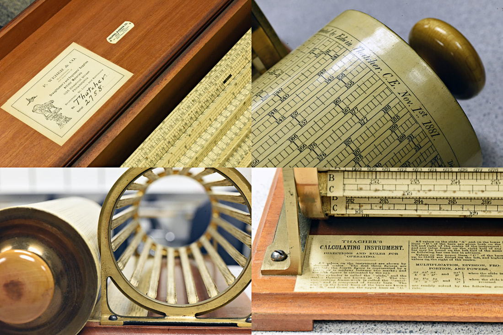

Views of the author's Model 4012 Thacher Calculator, serial number 2758 — the F. Weber & Co. box label (top left), the drum's engraved "divided by Edwin Thacher, C.E." text (top right), the magnifying cage (bottom left), and the base with its instruction plate (bottom right).

We start with this device because of its importance to history — and not just K&E history. The **Thacher Calculator** was first patented by Edwin Thacher in 1881 and manufactured by Stanley Ltd. in England. K&E arranged to have it distributed in the USA beginning around 1884, which is the copyright date of the first instruction manual produced by K&E. The device would first appear in the 1887 Catalog, known as the **Model 1740**. K&E likely imported the first Thacher Calculators, and shortly thereafter worked in partnership with Stanley to build them, with Stanley producing the scales and K&E building the rest, including the lovely box-jointed carry cases in which they came. There are slight variations in the construction of the earliest samples, enough to make me believe that there was indeed a transition between the earliest Stanley-made Thachers and those that would be made almost entirely by K&E.

Regardless, I believe the scales, indicated by the "divided by Stanley" text on the device itself, were always supplied by Stanley regardless of who made the remainder of the device.

At this time the main competition for such a high precision calculating machine came from another Stanley cylindrical rule, known as the **Fuller Calculator** (later carried by K&E as well, as discussed below) and the monstrous, heavy mechanical calculators of the day. Incidentally, the scales of the Fuller (made entirely by Stanley) look like they could have been divided by a similar machine to the Thacher, lending credence to the idea that K&E always sourced the scales from Stanley.

The Thacher features a 4" diameter drum 18" in length. The drum (also known as the slide) is covered with a single continuous "A" scale amounting to the equivalent of an 80" linear slide rule, rotating in a brass cage, with a secondary "B" and "C" paper scale on each of the triangular rail covered with shellac. Resolution is 4 to 5 significant figures, depending on the computation. Instructions for operating the rule were always affixed to the front of the Thacher's base, with serial number and maker-marks engraved on the back of the base. Likewise, the end of the drum contained patent information and the name of Edwin "Thatcher" curiously misspelled — note that the actual patent name differed from the name on the instruction plate as well as that in K&E Catalogs. "Thacher" is the correct name.

To use the Thacher, numbers are computed similarly to a normal slide rule. For example, to multiply something like 4.56 x 3.24, the number 456 on the drum (A scale) is aligned with the index of the B scale (there are indices at both the edge and the center of a triangular rail for convenience). Spin or slide the drum to the appropriate scale. Then, by spinning the cage to find the number 324 on the B scale, the product can be read off of the A scale. Like any slide rule, supply your own decimal! For division, bring the divisor to the dividend instead, and then read the quotient opposite the index on the B scale. Other computations, like cubes, can be computed by reversing the drum. Such computations achieve no less than 5 significant figures of precision due to the effective length of the scales!

Again, instructions for doing any such computations are affixed to the front of the device's base. These instructions, like the scales on the triangular rails, will often be deteriorated on many of these devices due to age.

By the turn of the century, it is estimated that around 1000 Thacher's were produced, with a rate that would increase greatly over the next couple of decades. These Thacher's are known as the **Type I** today, which includes the Model 1740 as well as a **Model 1741** that came with a brass rail with attached 3" magnifying glass. These first appeared in the 1887 Product Catalog, priced at $30 for the Model 1740 and $40 for the Model 1741. The Model 1740 (equating to $970 in today's money) was mostly purchased by research and science facilities within university or government settings, as well as within industry for heavier number-crunching in engineering fields. It is widely known that Lowell Observatory used (and still displays) a Thacher Calculator for computing ephemeris data for celestial bodies, including Pluto, as discovered in 1930 by Clyde Tombaugh at that very observatory. This Thacher Calculator and several K&E product manuals adorn my high school mathematics classroom.

In 1901, with the introduction of the new production line of slide rules built in-house, K&E changed the model number to the **4012**, all of which are known today as the **Type II** version of the machine. It would remain known as the Model 4012 until the end of its production. The magnifying version was called the **Model 4013** and is definitely considered the more rare of the two Thachers. These versions represented a significant change from the original models. The changes included a more open design of the ends of the brass cage where it is mounted to the base, as well as a possible change to the 4" drum from a metal to wood. This newer version would use only 2 screws on each end to mount the cage, whereby the Type I model used 3 screws per side. Bob Otnes (JOS, Fall 2001, p. 39), who owns both Type I and II Thachers, is of the opinion that K&E took over production entirely at this point, making the numerous changes because Thacher's original copyright ended in 1898 and was not renewed. This would have given K&E the liberty to make the device themselves without royalties to Thacher (or Stanley) and could build the units as they see fit.

The Type II would exist from 1901 to 1927 with an annual production rate increase to around 164 units. According to the September 1994 Journal of the Oughtred Society (Feely and Schure), the last known Model 4012 has a serial number of 5432. I own a Type II variant myself, serial number 2758, which places it maybe a little later than 1910 for a production date. It still uses scales with the "divided by Stanley" text on the drum, so it's clear to me that Stanley still had something to do with the Type II, even if Thacher himself might have been kicked to the curb, so to speak.

In 1927, along with many aesthetic changes that K&E was making to their slide rules, a new Thacher **Type III** variant began, changed enough to take on an "N-" prefix. As such, the new **Model N4012** and **Model N4013** added a single pedestal attachment to the cage ends, as well as knurled rings and white number bands at the ends of the cage. The Model N4013 sales ended right at the start of World War II in the early 1940s, with the Model N4012 lasting until the early 1950s, appearing in the 1952 catalog one last time. Priced at $130, it's easy to see why the Thacher would no longer be a viable option during that "golden-age" of nice, less expensive, yet powerful slide rules, not to mention the ingenious Curta Calculator (see sidebar below) introduced in the 1950s. And traditional usage of the Thacher could be replaced entirely with vacuum tube and transistorized mainframe computers into the 50s and 60s.

This scaling off of production was precipitous after the war, with the last known serial number ending just below 7000. As such, in all, there are less than 7000 of these devices out there despite the 70 year production run. Most are in rather bad shape today, coming up in auctions and on eBay typically priced between $600 to $1000 in a condition where the triangular scales will be only partially intact. Great samples, especially earlier Type I versions, are exceedingly rare and would carry a much higher premium. Mine is in quite good condition, especially the wooden case, and could sell for $2000 or more.

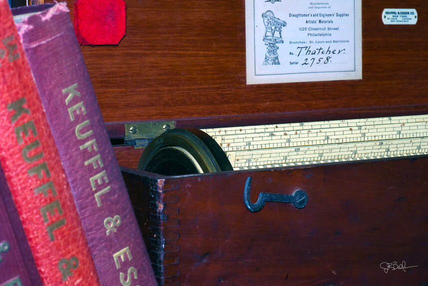

The author's Thacher Calculator, tucked into its box-jointed mahogany case.

### Fuller Calculator (Models 1742 and 4015)

This device was never made by K&E. Not at all and not in part. But it was distributed by them. While only one model of the Fuller Calculator would be sold by K&E over a relatively short history of the device, I will discuss it on the whole, including the models never sold by K&E, if only to give historical perspective.

The product was patented by George Fuller on September 2, 1879, slightly more than two years prior to the Thacher, and produced by Stanley Ltd. in England — also known as the "W.F. Stanley & Co." Not to be confused by USA-based hand-tool maker Stanley Toolworks, the English company's founder, William F. Stanley, was a kind-hearted genius — his story is quite remarkable — who began his company in 1853 with drafting and surveying equipment. The company was self-proclaimed as the "largest business of its type" by the turn of the century. His 1881 catalog states that his company employed 80 people and produced over 3000 products. Stanley invented the dividing engine in 1861, which of course is an important invention for every product mentioned in this book. Stanley would also produce many products that would be distributed by K&E in the States. If Keuffel & Esser needed a model to follow in the development of their own company, then they needed to look no further than Stanley.

NOTE: Why William Stanley's company produced a limited number of linear slide rules is worthy of further investigation. But suffice it to say, Stanley seemed content to license technology to other companies like K&E and Thornton, among others, as opposed to becoming a world-wide leader in any and all products that involved the use of his own dividing engine technology. And whereas they needed to fill out their catalog with a product, then historically they would distribute from other makers. Stanley marketed slide rules from Faber, Aristo, and Thornton/PIC, among many others.

Concerning his own products in the late 19th century, Stanley saw a great need for higher resolution "computers." As such, he would develop the Thacher and Fuller Calculators at roughly the same time, as well as the long-scale, pocket-watch style **Boucher Calculator**. To differentiate, the Thacher was a larger desktop model, capable of being used single-handed. The Fuller required two-handed use, but was certainly more portable. Stanley would have viewed the two devices for differing applications and, therefore, would not consider them to compete in the same markets.

In other words, it's conceivable that customers wealthy enough to afford them could have used BOTH. And it's this same reason that K&E, more than a decade later, included the Fuller in their catalog as well. Beginning in 1895 and listed as the **Model 1742** for a price of $28, the "Fuller's Spiral Slide Rule" featured a single scale on a movable cylindrical "sleeve," spiraled around at a linear length of 42 feet long (500 inches), and numbered from 100 to 1000. At this length, up to 5 significant figures in resolution would have been expected for many computations.

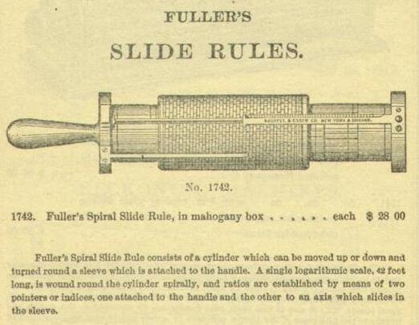

A page from K&E's 1895 product catalog: "1742. Fuller's Spiral Slide Rule, in mahogany box... $28.00."

Two brass pointers serve as the indices for the computations, one fixed to the body of the rule near the handle and the other to a rotating top cap of the rule. The latter is marked with 4 indices labeled B1, B2, B3, and B4, any of which can be used for convenience. The inner cylinder, on which the outer sleeve slides could have been left blank to be functional, had a simple scale for finding logarithms as well as a sine table for reference. As such, the device provided simple, but nicely resolved multiplication and division of numbers. Included with the calculator is a box-jointed case made of mahogany, similar to that of the Thatcher, only slightly smaller. The case also functioned as a stand for the device, with a brass attachment affixed to the end of the box on which a cantilevered-Fuller could rest. Early Fullers, made of mahogany, had a removable, threaded handle with a smaller case than those that would come later when the device evolved to a permanently affixed handle. The outer sleeve was constructed of papier-mâché with paper scales hardened with shellac. The inner stationary cylinder was wood, wrapped in papier-mâché, and then covered in scales.

In 1901, with the shifting of all K&E model numbers to the 4XXX series, the Fuller Calculator became the **Model 4015**. But it should be noted that this is a catalog designation only, as the device was always produced entirely by Stanley for the duration of its product life, never taking on a K&E label or maker's mark on the device itself. I find it interesting, as pointed out by Clark McCoy at his "everything" website about K&E slide rules, that K&E changed the catalog description for the Fuller rule in a seemingly negative manner beginning in 1901, pointing out that its spiral design only provided a single computation while not showing all the other simultaneous proportions compared to the Thacher and other linear slide rules, as well as being "heavy in the hand."

See also William Cox's similar criticism of the rule in *The Compass*, December, 1891, p. 67. It makes it quite apparent that Cox himself wrote many of the catalog descriptions.

This bit of seemingly unnecessary "marketing" couldn't help sell more devices, so it remains a curiosity why this would be noted from 1901 until the 1927 catalog when the Fuller Calculator would make its last appearance. However, the idea of pushing consumers toward the Thacher would make sense if K&E did take over all production rights as mentioned earlier, so perhaps this is the case?

For Stanley, this model was known as "Professor Fuller's Calculating Slide Scale," which would see a change to fully-molded Bakelite construction around 1928 (perhaps not coincidentally when it was discontinued by K&E). Stanley would continue to sell it abroad until the 70s when the hand-held calculator finally ended the run. Collectors, in retrospect, have coined this device the "**Model 1**."

## Sidebar: The Curta Calculator

If you lived in the 1950s and 60s and wanted a mechanical calculator that could be held in your hand, then you could have purchased a **Curta Calculator**. Introduced in 1949 after the most amazing early history of development imaginable (more about that later), Austrian inventor Curt Herzstark produced his Curta Calculator.

It would not be hyperbolic to state that Herzstark's pocket-sized device is one of the 20th century's most incredible inventions. Originally built in its **Type I** incarnation, the Curta, with the size and metallic feel of a hand grenade, is a mechanical calculator capable of multiplying numbers of astonishing size, able to add, subtract, multiply, and divide numbers with up to 11 significant digits using a stepped drum, cogs, carriage, and hand crank.

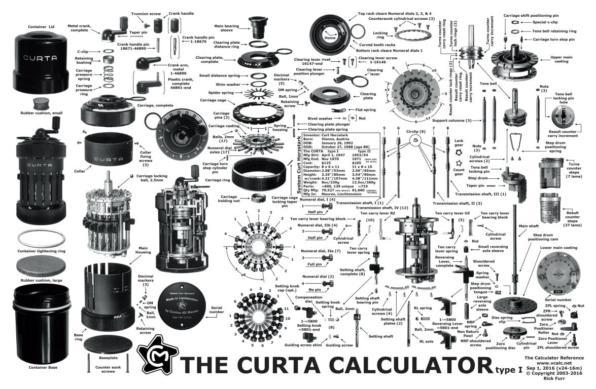

An exploded view of the Type I Curta demonstrates the level of genius behind the device. Click for a larger view.

Built in Liechtenstein until the early 1970s, the Curta cost $125 when it first appeared in 1949 (around $1500 in 2022 money), but was guaranteed a life-long warrantee. 3% of all Curta calculators would need service over the life of production, a figure that Herzstark anticipated due to its amazing complexity — the Type I used over 600 parts — which is why he adjusted the sale price accordingly. In 1954, the **Curta II** was sold, raising the capability to 15 significant figures of precision. Slightly larger in size, but still capable of fitting in a pocket, the introductory price was $180.

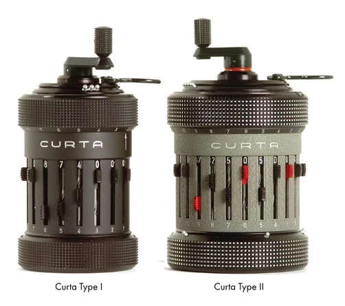

Not an exploded view after all, but a useful comparison: the Curta Type I (left) alongside the larger Type II (right), showing how little changed cosmetically between the two despite the jump from 11 to 15 significant figures of precision.

Demand for the device was extraordinarily high. Millions wanted the Curta calculators, but production could never supply them. From 1949 to 1972, an estimated 80,000 Type I and 60,000 Type II Curtas were sold, or around 140,000 in total. Contina AG (the name of the company producing the devices with Herzstark as the technical director) produced the two Curta models around the clock for 23 years.

Despite the rate at which the devices would need to be serviced — likely because curious people would take them apart and be incapable of putting them back together — both models of the Curta were actually remarkably durable and reliable, so much so that they remained in use by Rally Car drivers and their navigators throughout the 80s and the 90s.

But perhaps the most inspiring part of the Curta story is the circumstances in which it was first developed.

Curt Herzstark was imprisoned during the Nazi occupation of Austria during World War 2 until they discovered who he was. At that point, German leadership approached Herzstark to produce his device, giving him the resources and freedom to draw up the plans and produce prototypes. It is said that it would have been a gift for their Führer once the Nazis had won the war, though I suspect they also understood the need for such technology.

Once the end of the war came, Herzstark had produced the plans while also nearing completion of a prototype. At this point, Herzstark was discovered by the Prince Josef II of Liechtenstein, who provided him with the factory, Contina AG, to produce the Curta.

While the story doesn't redeem the atrocities of the war, it's certainly good that there was a happy ending for many, like Herzstark.

The "**Model 2**," which Stanley called simply "Fuller's Rule" in their 1912 catalog, added a scale on the fixed cylinder for computing the sine of angles. Three other, very rare models are also known to have been produced. A "**Fuller-Bakewell**" calculator, which adds sin²θ and sinθcosθ scales for stadia/tacheometric measurements, is shown in the 1912 Stanley catalog, as well as the "**Barnard's Co-ordinate Calculating Rule**," which was "modified to calculate co-ordinates."

In the early 1960s, the "**Stanley Whythe Complex Calculator**" was produced. This was "designed to do conversions from rectangular to polar coordinates, as well as to do operations with complex numbers."

For the collector, prices at auction and eBay will typically be $300 to well over $1000 for the Models 1 and 2, depending on condition and age. I have both models in my collection. The other models listed are rare, with very little information with regard to price, though a single Whythe Complex Calculator did come up on eBay within the last 23 years and failed to sell at its $1200 price tag.

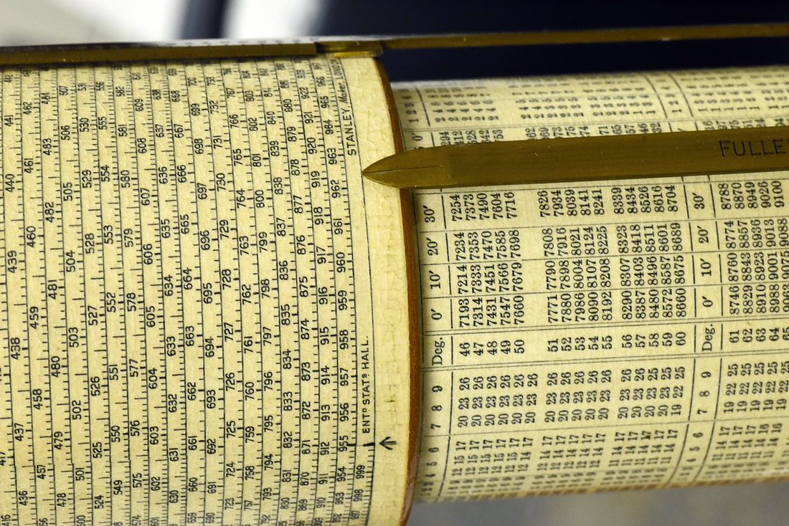

The Fuller Calculator "Model 1" from the collection. Serial number 11376. Made in 1954. Shown with Sine Table on the fixed, inside cylinder. Resolution sufficient for all angles in 10 minute increments.

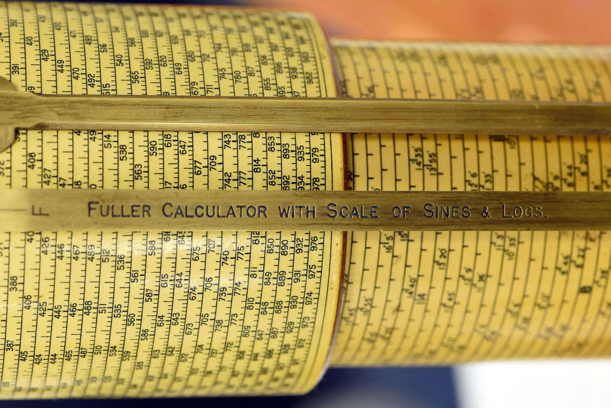

The Fuller Calculator "Model 2" from the collection. Serial number 12165. Made in 1957. Shown with Sine Scale on the fixed, inside cylinder.

### Charpentier Calculator (Model 1743/4020)

In the 100 plus years of the company's existence, this "calculator," likely imported from French maker Tavernier-Gravet (with whom K&E had a working relationship), would be the only circular slide rule K&E would offer. Ever.

This slide rule, made by G. Charpentier based on both French and English patents, was first introduced by Keuffel and Esser in 1895, though patent dates would put the rule with a 1882 or earlier manufacture. The calculator, which is the size of a large pocket watch, was likely made by both French makers Tavernier-Gravet and Henri Morin, and licensed for sale to many manufacturers on both sides of the Atlantic, including K&E competitor, Dietzgen, in the U.S. However, Dietzgen wouldn't carry the device until a decade later. The illustration in the K&E catalogs shows the Keuffel & Esser maker's mark imprinted on the rule's front side (which would replace the name of the device itself); however, no surviving sample shows that K&E actually stamped the devices in this way.

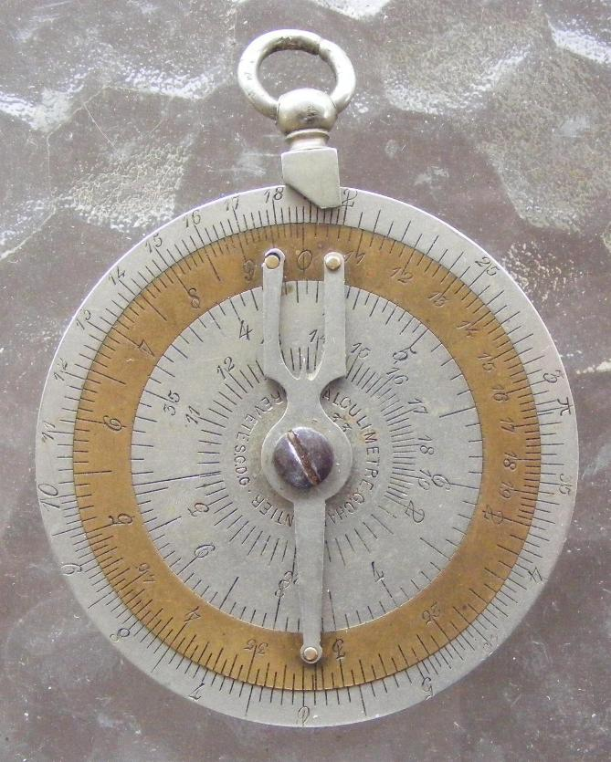

Charpentier Calculator - Front Side - Here the outer ring is a D scale, the articulating copper ring is a C scale, and the inner scales are for taking square roots of those numbers. Image used courtesy of Clark McCoy

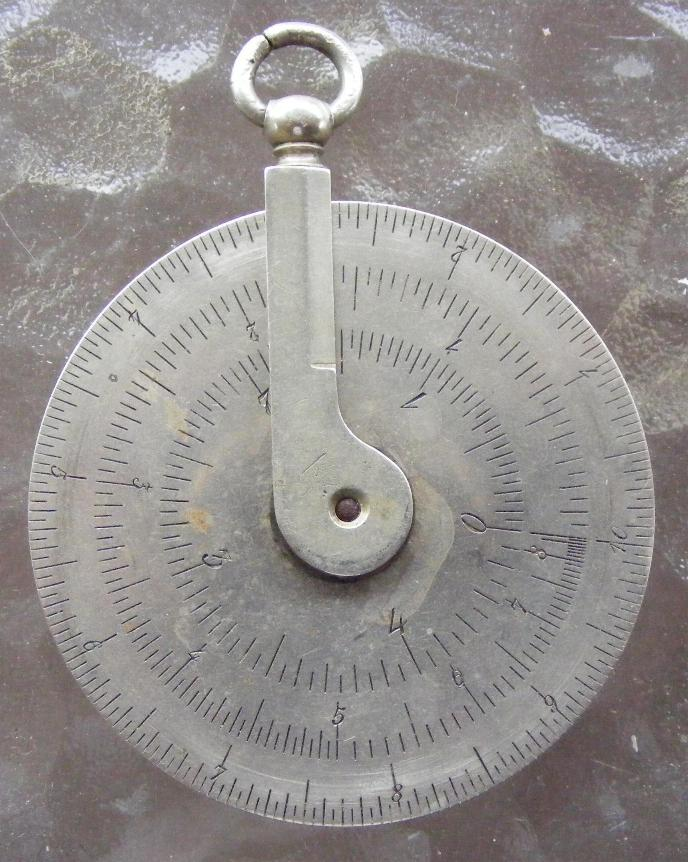

Charpentier Calculator - Rear Side - Here, the outer is the base 10 log scale (described by K&E as a "scale of equal measure"), the inner scale is for tangents, and the middle scale is for sines. Image used courtesy of Clark McCoy

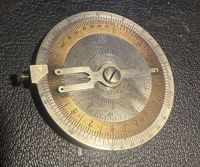

The author's calculimètre, acquired July 2024.

The calculimètre in my collection, acquired in July 2024, is smaller than you might think, right at 6 cm in diameter. Mine is missing the fob. Interestingly, the temporary screw is threaded straight through. As such, the secondary purpose of the fob appeared to be to tighten down on the edge of the rule to lock the slide into position. My sample is rather tight and doesn't move without considerable effort on my part; however, perhaps disassembly and cleaning would make for a smoother slide, and thus the necessity for a lock-down fob or screw.

As it pretty much had to be when it first appeared in the 1895 product catalog, the **Model 1743 "Charpentier Calculator"** was made of long-lasting metal. Bob Otnes, in a short article in the October 1991 issue of the Journal of the Oughtred Society, states that the main body of the rule is a nickel-plated metal, with a copper-colored, articulating, metal ring on the front side. I cannot confirm the actual metal type myself as I do not have a sample of my own. However, this copper colored ring is riveted to a metal indicator of distinctive shape on the front side of the rule, covering the entire diameter of the device's front scales. On the rear, a metal knife-edge indicator runs across the circular radius of the rear scales and connects to the fob at the top of the rule.

The Charpentier Calculator, which was re-designated as the **Model 4020** in 1901, has the functionality of a full-Mannheim rule, with what is essentially {D [C] Sq1, Sq2} on the front side of the rule, where the Sq1 and Sq2 scales are square root scales similar to those found on the Deci-Lon. Scales on the rear side are {L, S, T}.

To help understand how the rule works, it's probably best to explore how the rule would have been constructed...

Beginning with the proper sized, circular metal blank approximately 6 cm in diameter, the device would have been divided first on the outer ring on the rule's back side with the "scale of equal measure" running from 1 to 10. This traditional "L" scale would have been equally spaced all around the perimeter. The inner tangent scale and middle sine scale would then be divided, keying off of this L scale. The inner tangent scale runs up to 45° and the middle sine scale runs up to 90°. Outputs for both trig functions are read off of this L scale. And that takes care of the back side of the rule.

For the front side, the D scale at the edge would be aligned with the same index of the L scale on the back, providing functionality for the L scale (input on the D scale and output on the L scale for log(x) functions). From there, the two inner scales for square roots — one for odd digit squares (outputs scaled from 0 to √10) and another for even digit squares (outputs scaled from √10 to 10) — can be divided as referenced off of the D scale. Finally, a C scale on a movable brass ring can be divided, mirroring the D scale (as usual), in order to provide multiplication and division operations. Resolution would be similar to a 6" linear slide rule; however, the Charpentier was not as finely divided as a typical slide rule, likely because they would have needed to be etched and/or stamped by hand.

K&E would introduce the rule in 1895 at a price of $5.00, a price that would never change over the nearly 40 years the rule was offered. Otnes (JOS, October 1991) speculates that perhaps K&E purchased a large amount of the devices initially, while never selling many of them and, therefore, would remain listed in K&E catalogs until 1932 at that same $5.00 price.

As I mentioned, there are no known samples with K&E stamped on the Charpentier Calculator, which could be explained by a lack of sales, though that would be conjecture. Of the known samples, there is some variance in what is stamped on the rule. For the most part, the device's name is always on the front, while the back could be left blank or be inscribed with either Tavernier-Gravet or H. Morin (perhaps identifying both as makers of the rule). Another version of the rule has appeared with a Russian label, stamped along the rear indicator. Again, I have seen no samples with either K&E or Dietzgen affixed to the rule, so my belief is that K&E just didn't stamp any of those they sold, despite the catalog illustrations appearing as if they did. And if they really did, I can't see them stamping over the device name as the illustrations show.

For collectors, the Charpentier Calculator is not as rare as many of the online sources would have us believe. Perhaps two samples pop up on eBay each year, which is not nearly as rare as many of the slide rules described in our writings here. The average price of the 50 or so samples sold on eBay since 1999 is ~$500, ranging from $100 to $1100 depending on the whims of the market and the condition of the rule. Many of those samples, likely, were sold by K&E without any of us truly knowing for sure.

Circular slide rules originated with William Oughtred himself in the late 1600s, but the Charpentier Calculator was certainly the first circular slide rule available in the United States. As such, the Charpentier Calculator, regardless of known provenance, is a desirable rule for collectors. Most circular rules, particularly those offered in the States from Gilson, SIC, and Pickett, would have found origins in form and function with the Charpentier, and as such it deserves prominence in the pantheon of slide rules.

## Pocket Watch Rules

It stands to reason that circular slide rules could be fitted into a pocket watch enclosure, and that this would be something normal pocket watch consumers might desire. Interestingly, Keuffel & Esser was on the forefront of bringing pocket watch style rules to the United States, first importing European rules from overseas and then evolving into a maker of several rules themselves. Consequently, K&E became one of the larger sellers of a variety of pocket watch rules anywhere.

Pocket watch rules, unlike their chronological cousins, are not mechanized with clock movements, springs, jewels, and barrels, but they still utilize gears, pinions and drive stems to move clock-style arms or pointers. Unlike many makers of such rules — like Fowler, who used such a format for some rules that barely fit into a pocket — all pocket watch rules sold by K&E would be mostly the size of a traditional pocket watch. Pocket watches themselves were considered utility items necessary for living, so a budget model would have been constructed and priced in a way to make them available to the average citizen. And this can serve as a comparable price-point for many of the pocket watch style of slide rules. Of course, if we lived back during that era, we could have spent any amount of money we desired on high-end pocket watches.

There are three specific pocket watch rules that K&E was known for, the first of which is imported and the other two manufactured in-house. However, as we will learn with the Boucher Calculator, there were actually two different rules sold by K&E that were categorized as "Boucher's." That is the rule we shall introduce first.

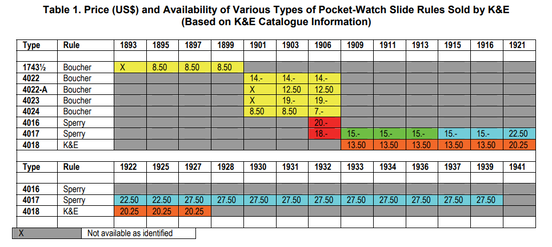

This excellent table of Pocket Watch rules sold by K&E is courtesy of Peter Hopp, Journal of the Oughtred Society: Volume 22, Number 2, Autumn, 2013. All of Peter's writings are must-read material for the slide rule collector.

### The Boucher Calculator

NOTE: Everything you likely want to know about the particulars of the Boucher Calculator can be found in a recent online book by Peter Hopp, *The Boucher/Calculigraphe Story*. It is a terrific, deep-dive into these earliest "pocket watch" slide rules.

The first pocket-watch rule to be sold by K&E is the Boucher Calculator, which appeared nearly two decades after the first Boucher rule was manufactured. These decades have an interesting history that is worth our time...

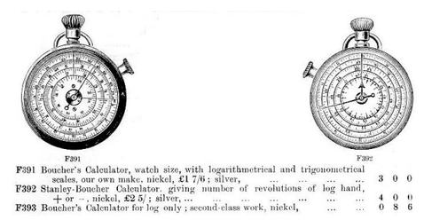

From a 1902 Stanley Ltd. catalog, showing the "Boucher" calculator's offered by Stanley. Note the description of the F393 type as for "second-class" work and the accompanying bargain basement price. This would seem to indicate that the "slovenly manner(ed)" Chatelain device was sold by Stanley as well? The Dietzgen catalog of this era also shows a "Boucher" described calculator with "Calculigraphe" dials, so it is apparent that Boucher became a general term for all of these calculator types.

The Boucher Calculator is based on French and English patents both awarded in 1876 and 1877 respectively. The device is the first "pocket watch style" slide rule, one that likely originated in LeHavre, France, from the design of Alexandre Boucher. The early history of the device is shrouded in some mystery, with the makers of the earliest samples somewhat unknown. But overall, there are essentially two branches of pocket watch rules which are regarded as "Boucher" in a manner which would appear in a K&E catalog. The first branch is an original patent design of the device which seems to revolve around the activities of A. Boucher himself, with more of an English manufacturing base (though the early versions were French made). The second originates in Paris as an "improved design" of the "Boucher System," made by Henri Chatelain called the **Calculigraphe**. Breaking down these histories might assist in the discovery of those K&E would offer between 1895 and 1906.

Regarding the first branch of rules, these begin with devices imprinted with "Havre" on the rule, with some speculation that Boucher either self-fabricated the device or enlisted an "agent" for production and distribution. The original maker for this rule is traditionally unknown, but I believe we can present sufficient evidence that the earliest rules were made by the Manlove, Alliott, and Fryer (M.A.F.) Company (see Sidebar: "Manloves" Chronology below). These rules date to around the patent dates themselves, as early as 1876/77. We also note that several other makers produced versions of the rule, including Morin, Stanley, and Chatelain at some point within a decade or two of the patent date. What is known is that all of these rules are true to the Boucher patent.

## Sidebar: "Manloves" Chronology

One of the larger mysteries in the Boucher story surrounds the mystery of three "Manlove"-related variants produced at some point within 15 years after the patents in 1876/77. Each of these rules would be mostly similar, of the same true Boucher design, yet would have different maker's marks. Presumably, these are all from the same "Manlove" maker. If we can understand those differences, then perhaps we might also have greater certainty with who produced the original version of the Boucher rule.

Of interesting note, this company was a prolific engine-maker mostly in the field of laundry machines with production facilities in both Nottingham, England, and Rouen, France. The first sample in question can be identified with "Manlove, Alliott, & Fryer" and the cities "Nottingham and Rouen" inscribed on the rule. "Made in France" — written in English — was also on the rule. The English text would seem to indicate an intent to export the rule, which indeed it was.

Another variant, presumably a few years later, is identical to the first sample, yet omits the "Rouen" and "Made in France" inscriptions. As such, it would appear to be made in Nottingham. The rules themselves are identical in every other way.

The last variant, arising circa 1892, takes on a different appearance, referring to the company only as "Manloves, London." This is enough of a change to make some think it's a different company, but that's easily debunked. By 1890, loads of documentation shows that Manlove, Alliott, and Fryer (M.A.F.) had not only set up a "house" of business in London, but also had become publicly and informally known simply as "Manloves." This had become their telegraph address in these early years of such communication, but also as a branded logo during the company's later years.

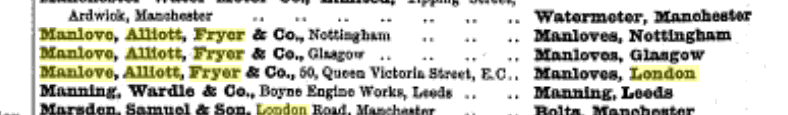

From an 1886 trade directory, the company is referenced with Alfred Fryer as a partner. Important to note is that Glasgow and London are added as business offices and Rouen is suspiciously absent. Also note the use of "Manloves" as a shorthand entry across all three. This most certainly connects all three variations of the relevant, early Boucher rules to the same company.

The company's 1958 Advertising Logo — by this point "Manloves" had gone from informal telegraph shorthand to the company's own branded identity.

By 1891, Fryer was dropped from the company name (he died in 1892) but had taken on Fryer's full business interests as their own. By this time, they had expanded their offices as well. Importantly, note that the company would have been informally known as simply "Manloves," as that was their telegraph identifier.

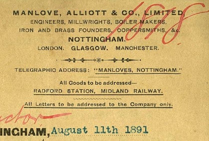

An 1891 Manlove, Alliott & Co., Limited letterhead, spelling out the company's telegraphic address — "Manloves, Nottingham" — the same shorthand identity that would eventually become their own advertising logo.

A second, more important question that arises is whether M.A.F. might have fabricated the earliest A. Boucher version of the rule?

I believe this is very likely. Several aspects give it away. The design is the same, including the same "A.B" scripted initials, as is the type-font, construction, and the scale layout. Hopp himself states that he feels that the rules are quite similar, except he couldn't commit the "Manlove, Alliott, Fryer & Co" company name to such an early date. But I think there is plenty of evidence that Alfred Fryer was made partner shortly after his design for the waste incinerator, the "Destructor," was first built by Manloves in 1874.

Likewise, it should not go unnoticed that Boucher's LeHavre address is within 54 miles of Rouen, which is an easy trip to make. Even after M.A.F. rules were made in Rouen, they would have crossed through the port city — Havre means "port" — to be exported. It's just too convenient for Boucher and passes the test of Occam's razor.

But any question of whether the company was related to the Boucher Calculator's early on can be put to rest by the January 30, 1880 advertisement below...

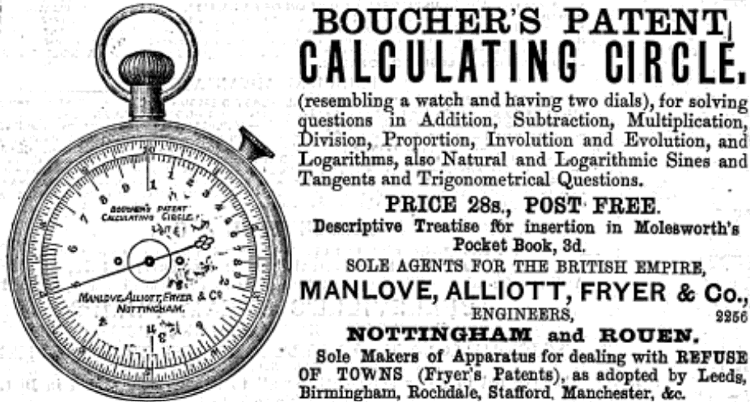

The "Smoking Gun" - Advertised in the January 30, 1880 periodical, "Engineering," the only thing remaining to be solved with concern to the early Boucher rules is what it means to be an "agent." 28s would be "old shillings," which is approximately $140 in today's U.S. dollars.

What follows is a time-line of the company's history, with comments:

- **Manlove and Alliott (1837–1845)** — Were drapers by trade.
- **Manlove, Alliott and Seyrig (1845–1860)** — Opened a bleaching company within the laundry industry, starting business in Nottingham, England. Produced equipment related to that industry, i.e. washing and drying machines.
- **Manlove, Alliott and Co (1860–1876)** — Bought out William Martin Sons & Co in Rouen circa 1871; the new plant added foundry and production facilities for railway and sugar machinery. Took over the production of a sugar "Concretor" machine for Alfred Fryer, which Fryer had been building himself starting in 1865. It revolutionized the sugar industry in N. America and abroad.
- **Manlove, Alliott, Fryer and Co (1876–1885)** — Fryer becomes partner after helping the company build a "Destructor" machine in 1874, based on his improved patent design of the Concretor. The company rapidly expands into the waste disposal industry with this machine, based on the "Compactor" machine design. Fryer retires from active involvement in 1884.
- **Manlove, Alliott and Co, Ltd. (1886–1962)** — Became a public limited company.

Cajori, in his text, claimed that the first Chatelain rules arrived as early as 1878. And an early 1880 manual for a Chatelain rule seems to support this, advertised as a "new-improved" Boucher design and carrying the name of the Calculigraphe. This manual would also clarify that the pocket watch rule was of the "Boucher System." So, clearly, by all descriptions of the earliest Chatelain rules, it was based on the Boucher patent design. So it would appear that these true Boucher rules as made by Chatelain are given this new name. It is not understood if Boucher really cared, or not; however, perhaps even he would have to think that Chatelain's name was more marketable than "A. Boucher's Calculating Circle." They were, after all, his rules...and profit is profit.

The earliest identifiable Calculigraphes of a different, Chatelain-design appear to have come around 1892. This might seem late to collectors who know something about this history; however, Hopp points out two observations from French trade directories of direct interest. First, there exists no H. Chatelain as a maker within Paris in 1885. Second, it isn't until 1892 when he is listed as a maker specifically of "new" Boucher calculators. It is not until an 1894 H. Chatelain company catalog when we catch a glimpse of the new pocket watch rule, explaining the virtues of the design.

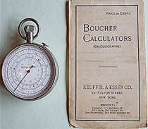

A candidate for the Model 1743½ introduced in 1895. - image courtesy of Peter Hopp

Functionally, this new Chatelain rule can spin the front dial using the "crown" on the main stem. This crown can also drive movable indicators simultaneously on both sides by pushing down a second "clutch" lever, thereby disengaging the stem from the front dial and engaging the indicators instead. This is far different from the Boucher patent design, which continually engages the main stem to the front dial while using a secondary, angled stem drive with knurled knob to also engage the dual indicators. Chatelain would call his an "improved-design," though honestly it's only an improvement in the sense that lesser materials and fabrication can accomplish the same functional tasks. And this is where the quality difference in the rules is obvious among samples of both rules that exist today. The materials used in the Boucher versions are much more substantial and structurally solid than the Calculigraphe with the thinner, single main stem and flimsy clutch engagement. This would also show in the price for the rules, which we will see later.

Essentially, other than the similarities in scale sets, these rules are mechanically nothing like each other. So it is very doubtful that Boucher would object, nor could he object if Chatelain had waited 18 years before selling his own design. Nor do I see the need, as the Chatelain design infringes so little on Boucher's patent rights. If the Chatelain-designed Calculigraphe had come out nearer to the 1878-80 date that many people have suggested, it most certainly would have not been authorized by Alex Boucher himself, nor would it be a rule that Boucher would wish to represent him. But if Boucher licensed him to make those early rules in an arrangement like he did with Morin, Stanley, and Manloves, then certainly there should be no problem.

But there would be no fixing the confusion caused by Chatelain calling the original Boucher-version the "Calculigraphe" and then calling his OWN designed rule the "new-improved Calculigraphe" almost two decades later.

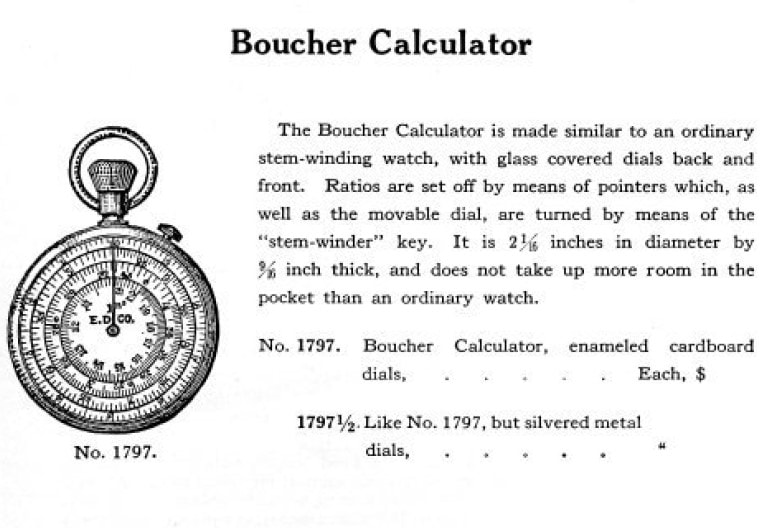

From Dietzgen's 1931 catalog, the Boucher was still being sold. Note the type, which is the Calculigraphe or clutched-version, since the main stem moves both the main face and the pointers. Dietzgen would sell this rule through 1936. They never sold a true Boucher-designed rule.

1894 seems to be a crucial year in the story, as not only do we see a Chatelain catalog with this new rule, but many print publications, company catalogs, and advertisements begin to showcase it as well. And this would blur the lines between what was a true Boucher-type rule and what was not. Some companies would continue to offer the Boucher rules, yet also refer to them as Calculigraphes. Other resellers of both rules would hardly attempt to differentiate between the two, including K&E.

To support this thought, the W.F. Stanley company, selling a true Boucher version of the rule around 1890, famously states in an advertising flyer with regard to "the invention of M. Alex. E. M. Boucher" that "this instrument was formerly made in France for this country [UK] in a very slovenly manner. It is now made in London of sound work and accurate centring [sic]. Manloves are the patentees' agents, but the instrument can be had of any opticians." There is some conjecture that Stanley is referring to earlier versions of the Boucher rule that were made by Chatelain in France, but perhaps Stanley was speaking about the Chatelain devices, a thought which makes more sense given the price points for both versions. The Calculigraphes were typically listed in retailer catalogs at almost a 50% discount to the Boucher types. Therefore, here is Stanley letting the market know to avoid the "improved" Chatelain rules, because they were in no way superior to the "real thing." It's a statement of, "You get what you pay for."

As a result, regarding both types of rules, I feel we can construct a picture of two rival makers battling each other for market share in Europe, paying homage to the Boucher rule as being the original pocket watch rule, whereas anything that followed would be of the "Boucher-type;" albeit, with other makers now free to fight for some market share.

For us today, because of the historical link of these rules to Boucher, the term "Boucher Calculator" can speak of a wide variety of historical products. And for this reason it appears that K&E offered both types of rules, as we shall see. And similarly, it would seem that the "Calculigraphe" would become somewhat of a generic term for these pocket watch rules over the ~30 years in which they were the only pocket watch rules out there. Too closely related at that time for obvious reasons, I believe these two versions of rule should not have such a direct association. They are, very much, separate types of pocket watch rules. However, because the Chatelain version would prove to be the longest enduring and most prolific of the two types of rules, the "Calculigraphe" is now the more familiar name, with more samples to be found for today's collector.

Importantly for Keuffel & Esser, who began selling Boucher Calculators in their 1895 catalog ([a fuller sample write-up is cataloged at OS Galleries](https://osgalleries.org/os/fulldetails.cgi?match=120)), is the version of calculators they were selling. Of course, as we've seen throughout these writings that early catalog descriptions and illustrations can be sparse and limited in detail, pinpointing the exact variation of the Boucher-style to the K&E models is complicated.

First, like the Charpentier we just covered, there are no known samples today that are identifiable as K&E products, this despite catalog descriptions clearly showing a "K&E" badge.

This seems to be a pattern with these earlier imported products: K&E illustrates them with their own name clearly on the device, yet such a sample is never seen in the wild. This was true of the 10" **Model 479-2 Mannheim** (imported from Tavernier-Gravet), the Charpentier Calculator, and now the Boucher Calculator. And it will continue to be a theme when we cover other seemingly rare devices. And to bring credence to this theory, like the Charpentier, Dietzgen also carried two models of the Boucher, shown in their 1907 catalog, that also illustrates a rule with their own badge. As you might have guessed, such a rule, too, has never been seen in the wild.

Moreover, comparing the Dietzgen advertisement with the K&E version in the 1906 catalog, the advertising-copy is very much the same. Since I'm not likely to believe plagiarism is involved, I think the evidence suggests that suppliers provided descriptions of the rules for the distributors and the sellers were encouraged to use the same advertising copy, with some personalization from each company. This makes it highly likely that both K&E and Dietzgen offered the exact same rules. They simply cannot be differentiated today because neither actually branded their Boucher models (which are both of the Chatelain type). Additional evidence comes with two samples in Peter Hopp's collection that are typical "HC Calculigraphes" with no K&E badge, yet both were accompanied with K&E branded instructions (see image at right).

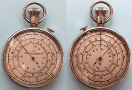

Two samples in Peter Hopp's collection, typical "HC Calculigraphes" with no K&E badge, yet both accompanied with K&E branded instructions.

Unless the instructions survive, then there would be no way to know who sold them. As such, catalog illustrations for early rules might not be representative of the details on the device itself.

Incidentally, there are versions in the wild that are branded on the dial face by resellers of these rules, so it's not impossible to have done so. But it appears very likely that both K&E and Dietzgen (among others) opted NOT to spend extra time and money to brand their supply of imported Bouchers.

The idea that K&E could have manufactured their own Boucher rule should be put to rest, as once again there are no samples to prove it so. Likewise, the Boucher was short-lived, being replaced in 1908 by the **Sperry Calculator** and in 1909 by the **K&E Pocket Watch Calculator**, both of which were made in-house by K&E and both of which we will discuss shortly. (Dietzgen would continue to sell the Calculigraphe version until 1936, calling it the Boucher, of course.)

Further complicating everything, by 1903, K&E would present four model offerings in their catalog. Those models, with some speculation of the suppliers, are as follows:

**Model 1743½ (4022):** The catalog illustration for the lone 1895 offering, designated as the Model 1743½ by K&E, seems to look like the Hopp samples of HC Calculigraphe mentioned earlier. This model would be described in the 1897 catalog as 9/16" thick, dual-sided, glass-covered, and with enameled-cardboard dials. Priced at $8.50, same as the Dietzgen Model 1797. It is puzzling that the 1895 catalog describes this rule as being "open-faced (glazed)," with no mention of glass. To anyone's knowledge, there are no known Calculigraphe variants sans glass, so the description is puzzling, and collectively, it's hard to know much about this rule. In 1901, this rule would become the **Model 4024** during the remapping of product models by K&E.

**Model 4024:** As mentioned, the previous rule would appear as the Model 4024 in the 1901 product catalog, with a description marked in the margin identifying it as the former 1743½ model. While the description of the No. 4024 changes the thickness of the rule to 5/8" thick, it does confirm the "clutch" feature of the rule to match the Chatelain type. It also keeps the price the exact same. The difference of 1/16" in thickness could be accounted for by being more precise with the actual dimension. I doubt there was a significant change in the rule after 1901. This rule would endure until 1906.

**Model 4022:** There were no changes in the 1899 catalog to their lone pocket watch rule, but as mentioned and as expected with the new 4XXX model designations in 1901, while the Model 1743½ changed to the Model 4024, K&E added another rule to the lineup, the **Model 4022**. This rule would be described as 1/2" thick with a second, milled "head key" to move two fixed pointers over the stationary dial. A third pointer is also affixed to the rim over the movable dial, which is spun by using the main crown of the device. Additionally, the dial is said to be "silvered." From surviving samples of this mechanism, it would appear that Boucher's earliest devices worked this way, as well as those seemingly made by the English builders including the "Manlove" version and the Stanley.

But then, in the 1903 catalog, K&E adds the word "Calculigraphe" to the same Model 4022 description, but only for this Model. I would dismiss this as erroneous, however, as that term matches the No. 4024 and not the No. 4022 of the clutch-less design.

### Sperry Calculator

🤖 AI-drafted &middot; unverified

<dl class="ke-ai-stub-facts">
<dt>What it is</dt>
<dd>K&E's own in-house pocket-watch slide rule, introduced in 1908 as the direct successor to the imported Boucher Calculator discussed above — the first pocket-watch rule K&E manufactured itself rather than imported.</dd>
<dt>What it did</dt>
<dd>Not described anywhere in the surviving source material beyond its role as the Boucher's replacement. Presumably it functioned like the other pocket-watch rules in this chapter, with rotating scales on a watch-style dial for multiplication, division, and proportion.</dd>
<dt>Approx. introduced</dt>
<dd>1908, per Jay's own account above. A Hopp price-and-availability table for pocket-watch rules (reproduced earlier in this section) lists a Model 4016 beginning in the mid-1900s that may correspond to this rule, though that identification is not confirmed here.</dd>
</dl>

This summary was generated by an AI assistant from the surrounding narrative and general knowledge of comparable pocket-watch rules, not from a verified first-hand source or sample. Treat every detail above as a starting point for research, not settled fact.

catalog image not yet sourced

Verify further: <a href="https://www.oughtred.org/">The Oughtred Society</a> &middot; <a href="https://www.sliderulemuseum.com/">International Slide Rule Museum (ISRM)</a>

### K&E Pocket Watch Calculator

🤖 AI-drafted &middot; unverified

<dl class="ke-ai-stub-facts">
<dt>What it is</dt>
<dd>K&E's second in-house pocket-watch rule, introduced in 1909 — following the Sperry Calculator and completing K&E's transition away from imported Boucher/Calculigraphe designs.</dd>
<dt>What it did</dt>
<dd>Not described anywhere in the surviving source material beyond its introduction date. Likely functioned similarly to the Sperry Calculator and the Boucher/Calculigraphe rules it ultimately replaced.</dd>
<dt>Approx. introduced</dt>
<dd>1909. The same Hopp price table referenced above lists two further model numbers, 4017 and 4018, appearing in the years after the Sperry's debut and continuing into the 1930s&ndash;40s, which may correspond to this rule across its production run.</dd>
</dl>

This summary was generated by an AI assistant from the surrounding narrative and general knowledge of comparable pocket-watch rules, not from a verified first-hand source or sample. Treat every detail above as a starting point for research, not settled fact.

catalog image not yet sourced

Verify further: <a href="https://www.oughtred.org/">The Oughtred Society</a> &middot; <a href="https://www.sliderulemuseum.com/">International Slide Rule Museum (ISRM)</a>

## Rare Linear Rules

Unlike the family-spanning rules covered so far in this book, the handful of linear slide rules in this section never found a lasting catalog family of their own. Some, like the Triangular Metal Rule and Universal Rule below, survive today only as a small handful of known samples despite once being real, cataloged products; others are little more than a name in a price list, their story lost to time along with the rules themselves.

### Model 4095 Triangular Metal Rule

Listed in the catalog for only 1901 and 1903, the original **Model 4095 Triangular Metal Rule** combines rarity with ingenuity in a way unlike any other K&E slide rule. Much of the only knowledge of this rule can be found in a Fall 2001 JOS article ("Journal of the Oughtred Society") by Conrad Schure, so it will be difficult to write anything not already attributed to Schure.

As we know, Keuffel & Esser had their hands in many different types of slide rules near the turn of the 20th century. This includes experimentation with untraditional slide rule designs, materials, and construction. This 10" Model 4095, a model designation which would be claimed within the Merchant's lineup of rules more than a decade later, uses what is known as German silver, triangular in shape, with a solid prism sliding within an outer hollow triangular shell, which in turn is held together with end "plates." The catalog description in both 1901 and 1903 mentioned that two types of cursors were available, one a chisel-style cursor which was true to the original 1898 patent design of the rule and an "I-beam" glass design with dual hairline on each of the three sides.

"German Silver" can describe any number of recipes dating back to the 17th century, but all of which would be a silver-white alloy of some combination of copper, zinc and nickel. Containing no real silver, it is also known commonly as "Nickel silver." The indicator or runner (terms used in the patent language), as it appears in known samples of the rule, could be either brass or German Silver.

Each side speaks to the versatility of the rule, with differing scale sets all indexed together across the rule's three sides, which are as follows:

Side 1A [B, C] D

Side 2A [BI, CI] D

Side 3A [S, L, T] D

Each side is marked with the scale labels, with "Keuffel & Esser, Co., New York" etched into one side of the rule, as well as "PAT. MAY. 10. 98" etched into another. The model number was not placed on the rule. When I say "etched," I do not mean stamped as on a wooden or celluloid-laminated rule, but truly etched by hand. This gives the labeling a shaky inconsistency from rule to rule.

The cursor design had the special task of conforming to the obvious three-sided shape of the rule. Both styles utilized a two sided "A" frame with a third side folded over and attached with four screws. As described, the chisel-type is just like their traditional "double-chisel" cursors, yet three-sided instead of two. The patent diagrams show chisel shapes on both "sides" (left and right) of each face, with chisel pointers where both A/B and C/D join at the slide/body. How the cursor was tensioned is unknown. The second cursor type has an "I-beam" look on each side, with glass left and right on two sides of the rule only. It is said that the third side wedged cardboard in between the cursor and the rule's face, providing tension. While Schure expresses his feeling that K&E likely designed it that way, I cannot commit so far, as such a solution not only seems beneath K&E's typically solid design principles, but also seems to make the rule unfunctional, not only on the side in which the cardboard is placed, which would hinder reading the rule, but also in the friction, bare metal-on-metal, it would cause on the other two sides of the rule.

Speaking to rarity, at the time of Schure's writing, he mentions that only three samples of the Triangular rule are known to exist. Two rules are part of the Jack Burton collection, who was a former VP of Marketing for K&E, a collection of rules mentioned previously in my writing here. The other is possessed by Schure himself. None of the three samples are the same according to Schure, varying in their end "plates," knob handles, and cursors. As such, it is clear that K&E made these to order and made so few of these that they didn't have an established design or construction technique. We can almost regard them as one-off prototypes, where each order presented K&E with the opportunity to improve the design.

Internet research has proven inconclusive with regard to other samples of the Triangular Metal rule since the Schure article was written. At least until one very recent lucky day when I stumbled upon the sample below on eBay. As Schure writes at the end of his JOS article, as a collector, when a slide rule appears for sale like this one, you don't question it, but rather you "step up" and do what you have to do. Therefore, this 4th known sample of the Triangular Metal rule is being added to my collection as I write this.

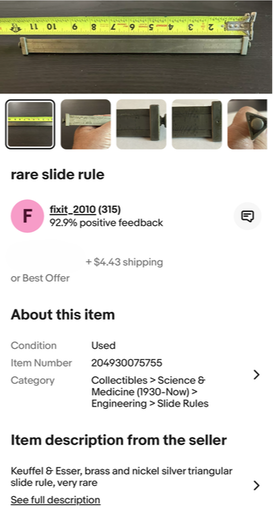

The eBay listing for this 4th known sample of the Model 4095 Triangular Metal Rule — described only as a "rare slide rule," Keuffel & Esser, brass and nickel silver.

There is no cursor, but even that didn't cause any pause in my decision to acquire the rule. When you have a rule like this, you don't really question the condition of it, or its completeness. And for a rule like this one, with so few known samples and a huge inconsistency among those samples, then I have no problem adding it to my collection.

As far as a cursor, I have the opportunity to either fashion a new one by hand according to the patent design, that is if my metal fabrication skills are sufficient enough. I can also prototype several types and sizes with my 3D printer. I am looking forward to seeing if I can create a viable, working cursor.

And speaking of viability, the question has to be raised concerning this unique slide rule in terms of being a practical product. Since the rule didn't hang around for long and since there are so few known samples, we likely know the answer to that question. However, to what can we attribute the lack of sales? Is the slide rule not that useful? Was the slide rule design not well-implemented, inaccurate, or frustrating to use? Or was it simply too expensive? I believe the answer to all those questions is simply, "yes"!

My impressions of the rule, now that I've had a chance to photograph it from several angles, are that it is much smaller than I expected, as I attempt to demonstrate in the gallery of images below. This sample has the maker mark and the patent date on the same side of the rule. It has knobs on both ends and slides quite easily within its frame. It's heavy, as you might expect, but only when compared to its small size. The rule reflects light across all faces. When you combine that fact with the nickel-silver color of the rule and the very small scales, the rule can be difficult to read. But to be honest, I've seen other more modern slide rules that were more difficult to both read and use.

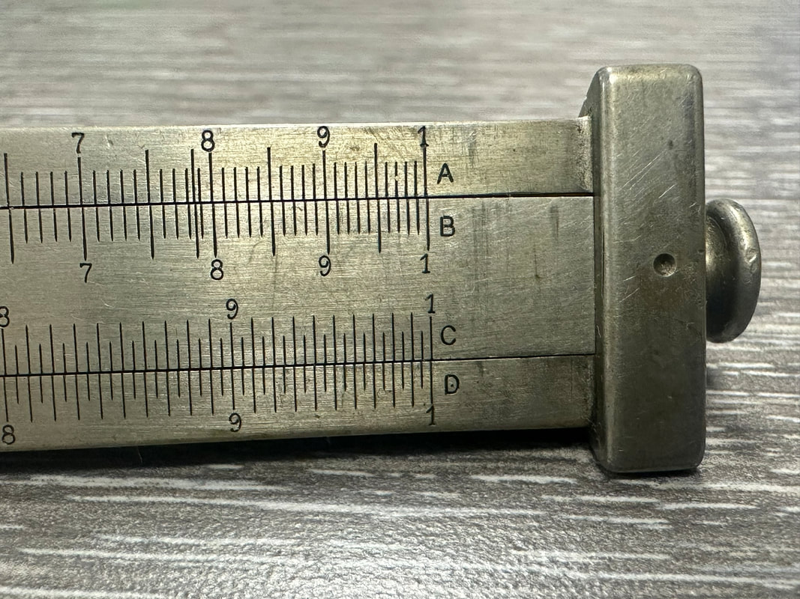

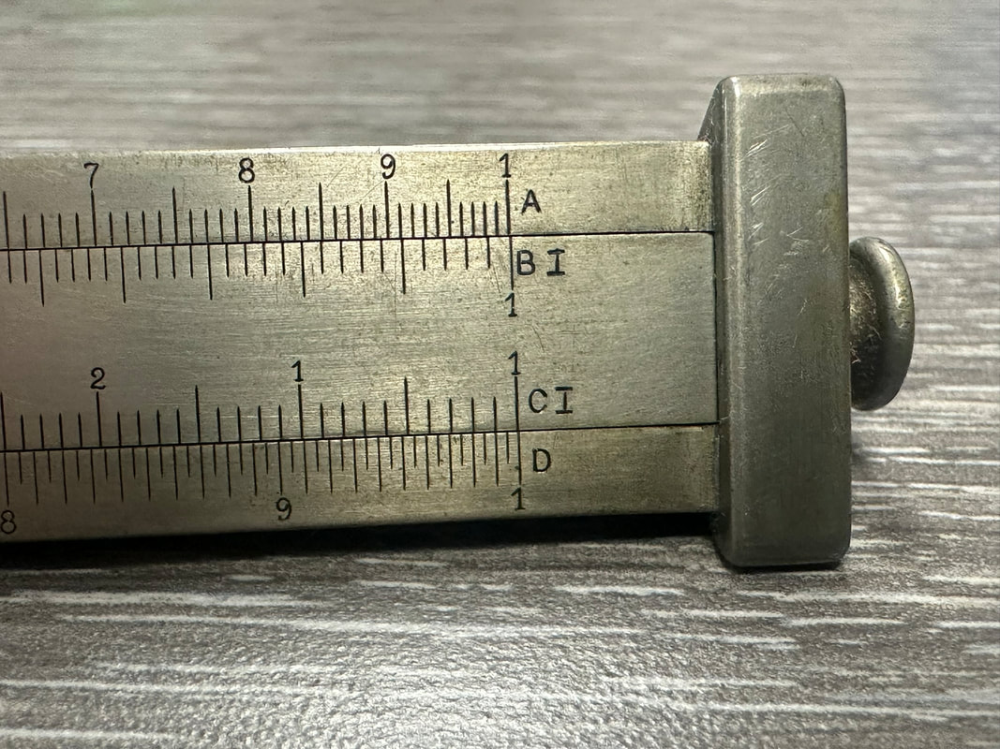

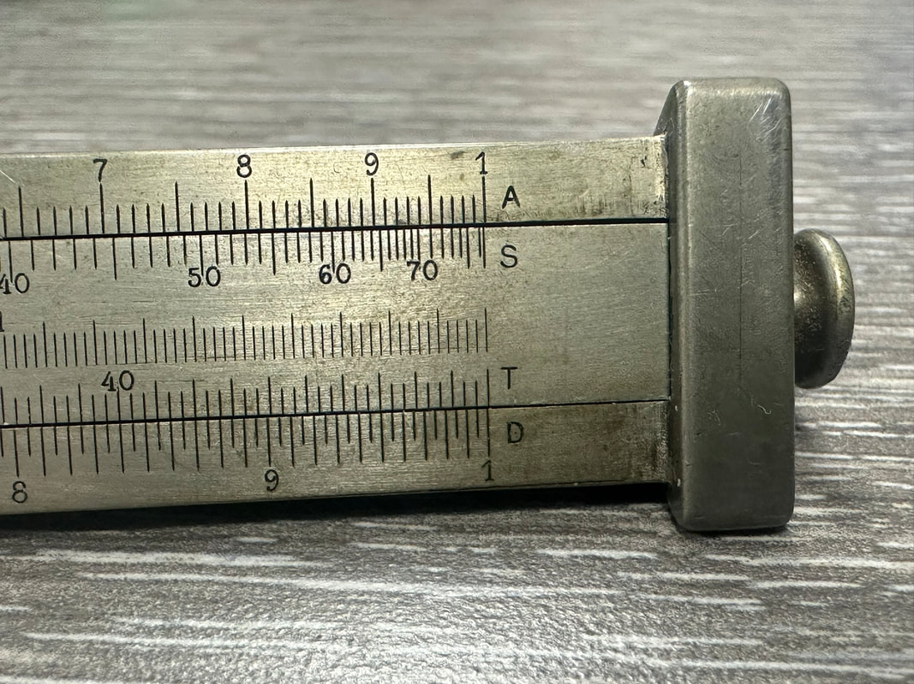

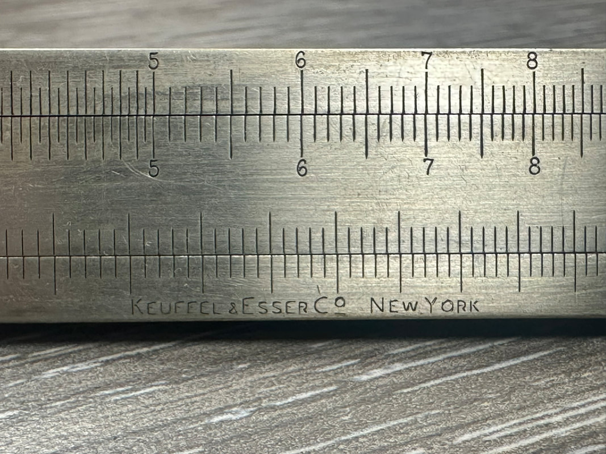

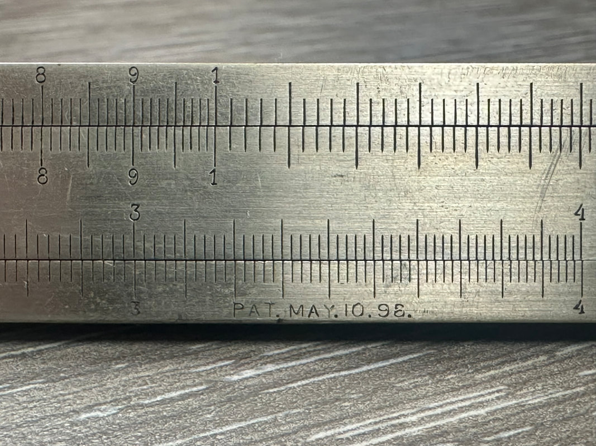

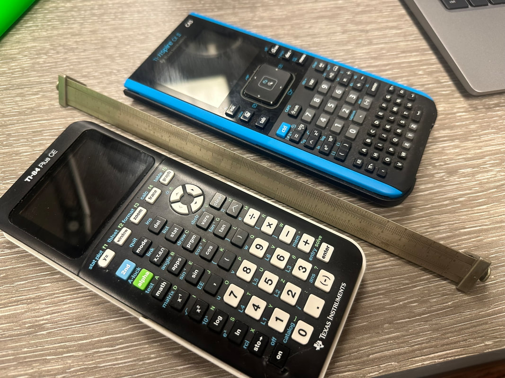

A selection from the author's fuller photo set of this rare, recently-acquired 4th known sample of the Model 4095 Triangular Metal Rule — top row: Side 1 (A [B, C] D), Side 2 (A [BI, CI] D), and Side 3 (A [S, L, T] D); bottom row: the hand-etched Keuffel & Esser maker's mark, the May 10, 1898 patent mark, and a size comparison against two modern graphing calculators, showing just how small this "10-inch" triangular rule really is in the hand.

Not having a cursor, I cannot speak to that actualized within the product other than to say the cursor itself would also be quite small, a trait that might make such a cursor less durable. It would also seem to make cursor design difficult to implement, as structurally a single face of such a cursor would be less than 1 square inch.

### Model 4090/4091 Universal Rule

This is a unique and important slide rule based on W.L.E. Keuffel's March 1899 "dual slide" patent. The patent was founded on the desire to have more scales on a duplex rule, whereas dividing engines of the day did not have the ability to etch scales on the center of the stator rails. As such, this patent called for a rule with three rails and two slides to allow for more total scales. Note that these slides and rails do not move independently; the 10" rails and slides move collectively like a typical slide rule as they are bound together. The result was a duplex rule with more edges for the dividing engine.

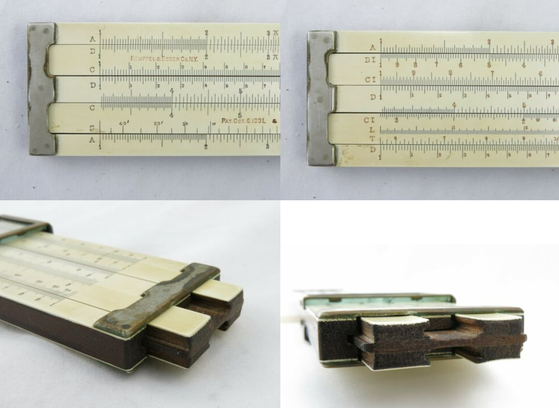

This sample of the <strong>Model 4090</strong> Universal rule came up on eBay in April of 2019, selling for $685, which would be a bargain for slide rule collectors. Note the dual slides and triple rails and the way they are connected. The idea is simply to give more "edges" to the rule to accommodate more scales. Images courtesy of eBay.

Scale arrangement was, of course, unique due to the dual slides and triple rails. But they were also innovative, constituting the earliest example of "folded" scales on a K&E rule.

Front SideA [B, C] D, CF [CF, S] A

Back SideA [BI, CI] D, CF [CI, L, T] D

Note that the CF scales were not labeled such on the rule. They also were labeled "C," but unlike the normal C found on the upper slide, these were indeed folded over √10 without the CF label. This is a decade earlier than the folded scales rolled out on the 4088 Polyphase Duplex model. Of course, as we saw with that model, as well as the Merchant's Family of rule that used folded scales, these are included to assure operations are always found on the rule due to the single index in the middle of the scale.

And it is also this feature that allows for rapid and efficient chaining of multiplication and division factors with the least number of settings on the slide. This aspect became a major selling point for the earliest duplex rules in general, as discussed earlier in our text.

The rule itself was put into production in 1901, built in-house and rolled out with all the other new products that year. Materials for the rule are the same as other duplex rules of the time, mahogany wood covered in celluloid with a full metal dual-sided pointing indicator. In 1906, as we've seen with most K&E rules, the cursor was changed to a glass indicator. With this change came the "N" designation, now catalogued as the **Model 4090N**. In the same year, the company produced a 16" version of the same slide rule known as the **Model 4091N**.

This "Universal Rule" was expensive; $20 for the Model 4090 (and 4090N) and $30 for the longer model. As a comparison, the normal 10" Model 4070 duplex rule was priced at $6.50 (or $8.00 for glass cursor). As such, the Universal rules would be short lived, remaining in production for 5 more years until 1911 when it would be discontinued. By that point, K&E had gained the ability to etch scales at the centers of the stator rails, making the Universal rule (and its patent) unnecessary. Likewise, by the mid-1900s, too many rules at a better price-point could accomplish much the same functionality, both from K&E and other manufacturers.

And the rule couldn't have been a great seller at that cost anyway. After discontinuation, the model numbers of 4090 and 4091 would be recycled by K&E at a later date within their Log Log Duplex family of rules.

Needless to say, these "Universal" rules are rare, but they do come up at auction on occasion. Five such rules have come up on eBay over the last 23 years, ranging in cost from $700 to $4000. Another, in not-so-good condition, sold at a major online auction in January 2023, for $4550. All samples were the 10" model; I have yet to witness an actual 16" version of the rule in "the wild." Needless to say, due to price, this rule is NOT part of my collection; though as with many rare rules, there's always a chance of a fortuitous meeting in any collector's journey.

### 4175 Kurtz Psychrometric

🤖 AI-drafted &middot; unverified

<dl class="ke-ai-stub-facts">
<dt>What it is</dt>
<dd>A specialty rule cataloged by K&E within the 41XX series used for linear specialty rules, alongside the Model 4180 Fraction Adder and Model 4185 Brunton Slope Chart discussed below.</dd>
<dt>What it did</dt>
<dd>The name points to a psychrometric-calculation rule — computing relative humidity, dew point, or related air-moisture properties from wet-bulb and dry-bulb thermometer readings, a common HVAC and meteorological task. "Kurtz" most likely names the rule's designer or licensor, following the same convention as the Kissam Stadia, Roylance, and Hudson rules discussed earlier in this book.</dd>
<dt>Approx. introduced</dt>
<dd>Unknown — no catalog appearance has been confirmed for this chapter.</dd>
</dl>

This summary was generated by an AI assistant from general knowledge of comparable specialty slide rules, not from a verified first-hand source or sample. The surviving record for this chapter contains only the model's name and number — treat every detail above as a starting point for research, not settled fact.

catalog image not yet sourced

Verify further: <a href="https://www.oughtred.org/">The Oughtred Society</a> &middot; <a href="https://www.sliderulemuseum.com/">International Slide Rule Museum (ISRM)</a>

### Model 4096/4098 Metal Mannheim Rule

🤖 AI-drafted &middot; unverified

<dl class="ke-ai-stub-facts">
<dt>What it is</dt>
<dd>Not to be confused with the Merchant's Family's wood-bodied Model N4096 Desk rule or Model 4096M covered in Chapter 4 — this is a distinct, very early all-metal Mannheim-format rule. Chapter 4 itself flags the distinction in advance: "this rule is not to be confused with a very early All-Metal Mannheim Model 4096, a rule we will discuss toward the end of our text&hellip; It is an absolute unicorn."</dd>
<dt>What it did</dt>
<dd>Presumably a standard Mannheim scale set (A, B, C, D at minimum) executed in metal rather than K&E's usual celluloid-covered wood — the material choice alone would have made it a very early, and very unusual, K&E product.</dd>
<dt>Approx. introduced</dt>
<dd>Unknown — no catalog appearance or date has survived in the source material for this chapter.</dd>
</dl>

This summary was generated by an AI assistant from general knowledge of comparable specialty slide rules and the forward-reference already written in Chapter 4, not from a verified first-hand source or sample. Treat every detail above as a starting point for research, not settled fact.

catalog image not yet sourced

Verify further: <a href="https://www.oughtred.org/">The Oughtred Society</a> &middot; <a href="https://www.sliderulemuseum.com/">International Slide Rule Museum (ISRM)</a>

### Model 4180 Fraction Adder

🤖 AI-drafted &middot; unverified

<dl class="ke-ai-stub-facts">
<dt>What it is</dt>
<dd>Cataloged within the same rare-linear-rule numbering block as the 4175 Kurtz Psychrometric above and the 4185 Brunton Slope Chart below.</dd>
<dt>What it did</dt>
<dd>The name suggests a device dedicated to adding and computing with fractions rather than decimals — likely aimed at trades such as carpentry or machining that routinely work in fractional inches. Whether it took the form of a conventional slide rule or a more specialized mechanical adder is not established in the surviving source material.</dd>
<dt>Approx. introduced</dt>
<dd>Unknown — no catalog appearance has been confirmed for this chapter.</dd>
</dl>

This summary was generated by an AI assistant from general knowledge of comparable specialty slide rules, not from a verified first-hand source or sample. The surviving record for this chapter contains only the model's name and number — treat every detail above as a starting point for research, not settled fact.

catalog image not yet sourced

Verify further: <a href="https://www.oughtred.org/">The Oughtred Society</a> &middot; <a href="https://www.sliderulemuseum.com/">International Slide Rule Museum (ISRM)</a>

### Model 4185 Brunton Slope Chart

🤖 AI-drafted &middot; unverified

<dl class="ke-ai-stub-facts">
<dt>What it is</dt>
<dd>Cataloged within the same rare-linear-rule numbering block as the 4175 Kurtz Psychrometric and 4180 Fraction Adder above.</dd>
<dt>What it did</dt>
<dd>"Brunton" most likely references the Brunton compass (pocket transit), a standard surveying and geology instrument for measuring bearing and inclination. A "slope chart" built around it would most plausibly convert angle-of-inclination readings into grade or slope percentages — a close cousin to the reduction work performed by the Stadia Family rules covered in Chapter 4.</dd>
<dt>Approx. introduced</dt>
<dd>Unknown — no catalog appearance has been confirmed for this chapter.</dd>
</dl>

This summary was generated by an AI assistant from general knowledge of comparable specialty slide rules and this chapter's own Stadia Family discussion, not from a verified first-hand source or sample. Treat every detail above as a starting point for research, not settled fact.

catalog image not yet sourced

Verify further: <a href="https://www.oughtred.org/">The Oughtred Society</a> &middot; <a href="https://www.sliderulemuseum.com/">International Slide Rule Museum (ISRM)</a>

### Model 4019 Goodchild Mathematical Chart

🤖 AI-drafted &middot; unverified

<dl class="ke-ai-stub-facts">
<dt>What it is</dt>
<dd>A specialty item cataloged under the 40XX numbering rather than the 41XX linear-specialty block used by the other rare rules in this section, grouped here nonetheless as a stand-alone, one-off product.</dd>
<dt>What it did</dt>
<dd>"Mathematical Chart" suggests this was more nomograph than slide rule — a printed alignment chart rather than a scaled, sliding instrument, similar in spirit to some of K&E's other licensed specialty products. "Goodchild" most likely names the chart's designer or licensor.</dd>
<dt>Approx. introduced</dt>
<dd>Unknown — no catalog appearance has been confirmed for this chapter.</dd>
</dl>

This summary was generated by an AI assistant from general knowledge of comparable specialty slide rules and charts, not from a verified first-hand source or sample. The surviving record for this chapter contains only the model's name and number — treat every detail above as a starting point for research, not settled fact.

catalog image not yet sourced

Verify further: <a href="https://www.oughtred.org/">The Oughtred Society</a> &middot; <a href="https://www.sliderulemuseum.com/">International Slide Rule Museum (ISRM)</a>

## Mechanical Calculators/Charts

Rounding out this survey of one-off K&E devices, this final category leaves logarithmic scales behind entirely for a single geared, mechanical device — a fitting bookend to a chapter that opened with the Curta Calculator sidebar, K&E's own brush with that same category of computing machine.

### Reckoning Machine

🤖 AI-drafted &middot; unverified

<dl class="ke-ai-stub-facts">
<dt>What it is</dt>
<dd>Uncertain, and flagged here honestly rather than invented: no model number survives for this entry anywhere in the source material, which is unusual for this book — every other device in this chapter carries at least a catalog number. It's plausible this isn't a named slide rule model at all, but a general catalog term K&E used for a mechanical adding/calculating device they distributed rather than manufactured or divided in-house.</dd>
<dt>What it did</dt>
<dd>If it follows the pattern of other mechanical (non-slide-rule) devices K&E distributed, most likely a geared adding machine for basic arithmetic rather than a logarithmic computing device.</dd>
<dt>Approx. introduced</dt>
<dd>Unknown — no catalog appearance, date, or even a model number has survived in the source material for this chapter.</dd>
</dl>

This summary was generated by an AI assistant from general pattern-matching only, not a verified first-hand source or sample — this is the thinnest entry in the chapter, preserving only a bare name. Treat every detail above as a starting point for research, not settled fact.

catalog image not yet sourced

Verify further: <a href="https://www.oughtred.org/">The Oughtred Society</a> &middot; <a href="https://www.sliderulemuseum.com/">International Slide Rule Museum (ISRM)</a>

[Back to All About Keuffel & Esser Rules](/sliderules/all-about-ke-rules/)
