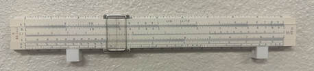
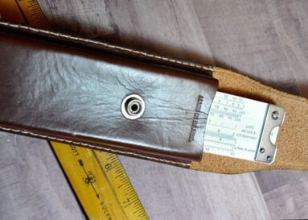
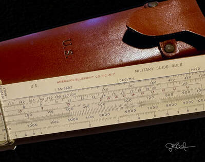
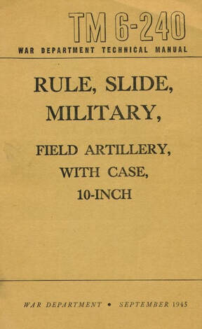
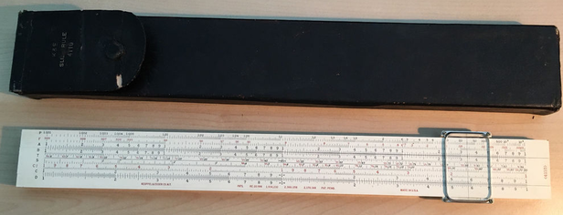
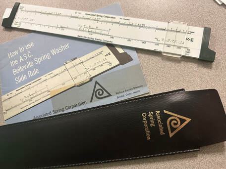
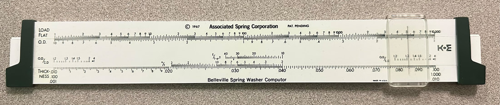
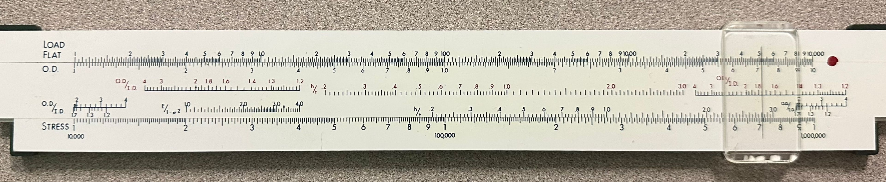
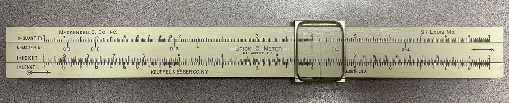

At this point, we turn to short-lived slide rules that never appeared in a K&E catalog.  Most such rules are custom-made in small quantities, therefore rare, and likely never meant to be offered for sale to the general public.  But K&E was often known to produce rules between catalog years that simply failed to sell for whatever reason, so it's difficult to know the intent of some of these slide rules.  What follows are descriptions of the rules, but also some interesting history worth exploring, though some of the descriptions are rather short due to the lack of information available.

### D4053-3 Government-Issue Rule

The author's D4053-3 rule, stamped "U.S. LUTZ" — the post-1962 government-resupply version discussed below.

In 1954, all versions of the Model 4053 Polyphase Mannheim took on **semi-plastic construction**, with the back of the rule completely laminated with celluloid as well. While the normal 4053 would drop the "N" prefix to reflect the major feature change, more plastic would be added over time, evolving to an all-plastic base in 1962, with typical celluloid-covered mahogany rails and slide. I mentioned earlier in Chapter 2 that K&E made a special government-use rule carrying the **Model D4053-3** designation beginning in 1954.

The "D" designation represented the decimal trig scales that had found it's way to the otherwise normal Model 4053 Polyphase rule — the Deci-Trig rules had already been around for some ~20 years. While I mentioned this rule when talking about the regular Model 4053, this "D" version is never mentioned in any catalog, and thus warrants inclusion here in Chapter 6.

Appearance-wise, this rule was either entirely normal except for the "D" designation, stamped "U.S." on the rule's body in one iteration, labelled "U.S. Government" in another version, and "US LUTZ" in the **Model D68-1617** version post-1962. Most such versions would come with a manual, magnifying cursor, and custom leather case to also accommodate the higher-profile cursor. The typical case was the same as provided with a stock 4053 rule sans any government-use identifiers. It is unknown at the moment of this writing if the packaging and documentation was customized.

A closer look at the leather case and identification tag of a U.S.-marked D4053-3.

It would appear that the rule was only ever intended for government use. Although versions of the "D" rule can be found without identifying U.S. government markings, it's unlikely that the rule was ever intended for general sale since it wasn't in a product catalog. My speculation (until shown wrong otherwise) is that early versions of the rule without government stamping gave way pretty quickly to those that would. Better said, all changes to the stock 4053 were on the slide, so the base of the rules, being identical, meant that manufacturing the D version of the rule just required a different slide. A short time after the "D" version appeared, it seems that K&E would add the additional "U.S." or "U.S. Government" stamp to the body of the rule.

In my mind, the real question is, why choose the Model 4503 as the base rule for supply to the government? Or better expressed, why not just use the 10" Model 4161-3 rule that was also introduced in 1954?

Remember that the all-plastic Modern Polyphase 4161-3 was already considered the evolution of the 4053 rule, with expanded Polyphase scale-set and at a heavy discount to the classic wooden 4053 rule. And importantly, the 4161 rule contained an ST scale in decimal degrees. Moreover, if you may recall, this rule was likely designed by US Naval Academy professors Kells, Kearn, and Bland, writers of that product manual! Now certainly, governments are seldom known for making good or efficient decisions, but why spend $13.50 per rule for a redesigned "D4053-3" when the $9.00 all-plastic 4161-3 rule was already available, one known about by certain government employees?

This is likely where the "LUTZ" stamped version of the D4053 rule comes into play. Remember that one?

LUTZ (always capitalized) is a label that appears on many tools supplied to the U.S. government, including compasses, drafting tools, and yes, even other slide rules. So it's clear that Lutz (not to be confused with the Lutz Tool Company) was a product supply/resupply vendor to the government, likely reselling post-1962 versions of the K&E rule. Understanding why Lutz would have chosen this same D4053-3 model to sell or why K&E opted to keep the decimal trig rule away from the general consumer public requires further research. But it's obvious that different government agencies under individual budgets and purposes would have differing needs. There would never be any reason to think there would be any consistency in what slide rules find their way into government use, particularly over decades of time.

### Model 4108 Military Rule

Part of the collection, the American Blueprint Company version of the K&E slide rule, made by K&E.

The distinguishing trait of this rule as compared with the previous government rule just discussed is that this slide rule is indeed for military-use. The **Model 4108 Military Rule** is one of four rules from various makers of very much the same design, made to provide artillery personnel during the World War II era with enough computational power to hit a target on a battlefield.

As for K&E's role in the rule's production, there is no doubt of their manufacturing behind two versions of the rule, one carrying K&E labelling (as the Model 4108) and another marked as offered by the "American Blueprint Co, Inc," also of New York (see above). But beyond it's manufacturer, there would be no other documentation by K&E for this rule, nor was it mentioned in any product catalog. The instruction manual was produced by the U.S Military, titled "[TM 6-240](http://www.mccoys-kecatalogs.com/KEManuals/TM6-240/TM6-240manual.htm), War Department Technical Manual, RULE, SLIDE, MILITARY." (Link to the manual courtesy of Clark McCoy at www.mccoys-kecatalogs.com).

K&E made the rules, yet the government provided the documentation. Image courtesy of Clark McCoy.

The third version of the rule is manufactured by Pickett, offered as a duplex rule in their larger format 2" (5.2 cm) aluminum rule known as the Model 14. This rule would be a feature the same features of the K&E version on the front side, yet making use of the rear with a full suite of general mathematics scales. It was only produced in their "ES" or eye-saver yellow color.

Yet a fourth version would appear to be Hemmi-made of typical celluloid-covered bamboo construction, yet it does not show any maker's marks. Unlike the 10" K&E-made rules, this Japanese make was 16" long.

The K&E and American Blueprint versions of the rule are quite identical, constructed of the same format and stock of the N4096 Merchant's desk rule and the Model 4110 Power Trig rule discussed next. Shorter than the N4096 but similarly adjustable, it's quite apparent that the two celluloid-laminated mahogany rules are of the same kinship despite being half the length. Both rules could have come with the same orange leather case labelled case with the U.S. marks on the front face of the leather. Alternatively, some models came in the less expensive, black, faux leather case, also with the U.S. marking.

The cursor of the K&E model 4108 is the typical K&E cursor of the era. It has been noted by some, including McCoy that the American Blueprint version of the rule also utilizes a K&E cursor, yet my same of that rule does not. It is clear that the cursor is made for the rule, yet there is a different dimension and look to the the cursor on my sample; a curious difference.

The rear side of both rules carry identical paper labels affixed just like any other single-sided Mannheim-formatted slide rule. Yet, this label used on both rules, containing right and oblique angle trigonometric formulas as well as a polar diagram for understanding directional bearing. It is doubtful that the rule was requisitioned for use with any specific equipment in mind, but rather to do computations related to field artillery surveys in general, as well as some basic arithmetic and trigonometric computations.

With that said, the scale set of the rule is as follows:

Front sideOpposite Angle Degs, Opposite Angle Mils [Apex Angle Mils, Apex Angle Degs, CI, C (BASE)] D (RANGE), K

Back of slide[TAN, SIN-TAN, SIN, C]

Gauge marksπ, e, //, /, 785, R

It has been speculated previously that the U.S. government kept Keuffel and Esser busy during the war with plenty of contracts. Yet, it's not clear how many were produced and to what extent. It is clear that serial numbers during the war and post-war years did not stray from it's linear production rates as noted by McCoy. The K&E rule does indeed carry the very typical serial number affixed to all celluloid and wood rules of the era.

McCoy speculates that the K&E model was likely the earliest version of the rule, while the other rules were likely made during the post-war years. In fact, the Pickett version of the rule is most certainly early 50s construction.

The relationship between K&E and the American Blueprint Company is unclear, but with both companies based in New York and both companies providing blueprinting services — K&E has been a leader in blueprinting from its inception — it would be worth some effort to figure out if they are linked by something other than this single slide rule.

### Model 4110 Power Trig

The Model 4110 Power Trig — picture courtesy eBay.

This interesting slide rule is built from a 1942 patient, licensed by K&E, and produced for a limited time in the early 1940s. Production of the slide rule predated the patent, as the 2,283,273 patent number is nowhere indicated on the actual slide rule. The rule does indicate "patent pending," however. The instruction manual of the **Model 4110 Power Trig** rule has a 1941 copyright date, which helps us confirm the production date.

This Model 4110 is often known as the **"Annapolis Rule"** for obvious reasons.

The Model 4110 was developed by three US Naval Academy professors, Lyman Kells, Willis Kearn, and James Bland, who also designed and wrote the manual for K&E's best selling **Model 4080** and **4081** slide rules. With those rules, the gentlemen entered a patent agreement with K&E, trading their rights to the design for upfront cash. But here, they would retain those rights. A fourth individual, John Tyler, is named on the aforementioned patent for this slide rule.

*Aside: This relationship of K&E with the military institution, beginning as early as 1935, is much more important than can be gleaned by all the minor, disparate sources that I can find. Between the Model 4080/81 rules, the several radio engineering rules, including the Cooke Radio Rule, and now this model, this association deserves more attention among K&E slide rule historians.*

Scales for the slide rule are front side only: P, F, A [B, T, S, CI, C] D. There is nothing on the back of the rule, not even a conversion table, nor are there any scales on the back of the slide. The trig scales are in degrees and minutes, so this is not a Deci-Trig rule. It is curious that the other rules involving the US Navy were instead Deci-Trig rules.

This Mannheim rule used the same oversized stock as the 4096M Merchant's rule — the handheld version — which was produced simultaneously. As such, it's also longer than a typical slide rule, with a 13" scale length. The extra length comes from using two decades worth of C and D scale. This is a strange feature, as the rule yields reduced resolution for multiplication and division, the equivalent of a 6.5" slide rule, in fact. However, this sacrifice is also the reason for both the "Power Trig" name and the patent, since the sine and tangent trigonometric functions now have greater range, capable of much finer outputs for small input angles, while doubling the effectiveness of the single S and T scales as compared to rules keyed to typical C and D scales. As such, it largely replaces the S, T, and ST scales on a traditional 10" slide rule, trading away some resolution for the simplicity of having the entire input range on single scales.

There is another noteworthy feature of the rule that you might have seen and that's the addition of F and P scales on the top stator. An F scale has been used before, denoting "frequency" in K&E's 4082 "Radio Special" rule (likely also a US Navy rule), and you no doubt notice that P scales ("Pythagorean") can be found on many European slide rules. But in this implementation, F and P is neither. Instead, these are log log scales, whereas P is for computing positive bases of exponentials and F is for negative bases. These are keyed off of the four-decade A and B scales. Doing so replaces the eight scales of a typical Log Log design. It's a tremendously space-saving and convenient feature; albeit, the reduction in resolution is significant. Quite elegant though! And an extra benefit was that inverses could be read directly off the F and P scales.

There are clearly two advantages to the rule's design, those being its ease of use, as well as its wonderful space efficiency. In the Model 4110, ease of use is certainly the primary reason for it's existence. But make no mistake, all of the typical computations normally performed on a 10" slide rule are significantly reduced in resolution. I feel that if this rule were implemented across 20" of real-estate, and maybe finely-divided to recover even more resolution, then the slide rule makes some sense, other than the undoubtedly exorbitant cost of such a rule.

As for space efficiency, the whole back of the slide was left blank. While folded scales were made obsolete by the double-decade main scales, and typical L and K scales are unnecessary on a rule where base 10 logs and cubes are performed more easily on the scales it has, then it wouldn't have made much sense to include them on the reverse of the slide. Just from the standpoint of design, it seems like a missing opportunity here. In keeping with the "Power Trig" name, why not add extra trig functionality? Maybe add an actual Pythagorean scale to the rule (which they never did on any rule) or maybe provide decimal trig scales on the back? A "Power Deci-Trig"?

Because this was built materially on the 20" 4096M Merchant's rule platform, which carried a heavy $15 price tag in 1939, we can begin to approximate a price for the Model 4110 despite it never appearing in a price list. We do know K&E never discounted their earlier wooden rules just because they were shorter. Production costs would have still been the same, as would the overall price; that is, if pricing history of the K&E Mannheim platform rules have taught us anything. Likewise, we know that certain rules that carried higher licensing costs (see the Log Log Duplex Vector) ultimately passed on that expense to the customer. The patent for this rule was owned by ***four*** individuals, all of which would have likely received a cut of the profits. As such, I would estimate the cost of the 13" Model 4110 Power Trig rule to be no less than $15, and very likely closer to $20. And in my mind, this would have priced the rule out of its intended market; that is, ***if such a market were consumers like you and me***.

Like the other slide rules designed and commissioned by the US Navy, this rule was never described in a K&E catalog, so it becomes difficult to know under what arrangements the rule was produced. But most certainly its production by K&E was very brief. A 1941 to 1942 production range seems likely. As a result, this is a rare slide rule today, scarce enough for one or two samples to be listed on eBay each year. Average price will be likely in the $150 to $200 range, assuming good condition.

Ultimately, the deficiencies of this rule are much ado about nothing, as it was apparently not intended for public sale. Or, in the least, K&E's decision to forego a patent agreement with Kells, Kearn, Bland, and Tyler might be all the indication we need as to the profit potential of such a slide rule? Given the success of the Log Log Duplex of the professors' design, certainly K&E would have pressed for a similar deal with the Model 4110 if they thought highly about the rule?

We do know that the Model 4110 was most certainly desired for use within its Academy, so in that way, perhaps, the rule might have been a success. Despite the rule being very interesting and potentially something that could have been refined into a desirable product, instead the "Power Trig" rule became a mere footnote to slide rule history.

And perhaps that is as it should be. If this had been brought to a general consumer market, especially for those who want a slide rule to do easier trigonometry, then I would have viewed the rule as a contradiction — appearing to be designed for people who want a simple, easy to use slide rule, yet costing more money than the vast majority of rules K&E made.

Some rules, like the Cooke radio rule, take on extra life as a consumer product after its private commissioning. In this case, I believe the Model 4110 slide rule was never considered for sale to the public, regardless of what the US Navy might have done with it. So its lack of appearance in a K&E product catalog should not be surprising. It does seem like a rule that when redesigned, would have been something people might have purchased, especially if it had been produced in the modern era with ultra-cheap, all-plastic construction.

I would have liked to have seen that slide rule.

### Belleville Spring Washer Computor

The Belleville Spring Washer Computor with its instruction booklet and Associated Spring Corporation case.

An interesting slide rule, commissioned by the Associated Spring Corporation and constructed by K&E in 1967, this **Belleville Spring Washer Computor** (sic), so named on the slide rule, is of the same construction as the K12-Prep rule made toward the end of the slide rule era. As such, it is nothing fancy, with the same vinyl-laminated, heat pressed plastic construction. The slide rule came with a black slip case, labeled with "Associated Spring Corporation," and a 13-page instruction booklet. These slide rules were provided to the engineers and customers of the company. It has scales useful for designing spring washers. The Associated Spring Corporation was located in Bristol, Connecticut.

There is no record of this slide rule in any K&E product catalog. As you might expect with a custom slide rule like this, it was never offered for public sale. A 1967 copyright pressed into the rule allows us to date it. It is doubtful that it was produced beyond 1967; likely a one-off production for that company.

The scale set is as follows:

Front SideLoad Flat [OD, OD/ID (2 scales), h/t, E/l-σ²] Thickness

Back SideLoad Flat [OD, OD/ID (4 scales), h/t, E/l-σ²] Stress

Scales on my sample of this rule are in black ink, though green could have been used in some samples, akin to the K12-Prep rule. My sample has some red scale values on the back of the slide, likely to help with readability.

The rule is rare, but not necessarily valuable, with a sample or two popping up yearly on eBay, to be bought for maybe $60 or $70. It is thought that by 1967, K&E was already seeing the writing on the wall regarding future slide rule sales, so perhaps it is not strange to think that rules based on K12-Prep pressed vinyl construction only surfaced with this one other rule. As we mentioned when talking about that rule, these were very cheap to make, with a high potential to be used in other slide rules. But alas, other than the Belleville Spring Washer Computor, it never happened.

Belleville Spring Washer Computor — Front.

Belleville Spring Washer Computor — Back.

### Brick-O-Meter

Here is a custom rule, commissioned by the Mackensen C. Co. Inc., with the purpose of allowing quick computations of the amount of a construction material needed for a job depending on square footage. Called the **Brick-O-Meter**, this 10" slide rule was built using the same white painted boxwood and black painted scales as the Model 4058W "Beginner's Rule." Cursor design and overall look corresponds to a 1938 to 1942 production date. It has no K&E model number, no serial number, and appears in no catalog. However, originally, it did come with 5 or 6 stapled pages worth of instructions wrapped around the rule in a black boxed case, identical to the 4058W rules of the time.

Scales on the rule are front side only:

Front sideQ-Quantity [M-Material, H-Height] L-Length

The L scale, which is essentially a D scale, and the H scale (inverted D scale), sets the size of what is to be covered, be it with bricks, tile, gypsum board, or any other material. This material is then lined up under the cursor on the M scale. The quantity required for that material would be read off the Q scale. The M or Material scale is interesting, with 7 marks for standard material sizes, which likely was customized to Mackensen needs. They are as follows:

- **C.B.** — For any material in one square foot size, like a 12"x12" or 8"x16" tile
- **B-2** — For a 2 brick thick wall (around 9") where there would amount to 13 standard sized bricks to a square foot
- **B-3** — For a 3 brick thick wall (around 12") where there would amount to 21 standard sized bricks to a square foot
- **T** — Stands specifically for "tile" sized for 2.2 units per square foot, such as a 5"x12" rectangular sized tile
- **G** — Smaller "Gypsum" tiles of the era, with 4 units within a 10 square foot area, with no waste allowed
- **F.L.** — For a standard sized brick laid flat; or approximately 4.5 bricks per square foot area, regardless of design and with no waste allowed
- **B-1** — For a 1 brick thick wall (around 4") where there would amount to 6.5 standard sized bricks to a square foot

The amount of a material read from the quantity scale accounts for the typical 3/8" to 1/2" mortar spacing and the approximate 20% overage/waste, which is typical in the industry. For the B-2 and B-3 readings, the value would be multiplied by the number of bricks used per square foot, which would need to be estimated if the brick's size is non-standard.

This is a very flexible rule in that there is plenty of clean white areas for the user to mark their own lines on the material scale. The rule would be useful in the modern era as well, especially for today's do-it-yourself home renovations, where DIYers might need help computing flooring materials.

The Brick-O-Meter is quite rare, coming up on eBay at a frequency of maybe once per year, usually with an average price approaching $100. This seems expensive, as materially it's the same rule as the 4058W rule which collectors wouldn't pay more than $5 for. But it is a unique rule and a rare K&E item with a interesting story.

The unique Brick-O-Meter in the author's collection.

### K&E Lumber/Construction Rule

🤖 AI-drafted &middot; unverified

<dl class="ke-ai-stub-facts">
<dt>What it is</dt>
<dd>A named-only entry in Jay's working list of out-of-catalog K&E custom rules — presumably a job-costing rule for the lumber/construction trade, in the same spirit as the Brick-O-Meter above, but for a different customer or material.</dd>
<dt>What it did</dt>
<dd>Not described anywhere in the surviving source material.</dd>
<dt>Approx. introduced</dt>
<dd>Unknown.</dd>
</dl>

This summary was generated by an AI assistant from the surrounding narrative (the Brick-O-Meter's construction-trade custom-rule pattern) and general knowledge of comparable rules, not from a verified first-hand source or sample. Treat every detail above as a starting point for research, not settled fact.

catalog image not yet sourced

Verify further: <a href="https://www.oughtred.org/">The Oughtred Society</a> &middot; <a href="https://www.sliderulemuseum.com/">International Slide Rule Museum (ISRM)</a>

### Beatley I-Q Slide Rule

🤖 AI-drafted &middot; unverified

<dl class="ke-ai-stub-facts">
<dt>What it is</dt>
<dd>A named-only entry in Jay's working list of out-of-catalog K&E custom rules, distributed or commissioned under the "Beatley" name.</dd>
<dt>What it did</dt>
<dd>Not described anywhere in the surviving source material.</dd>
<dt>Approx. introduced</dt>
<dd>Unknown.</dd>
</dl>

This summary was generated by an AI assistant from general knowledge of comparable custom-branded rules, not from a verified first-hand source or sample. Treat every detail above as a starting point for research, not settled fact.

catalog image not yet sourced

Verify further: <a href="https://www.oughtred.org/">The Oughtred Society</a> &middot; <a href="https://www.sliderulemuseum.com/">International Slide Rule Museum (ISRM)</a>

### Portland Cement Slide Rule

🤖 AI-drafted &middot; unverified

<dl class="ke-ai-stub-facts">
<dt>What it is</dt>
<dd>A named-only entry in Jay's working list of out-of-catalog K&E custom rules — likely a job-costing rule commissioned by a cement or concrete supplier, similar in purpose to the Brick-O-Meter above.</dd>
<dt>What it did</dt>
<dd>Not described anywhere in the surviving source material.</dd>
<dt>Approx. introduced</dt>
<dd>Unknown.</dd>
</dl>

This summary was generated by an AI assistant from the surrounding narrative (the Brick-O-Meter's construction-trade custom-rule pattern) and general knowledge of comparable rules, not from a verified first-hand source or sample. Treat every detail above as a starting point for research, not settled fact.

catalog image not yet sourced

Verify further: <a href="https://www.oughtred.org/">The Oughtred Society</a> &middot; <a href="https://www.sliderulemuseum.com/">International Slide Rule Museum (ISRM)</a>

### Reymond Leather Calculator

🤖 AI-drafted &middot; unverified

<dl class="ke-ai-stub-facts">
<dt>What it is</dt>
<dd>A named-only entry in Jay's working list of out-of-catalog K&E custom rules — likely a job-costing or measuring calculator commissioned by a leather goods or tanning trade customer.</dd>
<dt>What it did</dt>
<dd>Not described anywhere in the surviving source material.</dd>
<dt>Approx. introduced</dt>
<dd>Unknown.</dd>
</dl>

This summary was generated by an AI assistant from general knowledge of comparable trade-specific custom rules, not from a verified first-hand source or sample. Treat every detail above as a starting point for research, not settled fact.

catalog image not yet sourced

Verify further: <a href="https://www.oughtred.org/">The Oughtred Society</a> &middot; <a href="https://www.sliderulemuseum.com/">International Slide Rule Museum (ISRM)</a>

### Model 4104 20" Longscale

🤖 AI-drafted &middot; unverified

<dl class="ke-ai-stub-facts">
<dt>What it is</dt>
<dd>A K&E model number in Jay's working list of out-of-catalog rules, its "Longscale" name implying a general-purpose Mannheim-type rule extended to 20" for greater resolution, in the tradition of the N4096 Merchant's desk rule discussed elsewhere in this book.</dd>
<dt>What it did</dt>
<dd>Not described anywhere in the surviving source material.</dd>
<dt>Approx. introduced</dt>
<dd>Unknown — the 4XXX model number places it after K&E's 1901 renumbering, but that is the only chronological clue available.</dd>
</dl>

This summary was generated by an AI assistant from the model's own name and general knowledge of comparable long-scale K&E rules, not from a verified first-hand source or sample. Treat every detail above as a starting point for research, not settled fact.

catalog image not yet sourced

Verify further: <a href="https://www.oughtred.org/">The Oughtred Society</a> &middot; <a href="https://www.sliderulemuseum.com/">International Slide Rule Museum (ISRM)</a>

### K&E Planer Slide Rule

🤖 AI-drafted &middot; unverified

<dl class="ke-ai-stub-facts">
<dt>What it is</dt>
<dd>A named-only entry in Jay's working list of out-of-catalog K&E custom rules, likely a trade rule for planer-mill or woodworking calculations. A Journal of the Oughtred Society article appears to cover this rule directly (linked below), but its content could not be extracted for this summary.</dd>
<dt>What it did</dt>
<dd>Not confirmed here — see the linked JOS article for a primary-source treatment.</dd>
<dt>Approx. introduced</dt>
<dd>Unknown.</dd>
</dl>

This summary was generated by an AI assistant without being able to read the linked source article, not from a verified first-hand source or sample. Treat every detail above as a starting point for research, not settled fact.

catalog image not yet sourced

Verify further: <a href="https://osgalleries.org/journal/displayarticle.cgi?match=6.1/V6.1P25.pdf">Journal of the Oughtred Society, V6.1 p.25</a> &middot; <a href="https://www.oughtred.org/">The Oughtred Society</a> &middot; <a href="https://www.sliderulemuseum.com/">International Slide Rule Museum (ISRM)</a>

### M4 and M16 Graphical Firing Table

🤖 AI-drafted &middot; unverified

<dl class="ke-ai-stub-facts">
<dt>What it is</dt>
<dd>A named-only entry in Jay's working list of out-of-catalog K&E rules. "Graphical Firing Tables" were general U.S. Army artillery aids of the WWII/Korean War era, distinct from circular slide-rule-style computers like the M4/M16 Flash Ranging and gunnery devices used alongside them — it isn't confirmed here which specific device K&E's version corresponds to.</dd>
<dt>What it did</dt>
<dd>Not described anywhere in the surviving source material beyond its military artillery-computation context.</dd>
<dt>Approx. introduced</dt>
<dd>Likely WWII-era, based on the general use of graphical firing tables during that period, but not confirmed for this specific K&E item.</dd>
</dl>

This summary was generated by an AI assistant from general knowledge of WWII-era U.S. Army artillery computing aids, not from a verified first-hand source or sample. Treat every detail above as a starting point for research, not settled fact.

catalog image not yet sourced

Verify further: <a href="https://www.oughtred.org/">The Oughtred Society</a> &middot; <a href="https://www.sliderulemuseum.com/">International Slide Rule Museum (ISRM)</a>

### E-6B Aerial Dead Reckoning Computer

🤖 AI-drafted &middot; unverified

<dl class="ke-ai-stub-facts">
<dt>What it is</dt>
<dd>A named-only entry in Jay's working list of out-of-catalog K&E rules. The E-6B is a famous circular slide-rule-style aviation navigation computer, originally designed by Philip Dalton in the 1930s and produced by many manufacturers for military and civilian pilots; it isn't confirmed here whether K&E manufactured its own E-6B or simply distributed one made elsewhere.</dd>
<dt>What it did</dt>
<dd>In general, E-6B computers solve dead-reckoning navigation problems — wind correction, groundspeed, fuel burn, and time/distance/speed calculations — using a circular slide rule on one face and a sliding wind-correction grid on the other. Whether K&E's specific version matched this standard design isn't confirmed here.</dd>
<dt>Approx. introduced</dt>
<dd>The E-6B design itself dates to the 1930s and remained in wide production through WWII and beyond; K&E's own production dates are not confirmed here.</dd>
</dl>

This summary was generated by an AI assistant from general knowledge of the well-documented E-6B design, not from a verified first-hand source or sample of K&E's specific version. Treat every detail above as a starting point for research, not settled fact.

catalog image not yet sourced

Verify further: <a href="https://www.oughtred.org/">The Oughtred Society</a> &middot; <a href="https://www.sliderulemuseum.com/">International Slide Rule Museum (ISRM)</a>

### Syrup Rule

🤖 AI-drafted &middot; unverified

<dl class="ke-ai-stub-facts">
<dt>What it is</dt>
<dd>A named-only entry in Jay's working list of out-of-catalog K&E custom rules — likely a trade rule commissioned for the food/syrup processing industry, in the same spirit as the Brick-O-Meter and other named-customer rules in this chapter.</dd>
<dt>What it did</dt>
<dd>Not described anywhere in the surviving source material.</dd>
<dt>Approx. introduced</dt>
<dd>Unknown.</dd>
</dl>

This summary was generated by an AI assistant from the rule's name and general knowledge of comparable trade-specific custom rules, not from a verified first-hand source or sample. Treat every detail above as a starting point for research, not settled fact.

catalog image not yet sourced

Verify further: <a href="https://www.oughtred.org/">The Oughtred Society</a> &middot; <a href="https://www.sliderulemuseum.com/">International Slide Rule Museum (ISRM)</a>

### Fetal Medical Slide Rule

🤖 AI-drafted &middot; unverified

<dl class="ke-ai-stub-facts">
<dt>What it is</dt>
<dd>A named-only entry in Jay's working list of out-of-catalog K&E custom rules. Obstetric/gestational calculators (sometimes called "pregnancy wheels") were a common genre of circular slide rule used by physicians to estimate due dates and fetal development milestones — it isn't confirmed here whether K&E's version matches that genre or another medical use.</dd>
<dt>What it did</dt>
<dd>Not described anywhere in the surviving source material beyond the "Fetal Medical" name.</dd>
<dt>Approx. introduced</dt>
<dd>Unknown.</dd>
</dl>

This summary was generated by an AI assistant from the rule's name and general knowledge of comparable medical calculators, not from a verified first-hand source or sample. Treat every detail above as a starting point for research, not settled fact.

catalog image not yet sourced

Verify further: <a href="https://www.oughtred.org/">The Oughtred Society</a> &middot; <a href="https://www.sliderulemuseum.com/">International Slide Rule Museum (ISRM)</a>

### Albert J. Smith TimeSlide Calendar Rule

🤖 AI-drafted &middot; unverified

<dl class="ke-ai-stub-facts">
<dt>What it is</dt>
<dd>A named-only entry in Jay's working list of out-of-catalog K&E rules, apparently a calendar/date-calculation slide rule associated with an "Albert J. Smith" name — possibly the rule's designer, patent holder, or commissioning customer.</dd>
<dt>What it did</dt>
<dd>Not described anywhere in the surviving source material beyond the "TimeSlide Calendar Rule" name, which suggests a device for calculating dates or elapsed time.</dd>
<dt>Approx. introduced</dt>
<dd>Unknown.</dd>
</dl>

This summary was generated by an AI assistant from the rule's name alone, not from a verified first-hand source or sample. Treat every detail above as a starting point for research, not settled fact.

catalog image not yet sourced

Verify further: <a href="https://www.oughtred.org/">The Oughtred Society</a> &middot; <a href="https://www.sliderulemuseum.com/">International Slide Rule Museum (ISRM)</a>

### Short Base Triangulation Rule

🤖 AI-drafted &middot; unverified

<dl class="ke-ai-stub-facts">
<dt>What it is</dt>
<dd>A named-only entry in Jay's working list of out-of-catalog K&E rules, presumably a surveying aid related in purpose to the Stadia Family of rules covered in Chapter 4 — used for computing distances via short-base triangulation methods rather than stadia-interval methods.</dd>
<dt>What it did</dt>
<dd>Not described anywhere in the surviving source material.</dd>
<dt>Approx. introduced</dt>
<dd>Unknown.</dd>
</dl>

This summary was generated by an AI assistant from the rule's name and general knowledge of comparable surveying rules, not from a verified first-hand source or sample. Treat every detail above as a starting point for research, not settled fact.

catalog image not yet sourced

Verify further: <a href="https://www.oughtred.org/">The Oughtred Society</a> &middot; <a href="https://www.sliderulemuseum.com/">International Slide Rule Museum (ISRM)</a>

### Model 4010 Stima Calculator

🤖 AI-drafted &middot; unverified

<dl class="ke-ai-stub-facts">
<dt>What it is</dt>
<dd>A K&E model number in Jay's working list of out-of-catalog rules, named the "Stima Calculator" — the low 4010 model number suggests an early-1900s designation, possibly reused or reassigned later, similar to how the Model 4095 designation was reused decades apart between the Triangular Metal Rule and the Merchant's family (see Chapter 5).</dd>
<dt>What it did</dt>
<dd>Not described anywhere in the surviving source material.</dd>
<dt>Approx. introduced</dt>
<dd>Unknown.</dd>
</dl>

This summary was generated by an AI assistant from the model number and general knowledge of K&E's numbering conventions, not from a verified first-hand source or sample. Treat every detail above as a starting point for research, not settled fact.

catalog image not yet sourced

Verify further: <a href="https://www.oughtred.org/">The Oughtred Society</a> &middot; <a href="https://www.sliderulemuseum.com/">International Slide Rule Museum (ISRM)</a>

### K&E Chemco

🤖 AI-drafted &middot; unverified

<dl class="ke-ai-stub-facts">
<dt>What it is</dt>
<dd>A 20" mahogany rule with a white celluloid face, K&E logo stamped on the front, alongside markings for "Chemco Photoproducts Company Ltd, Glen Cove NY" and a "Copyright 1950" date. Scale set: A=B C [P, L] — the A and B scales run from 1 to 50, the folded P scale runs from 6 to 300, the folded L scale runs from 14 to 700, and the folded C scale runs from 10 to 100 relative to A and B.</dd>
<dt>What it did</dt>
<dd>Listed for "Photography" use, but the exact application isn't explained in the source record — the OS Galleries donor notes they could not find any other mention of the rule and were unsure of its precise purpose.</dd>
<dt>Approx. introduced</dt>
<dd>Circa 1950, per the copyright date stamped on the rule.</dd>
</dl>

This summary was generated by an AI assistant from the OS Galleries "Full Details" database record for this item (donated by collector Wayne Harrison, rated "RRRR" — extremely rare), not from Jay's own collection, handling, or writing. Treat every detail above as a starting point for research, not settled fact.

catalog image not yet sourced

Verify further: <a href="https://osgalleries.org/os/fulldetails.cgi?match=404">OS Galleries record</a> &middot; <a href="https://www.oughtred.org/">The Oughtred Society</a> &middot; <a href="https://www.sliderulemuseum.com/">International Slide Rule Museum (ISRM)</a>

### American Optical Company

🤖 AI-drafted &middot; unverified

<dl class="ke-ai-stub-facts">
<dt>What it is</dt>
<dd>The <strong>Dr. Prince Refracting Rule</strong>, made by K&E for the American Optical Company — a 48 cm (19") solid boxwood or pearwood rule with no slider, its logarithmic scales fixed rather than sliding. Front scales cover age-in-years and dioptric correction; the back carries instructions.</dd>
<dt>What it did</dt>
<dd>Used by opticians for eye examinations, before being made obsolete by electronic equipment. Further detail reportedly appears in the <em>Journal of the Oughtred Society</em>, Vol. 17, No. 2 (2008), p. 28, "Dr. Prince's Refracting Rule Made by K&E" — not itself consulted for this summary.</dd>
<dt>Approx. introduced</dt>
<dd>Sometime between 1920 and 1950, per the OS Galleries record's estimated manufacture range.</dd>
</dl>

This summary was generated by an AI assistant from the OS Galleries "Full Details" database record for this item (donated by collector Clay Castleberry, rated "RRR" — very rare), not from Jay's own collection, handling, or writing. Treat every detail above as a starting point for research, not settled fact.

catalog image not yet sourced

Verify further: <a href="https://osgalleries.org/os/fulldetails.cgi?match=374">OS Galleries record</a> &middot; <a href="https://www.oughtred.org/">The Oughtred Society</a> &middot; <a href="https://www.sliderulemuseum.com/">International Slide Rule Museum (ISRM)</a>

[Back to All About Keuffel & Esser Rules](/sliderules/all-about-ke-rules/)
