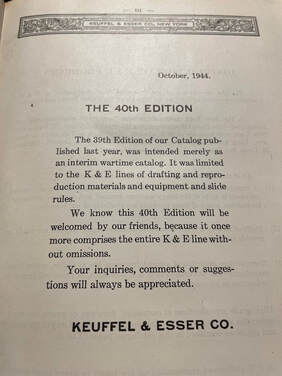

K&E rules are the most numerous in my collection, and this chapter is my attempt to catalog them properly, one entry per rule (or closely related set of samples), organized the same way as the rest of this book: Single-Sided Mannheim, Double-Sided Duplex, Specialty, Miscellaneous, and Out-of-Catalog/Custom. Click a rule's name to expand it and see its photo and story. Many of these entries repeat and condense stories already told in earlier chapters; a few are only mentioned here for the first time.

This chapter is a living framework. Every rule below already has a first-hand write-up, since I've built the list so far from what I've already documented elsewhere in the book. But my actual collection is considerably larger than what's written up here, so expect this catalog to keep growing.

## Single-Sided Mannheim

Tavernier-Gravet Mannheim Rule (10")

The 10" Tavernier-Gravet Mannheim rule in my collection, likely a strong match for what K&E's earliest Model 479-2 looked like.

Before K&E built rules in-house, they outsourced their first slide rules, likely from the French maker Tavernier-Gravet. No genuine Model 479 has ever resurfaced, so this un-badged T-G Mannheim rule in my collection — brass chisel indicator and all — is the best physical stand-in we have for what that first K&E-sold rule probably looked like, possibly as early as 1883.

K&E "Favorites" — Models 4054 &amp; 4056 (boxwood editions)

A 4054 Favorite rule in my collection from approximately 1915 — exceptionally rare in its original boxwood form.

The budget "Favorite" line sold alongside the flagship 4041 Mannheim, and the original boxwood versions of the 4054 and 4056 are genuinely hard to find, since most survivors in the wild are the later, more common mahogany Polyphase versions. My 4054 sample dates to around 1915 and cost less than $20 — a keen-eyed bargain, since it's easy to mistake for one of the ordinary later rules. I also hold a bare, "polished" boxwood 4056, the even more budget of the two original Favorite models.

K&E Beginner's Family — Model 4058 Series (4058C &amp; 4058W)

I own two 4058C samples from 1930–1935 — bare wood with printed scales and a glass cursor on wooden rails — which still function beautifully 90 years on; in my opinion, this is the version K&E should have made all along. I also hold several 4058W samples from the 1940s–50s, and those have fared far worse: the white-painted wood is soft enough to dent with a fingernail, and most of mine have warped into unusability. Between the two, it's a small case study in how K&E's budget "Student's" line quietly declined in wood quality over the decades.

K&E Model 4098A Pocket Slide Rule

My sample of the Model 4098A pocket rule, in very good condition for what it is.

A thin, all-Xylonite pocket Mannheim rule that became K&E's cheapest slide rule after the 4058 Student's line, priced at $1.75 when it split off from the Ever-There series in 1936. My sample carries black-only ink, which — cross-referenced against other known serial numbers — helps date the switch away from red-and-black printing to around 1940. It was the last true Mannheim-scale rule left in the K&E lineup by the time it was discontinued in 1953.

N4053 Polyphase Mannheim Collection (8", 10", &amp; 20")

Part of the collection: 8", 10", and 20" versions of the N4053 Polyphase Mannheim.

The 4053 Polyphase Mannheim was K&E's least-changed model over its entire run — essentially a 4041 with a K scale and a CI scale added — and one of their most enduring products, produced continuously from 1909 all the way to 1975 in one form or another. I've collected the family across its three principal lengths, shown here side by side: the 8" N4053-2, the standard 10" rule, and the full 20" version.

## Double-Sided Duplex

K&E Model 4092 / 4092-3 Log Log Duplex (four samples)

I own four samples spanning the evolution of K&E's first flagship duplex rule: two "original" 4092s from around 1920, before the dash-suffix length designation existed, and two 4092-3s from 1933 and 1934, made after K&E switched to a sans-serif font and fully laminated edges in 1927. The later pair are among my favorite slide rules to actually use — the 4cm-wide body and uncluttered scale arrangement of this family just feel right in the hands.

K&E Model 4088-1 &amp; Model 4090-3 (edge-delamination pair)

Delamination at the edges, as shown with the 4088-1 and 4090-3 rules in my collection.

A 5" Polyphase Duplex (4088-1) and a 10" Log Log Duplex Trig (4090-3), the latter from the short-lived 1933–1937 trig-scale redesign. I keep this pair together as a cautionary example of celluloid edge lamination failing over time — likely part of why K&E abandoned full-edge lamination for inlaid celluloid strips in 1952.

K&E Model 4080/4081 Log Log Duplex Trig &amp; Deci-Trig

Two rules from my collection, the 4080-5 Trig and 4081-5 Deci-Trig, top and bottom respectively.

K&E's most successful duplex line, often called the standard-bearer of general-purpose slide rules. I own a matched 20" Trig/Deci-Trig pair (pictured) as well as an additional 10" set, useful for visually demonstrating the only real difference between the two: how finely the trig scales are divided — sixths of a degree on the Trig, tenths on the Deci-Trig.

K&E Model 4083 Log Log Duplex Vector (10" &amp; 20")

Two of the Log Log Duplex Vector rules in my collection — a pre-1952 10" rule and a c. 1962 20" rule.

The hyperbolic-trig "Vector" duplex rule, born from a patent-royalty dispute with Louis Weinbach that's a story unto itself. I hold a 10" sample from just before the 1952 move to inlaid celluloid edges, and a 20" sample from around 1962 — enough of a spread to see the 1954 scale revision and 1955 SRT-scale relabeling play out across my own rules.

K&E Model 9071-3 Polyphase Duplex Doric

The Model 9071-3 Polyphase Duplex Doric, acquired for the collection in 2023.

A genuinely rare plastic Doric-family rule, never described in an actual K&E catalog — only in a 1949 parts list — and likely produced for just two or three years around 1947–1949. I picked this one up in 2023; it typically runs about $25 when it shows up at all, though good samples have become harder to find in recent years.

K&E Doric Family Duplex Group (N9081-3, 4168 Celcon, 9068/4168, 4150-1)

Pictured top to bottom: the N9081-3, the 4168 Celanese Celcon (originally the 9068), the 4168 Polyphase Duplex (also the 9068), and the 4150-1 Merchant's Pocket Rule (formerly the 9050-1).

Four of the small run of "Doric" plastic rules K&E briefly badged with a 9XXX model number starting around 1948, before folding most of them back into the 4XXX naming scheme. The N9081-3 is a full plastic Doric conversion of the flagship Log Log Duplex Deci-Trig scale set; the 4168 pair are two takes on the little 5" pocket duplex that outlived every other Doric model, including a one-year-only (1968) green "Celcon" resin variant made for the Celanese Company; and the 4150-1 is the Doric-era Merchant's pocket rule. I'm still hunting for the 9071-3 and 9061-1 to round out the full known Doric family.

K&E Deci-Lon 10 (68-1100)

One of my many Deci-Lon 10 samples.

Widely considered — by me included — the best general-purpose slide rule K&E ever made: 26 scales on an angular, all-Ivorite duplex body. I own seven samples, never having paid more than $30 for any of them, which has let me track a running production change in the slide's tongue-and-groove joint that determines whether the slide can be flipped end-for-end.

K&E Deci-Lon 5 (68-1300)

One of my Deci-Lon 5 pocket rules.

The pocket sibling of the Deci-Lon 10, and quite possibly the best pocket slide rule ever made — futuristic-looking, full of irony given it's also one of the last rules K&E ever produced. I hold two dated samples (serial numbers 011482 and 021968) that happen to bracket a running change to the slide's joint, letting me pin down roughly when K&E stopped allowing the slide to be inverted.

K&E Model GP-12 (68-1565)

From my collection, the K&E GP-12, front side.

A curious "simplex" rule — duplex construction with plastic end brackets, but printed for one-sided use — whose back doubles as both a log-scale calculator and an inch/centimeter ruler. At $6.50 in 1968, it struck me as a lot of capability for the price when I first came across mine.

## Specialty

K&E Merchant's Mannheim &amp; Duplex (4094 &amp; 4095-3)

The Model 4094 Merchant's Mannheim and its duplex sibling, the Model 4095-3, both from my collection.

Two takes on the same simplified Merchant's scale set — multiplication, division, and proportions only, aimed at businessmen and accountants rather than engineers. The 4094 is a standard single-sided Mannheim build; the 4095-3 puts the same idea in duplex form, trading its front CI scale for a mostly blank back panel that K&E left open for owners to mark their own gauge points.

K&E Model 4096M Merchant's Desk Rule (hand-held)

A hand-held version of K&E's 20" Merchant's desk rule, introduced in 1939 minus the desk model's metal stands and slide knob. My sample carries a 1938 serial number — a year before its official May 1938 price-list debut — which is a good reminder that a rule's first catalog appearance isn't always a reliable production date.

K&E Model N4101 Stadia Surveyor's Rule (20")

The 20" N4101 Stadia Surveyor's Rule, a mint find with its original case.

Part of K&E's longest-running product line (1901–1960 in various forms), this 20" single-sided stadia rule of mine dates to 1943 and still carries a U.S. Geological Survey asset sticker on the back — a small, documented piece of wartime federal surveying history, and one I stumbled onto in near-mint condition with its original case.

K&E Model 4143 Kissam Stadia

The Model 4143 Kissam Stadia in my collection, likely purchased around 1962.

The all-plastic spiritual successor to the Model 4100 Stadia, named for Princeton surveying professor Phillip Kissam, trading general-math capability on the back of the slide for an expanded R1/R2 scale set. My sample still has its slide, plastic instructional insert, and case intact, right down to the maker's marks in the slide well.

K&E Model N4102 Surveyor's Duplex

My sample of the N4102 Surveyor's Duplex, as displayed on my classroom wall.

A 20" duplex rule unique for pairing traditional stadia-reduction scales with astrometric scales for computing true north from a solar transit observation. My 1937-dated sample was an auction find for under $100 — well below the $400+ this rule usually commands on eBay — with a cracked cursor rail repaired with cyanoacrylate glue, a common failure of rules from that era.

K&E Model 4133 Roylance Electrical

The Model 4133 Roylance sample in my collection.

An 8" single-sided rule for electrical infrastructure work, built on the 4035 Mannheim frame with a Brown &amp; Sharpe wire-gauge scale and a distinctive three-hairline cursor for direct circle-area computation. My sample has an unusual back-of-bottom-stator celluloid centimeter strip — as far as I know, the only known instance of that feature on a single-sided wooden Mannheim rule.

K&E Model 4082-3 Radio Special

The Model 4082-3 "Radio Special" within my collection.

A rare, never-cataloged rule built on the 4081 Log Log Duplex Deci-Trig with an added "F" (frequency) scale for reactance calculations, believed to have been developed for the U.S. Naval Academy. My sample is the second, post-1939 variant, and its serial number dates it to 1941.

K&E Model 4139 Cooke Radio Rule (two samples)

The front side of my more recent Cooke Radio sample, with a 1954 serial number.

K&E's longest-enduring electronics rule, designed by Navy Chief Radio Electrician Nelson Cooke. I own two samples spanning nearly the rule's full production run: an early one with an unusually early 1938 serial number, and this 1954 example, showing the later exposed-mahogany-edge construction and rounded "Cooke Radio" emblem.

K&E Model 68-1929 Deci-Lon Classroom Demonstrator

My Model 68-1929 Deci-Lon Demonstrator, a 6.5-foot redwood rule, hanging in my classroom.

A 6.5-foot redwood classroom demonstrator modeling the full Deci-Lon 10 scale set, with a gravity-held plexiglass cursor rather than the real rule's Ivorite construction. I found this one on Craigslist in Austin — it still carries a Mineola ISD metal asset-inventory tag — and it hangs proudly in my own classroom today.

## Miscellaneous

Thacher Calculator (K&E Model 4012, Type II)

The Model 4012 Thacher Calculator in my collection, serial number 2758.

A monumental cylindrical calculator — a 4" diameter, 18"-long rotating drum bearing the equivalent of an 80" logarithmic scale — and one of the most historically significant analog computers K&E ever sold. My sample, serial number 2758 (c. 1910–1912), came through the F. Weber Co. of Philadelphia and is in unusually good condition, box-jointed mahogany case included.

Fuller Calculator — Model 1

The Fuller Calculator "Model 1" from the collection. Serial number 11376, made in 1954.

A cylindrical spiral slide rule with an effective 500-inch scale wound around a rotating papier-mâché sleeve — made entirely by Stanley Ltd. and only ever cataloged, not manufactured, by K&E. My sample, serial number 11376, dates to 1954.

Fuller Calculator — Model 2

The Fuller Calculator "Model 2" from the collection. Serial number 12165, made in 1957.

The other Fuller variant in my collection, distinguished from Model 1 by an added sine scale on its fixed inner cylinder. My sample, serial number 12165, dates to 1957, from very late in the device's decades-long production run.

Charpentier Calculator (calculimètre)

My own Charpentier calculimètre sample, missing its fob.

K&E's only circular slide rule ever offered — a nickel-plated, pocket-watch-sized device with a full Mannheim-equivalent scale set. My sample, acquired in July 2024, is smaller than you'd expect at just 6 cm across, and is missing the fob that would otherwise lock the slide in place, leaving it stiffer to operate than it should be.

K&E Model 4095 Triangular Metal Rule (4th known sample)

The 4th known sample of the Model 4095 Triangular Metal Rule, recently added to the collection.

An extraordinarily rare 10" German-silver rule from 1901–1903 — only about four samples are known to exist — with a solid triangular prism sliding inside a hollow outer shell and three distinct hand-etched scale sets across its faces. Mine is the 4th known sample, found on eBay, missing its cursor; I'm weighing whether to hand-fabricate or 3D-print a replacement based on the original 1898 patent drawing.

## Out-of-Catalog / Custom

D4053-3 Government-Issue Rule

My D4053-3 rule, stamped "U.S. LUTZ" — the post-1962 government-resupply version.

A decimal-trig government version of the 4053 Polyphase Mannheim, never mentioned in any K&E catalog. My sample carries the "U.S. LUTZ" stamp — LUTZ being a government resupply vendor, not to be confused with the unrelated Lutz Tool Company — placing it in the post-1962 production window. See Chapter 6 for the full story of why K&E built a decimal-trig government rule instead of just supplying the cheaper 4161-3.

Model 4108 Military Rule

The American Blueprint Company version of the K&E slide rule, made by K&E, part of my collection.

One of four WWII-era artillery rules of near-identical design from different makers. My sample is the version badged for the American Blueprint Co. of New York rather than K&E directly, though it was manufactured by K&E on the same stock as the N4096 Merchant's desk rule and Model 4110 Power Trig. See Chapter 6 for the fuller story of this rule's murky relationship between K&E, the U.S. military, and American Blueprint.

Belleville Spring Washer Computor

My Belleville Spring Washer Computor, with its instruction booklet and Associated Spring Corporation case.

A custom rule commissioned by the Associated Spring Corporation in 1967 for designing spring washers, built on the same cheap vinyl-laminated, heat-pressed plastic construction as the K12-Prep. My sample retains its black slip case and 13-page instruction booklet, and never appeared in any K&E product catalog.

Brick-O-Meter

My Brick-O-Meter, a unique custom K&E rule for computing construction materials.

A custom rule commissioned by the Mackensen C. Co. Inc. for quickly computing brick, tile, or gypsum board quantities against a job's square footage, built on the same white-painted boxwood stock as the 4058W Beginner's Rule. No K&E model number, no serial number, no catalog appearance — just a rare and delightfully specific piece of trade history.

[Back to All About Keuffel & Esser Rules](/sliderules/all-about-ke-rules/)
