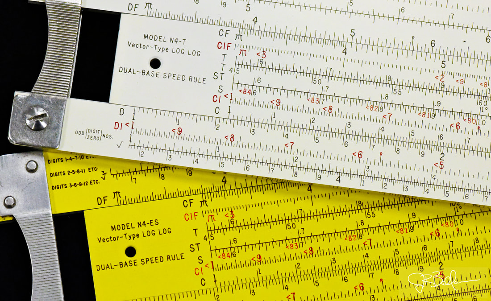
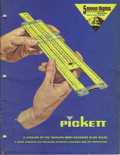
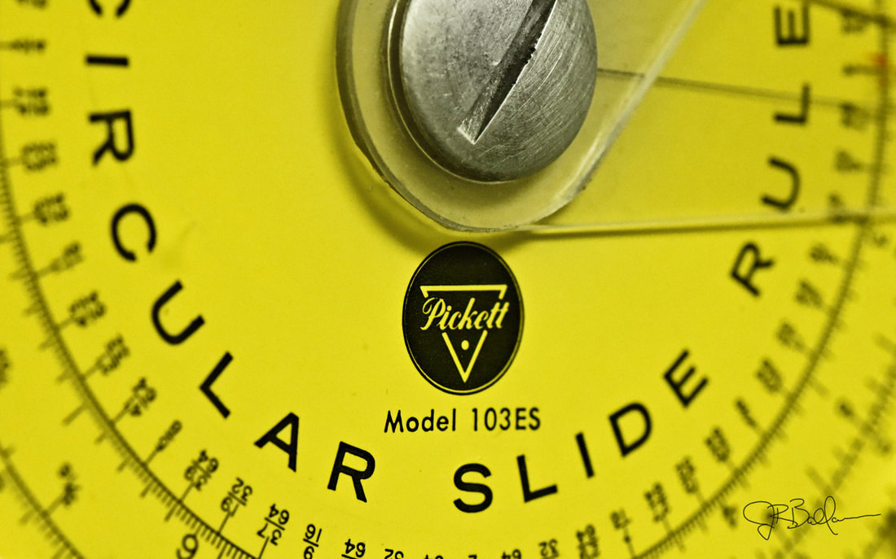
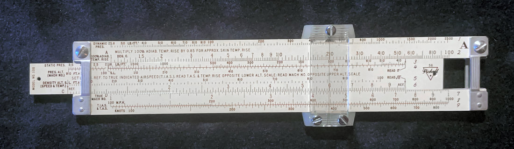
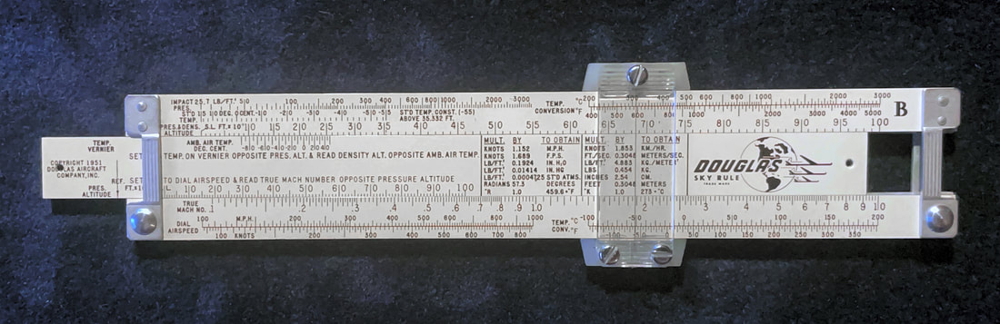

Many people have a love or hate relationship with Pickett slide rules. This is because they are the only major maker who made them out of metal, almost exclusively. Early slide rules, beginning in post-war 1945 - rather late compared to most other major makers - used magnesium for their construction. But over a short time, remarkably within a decade of their introduction, the corrosive nature of that metal forced Pickett to shift entirely to aluminum. By the end of the slide rule era (EoE) in the early 1970s, Pickett had gone to plastic for their budget/student rules (as did most makers), whereas the photo-lithographed aluminum were reserved for their more powerful slide rules.

Among the aluminum rules, Pickett typically made them in two colors...a white rule designated with a "T" at the end of the model number, and an "eyesaver" yellow rule designated as "ES". For example, the powerful N4 "VectorLog" slide rule had either N4-T (white) or N4-ES (yellow) models. If a smaller "pocket" rule version exists of a model, they typically append the letter "P" in the designation, such as the N4P-T slide rule, which would be Pickett's white "pocket" rule.

Furthermore, if the same rule went through refinements or enhancements without necessitating a new model, then Pickett would designate this "new" version of the rule by use of "N" before the number. As such, the N4-ES slide rule was preceded by the "Model 4-ES." For the most part, non-N varieties are the magnesium predecessors. However, some of the product lines had a transitional model, often made of thicker aluminum, around 1950. But at some point shortly thereafter, Pickett settled on standardized thickness for their aluminum rules, which is remarkably consistent over the company's last 25 years or so.

Most Pickett low-budget rules and their lower-cost aluminum rules included a plain plastic slip case and "how to use" instruction booklet. The powerful (expensive) rules, as well as many of the specialty rules, gave buyers an upgrade to a nice leather case.

In the 60s and 70s, Pickett did shift most of their student slide-rules to plastic. These are good slide rules, but are rather unremarkable. These rules typically have model numbers between 115 to 160. As a high school Precalculus teacher, I give many of these rules to my own students today to encourage further investigations, having first earned them by doing an extra-credit research project.

To be certain, I find the typical aluminum Pickett rule to be less enjoyable to use than competitor rules made of wood or high-grade plastic. They feel cold in my hand and I find them somewhat hard to read, which is an emotion found among many collectors. The lithographic type also doesn't endure as well over time and with regular usage, as many samples will be faded or rubbed-away.

Pickett was widely known for producing a variety of custom slide rules for a variety of clients. As such, there is a remarkable array of "specialty" rules that can be found which, in my mind, is the best part about collecting Pickett rules today. This is made possible because almost every metallic rule is the same, except for what is printed on the rule. As such, once the photographic master is created, any number of rules can be quickly and cheaply printed. So if a client wanted a custom-rule made, Pickett could do so in a short run without too much extra expense. In my collection, we will see that most of the larger custom rules like this, particularly the ones with the most value today, will be found within the range of rules between models 5 and 19. A collection with most or ALL of those models will be truly outstanding.

Dating Pickett rules is also difficult to accomplish, as they did not change their rules at all over extended periods (typically 4 to 8 years), nor did they use serial numbers. The best we can do is to identify a slide rule to one of maybe seven distinct eras of the company based on changes to the Pickett logo (on the rule) as well as the evolution of slide rule construction and materials. Likewise, the designs of the cursors and end-brackets over time can yield some enlightenment. As such, I will date them between a certain range of years based on these features.

But the sheer number of Pickett rules and the stories they tell really make them one of my favorite slide rule brands to collect. I have some Pickett rules that nobody else seems to possess, even among the most avid collectors today. I find stumbling across such treasures to be very satisfying.

## General-Purpose Rules

Here are Pickett slide rules that allow for basic to complex evaluation of mathematical computations and functions. I will also include "engineering" rules here, since that designation typically includes hyperbolic trig scales which, as far as I'm concerned, is still computational mathematics; however, where that applies, I will make note of that.

### Full-Scale Rules
- N4-T Vector Hyperbolic Dual Base Log Log
- N4-ES Vector Dual Base Log Log
- N3-ES Power Log Exponential
- N500-ES Hi-Log Log Duplex
- N902-ES Simplex Trig
- Model 1000 Ortho-Phase Duplex
- N1010-ES Trig Duplex
- N1010LS-ES Super Power Trig
- Model 2 Deci Log Log Duplex
- Model 902 Simplex Trig
- N1010-T Trig Duplex
- N901-ES Simplex
- N903-ES Trig and Conversion
- N909-ES Simplex Trig with Metric Conversion
- Model 4 Vector Hyperbolic Deci Log Log
- Model 800 Log Log Duplex
- Pickett B1 Bamboo Rule

### Pocket Rules
- N600-ES Log Log Duplex
- N300-T Log Log Duplex
- N200-T Trig
- N1006-ES Duplex Trig
- Model 20 Basic
- N4P-ES Vector-Type Log Log Duplex

### Circular Rules

- 111-ES Circular
- Model 101-C Dial-Rule Circular
- 110-ES Circular
- 108-ES Circular

## Specialty Rules

These Pickett slide rules are "specialty" rules because they were designed or marketed for a specific purpose in mind. Such a rule will often include one or more scales for a specific application, whether a finance formula, chemistry conversion, electronics functions, or even unit conversions.

### Full-Scale Rules
- Model 14 US Military
- N16-ES Electronics
- C19-T Collins Microwave Transmissions
- N525-ES Stat-Rule
- N531-ES Capital Radio Engineering Institute
- N535-ES Electronic Technician
- N808-T Standard Marine Fuels
- N1041-GP Universal Valve Sizing
- N1072-ES Spring Calculator
- N905-ES Texas Slide Rule
- Model 575 Kellogg Hydraulic Rule
- N1041-G Fisher Controls Universal Value Sizing
- Model 6-T Statistical Quality Control Rule
- N15-T Georgia Ironworks Hydraulic Rule
- PR-12 Projection Slide Rule
- PR-13 Log Log Projection Slide Rule
- N515-T Cleveland Institute of Electronics Rule
- N1080-ES & N1080-T Refinery Supply Co. Calculator
- N1090-ES Connor Spring Manufacturing Calculator

### Pocket Rules

- Model 100 Douglas Sky Rule
- Model 700 Aerial Photo USAF
- Model 400 Business

### Circular Rules

- 103-ES Mark-Up
- 106C Proportional Scale
- 105-C Profit Rule
- 112C Metric Convertor Scale
