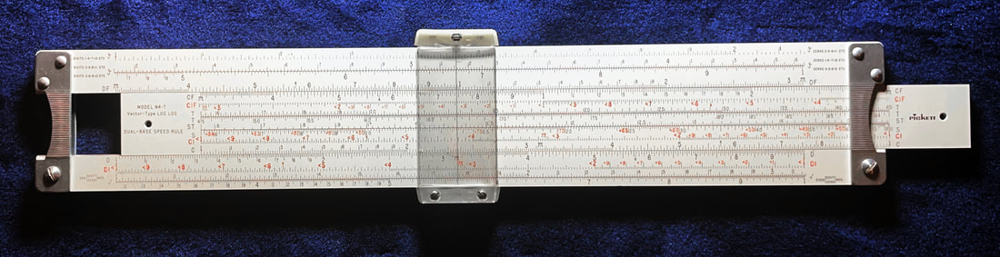
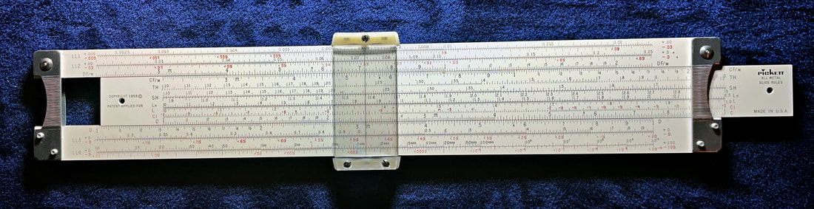

Many people have a love or hate relationship with Pickett slide rules. This is because they are the only major maker who made them out of metal, almost exclusively. Early slide rules, beginning in post-war 1945 - rather late compared to most other major makers - used magnesium for their construction. But over a short time, remarkably within a decade of their introduction, the corrosive nature of that metal forced Pickett to shift entirely to aluminum. By the end of the slide rule era (EoE) in the early 1970s, Pickett had gone to plastic for their budget/student rules (as did most makers), whereas the photo-lithographed aluminum were reserved for their more powerful slide rules.

Among the aluminum rules, Pickett typically made them in two colors...a white rule designated with a "T" at the end of the model number, and an "eyesaver" yellow rule designated as "ES". For example, the powerful N4 "VectorLog" slide rule had either N4-T (white) or N4-ES (yellow) models. If a smaller "pocket" rule version exists of a model, they typically append the letter "P" in the designation, such as the N4P-T slide rule, which would be Pickett's white "pocket" rule.

Furthermore, if the same rule went through refinements or enhancements without necessitating a new model, then Pickett would designate this "new" version of the rule by use of "N" before the number. As such, the N4-ES slide rule was preceded by the "Model 4-ES." For the most part, non-N varieties are the magnesium predecessors. However, some of the product lines had a transitional model, often made of thicker aluminum, around 1950. But at some point shortly thereafter, Pickett settled on standardized thickness for their aluminum rules, which is remarkably consistent over the company's last 25 years or so.

Most Pickett low-budget rules and their lower-cost aluminum rules included a plain plastic slip case and "how to use" instruction booklet. The powerful (expensive) rules, as well as many of the specialty rules, gave buyers an upgrade to a nice leather case.

In the 60s and 70s, Pickett did shift most of their student slide-rules to plastic. These are good slide rules, but are rather unremarkable. These rules typically have model numbers between 115 to 160. As a high school Precalculus teacher, I give many of these rules to my own students today to encourage further investigations, having first earned them by doing an extra-credit research project.

To be certain, I find the typical aluminum Pickett rule to be less enjoyable to use than competitor rules made of wood or high-grade plastic. They feel cold in my hand and I find them somewhat hard to read, which is an emotion found among many collectors. The lithographic type also doesn't endure as well over time and with regular usage, as many samples will be faded or rubbed-away.

Pickett was widely known for producing a variety of custom slide rules for a variety of clients. As such, there is a remarkable array of "specialty" rules that can be found which, in my mind, is the best part about collecting Pickett rules today. This is made possible because almost every metallic rule is the same, except for what is printed on the rule. As such, once the photographic master is created, any number of rules can be quickly and cheaply printed. So if a client wanted a custom-rule made, Pickett could do so in a short run without too much extra expense. In my collection, we will see that most of the larger custom rules like this, particularly the ones with the most value today, will be found within the range of rules between models 5 and 19. A collection with most or ALL of those models will be truly outstanding.

Dating Pickett rules is also difficult to accomplish, as they did not change their rules at all over extended periods (typically 4 to 8 years), nor did they use serial numbers. The best we can do is to identify a slide rule to one of maybe ***seven*** distinct eras of the company based on changes to the Pickett logo (on the rule) as well as the evolution of slide rule construction and materials. Likewise, the designs of the cursors and end-brackets over time can yield some enlightenment. As such, I will date them between a certain range of years based on these features.

But the sheer number of Pickett rules and the stories they tell really make them one of my favorite slide rule brands to collect. I have some Pickett rules that nobody else seems to possess, even among the most avid collectors today. I find stumbling across such treasures to be very satisfying.

## General-Purpose Rules

Here are Pickett slide rules that allow for basic to complex evaluation of mathematical computations and functions. I will also include "engineering" rules here, since that designation typically includes hyperbolic trig scales which, as far as I'm concerned, is still computational mathematics; however, where that applies, I will make note of that. Click any rule below to see its photo and details.

### Full-Scale Rules

N4-T Vector Hyperbolic Dual Base Log Log

Front

Back

This is Pickett's most powerful slide rule, boasting 34 scales. It comes in either the white or the "eye-saver" yellow variety, of which I have both in my collection. I prefer the white, but I'm willing to change my mind over time.

This is a "vector" type of slide rule which permits the computation of the magnitude of a vector component if you know the other one. This lets engineers perform a variety of vector-based mathematics in both the real and complex planes, polar and rectangular conversions, and even hyperbolic trig functions. If you need computations within oscillating or rotational systems, such as with phasor diagrams of inductance or capacitance in electronics, then this is the slide rule for you!

This slide rule packs a big punch. 34 scales is among the largest number of scales you'll find on any slide rule. Unlike the yellow ES version (which I have as well), this one in white is really gorgeous. Once cleaned and lubricated with some PTFE dry lube on the slide, it's really a pleasure to hold and use. I find it readable, though the smaller text and back-to-back scales make it a little harder to get used to.

<dl class="ke-portfolio-stats">
<dt>Model No.</dt><dd>N4-T</dd>
<dt>Model Name</dt><dd>Vector Type Log Log Dual Base</dd>
<dt>Maker</dt><dd>Pickett</dd>
<dt># of Scales</dt><dd>34</dd>
<dt>Country</dt><dd>USA</dd>
<dt>Material</dt><dd>Aluminum</dd>
<dt>Scale Length</dt><dd>10"</dd>
<dt>Date</dt><dd>1958 to 1962</dd>
<dt>Condition</dt><dd>C4 (like new, but with case only)</dd>
<dt>Front</dt><dd><code>3√ #1, 3√ #2, 3√ #3, DF [CF, CIF, T1, T2, ST, S Cos, CI, C] D, DI, √#1, √#2</code></dd>
<dt>Rear</dt><dd><code>LL1+.00D/-.00D, LL2+.0D/-.0D, DF/m [CF/m, TH, SH, Ln, L, CI, C] D, LL3+.D/-.D, LL4+D./-D</code></dd>
</dl>

N4-ES Vector Dual Base Log Log

I own this rule but haven't written up its details yet — check back as this catalog grows.

N3-ES Power Log Exponential

I own this rule but haven't written up its details yet — check back as this catalog grows.

N500-ES Hi-Log Log Duplex

I own this rule but haven't written up its details yet — check back as this catalog grows.

N902-ES Simplex Trig

I own this rule but haven't written up its details yet — check back as this catalog grows.

Model 1000 Ortho-Phase Duplex

I own this rule but haven't written up its details yet — check back as this catalog grows.

N1010-ES Trig Duplex

I own this rule but haven't written up its details yet — check back as this catalog grows.

N1010LS-ES Super Power Trig

I own this rule but haven't written up its details yet — check back as this catalog grows.

Model 2 Deci Log Log Duplex

I own this rule but haven't written up its details yet — check back as this catalog grows.

Model 902 Simplex Trig

I own this rule but haven't written up its details yet — check back as this catalog grows.

N1010-T Trig Duplex

I own this rule but haven't written up its details yet — check back as this catalog grows.

N901-ES Simplex

I own this rule but haven't written up its details yet — check back as this catalog grows.

N903-ES Trig and Conversion

I own this rule but haven't written up its details yet — check back as this catalog grows.

N909-ES Simplex Trig with Metric Conversion

I own this rule but haven't written up its details yet — check back as this catalog grows.

Model 4 Vector Hyperbolic Deci Log Log

I own this rule but haven't written up its details yet — check back as this catalog grows.

Model 800 Log Log Duplex

I own this rule but haven't written up its details yet — check back as this catalog grows.

Pickett B1 Bamboo Rule

I own this rule but haven't written up its details yet — check back as this catalog grows.

### Pocket Rules

N600-ES Log Log Duplex

Front

Back

A version of this slide rule is said to have gone to the moon with Buzz Aldrin on Apollo 11. Because of this, it's known sometimes as the "Apollo Rule." This, of course, has made it very collectible, whereas it becomes hard to find a copy for less than $50...MUCH more if it comes with the original box, case, and documentation.

This is one of the smallest rules I own. It has a durable feel, albeit the numbers can be a bit hard to read. The cursor does feature a convex lens, which magnifies the numbers at the hair-line ever so slightly. Like most typical rules, I don't care much for the eye-saver yellow as I don't find them easy to read, especially the red fonts. Even so, it's an iconic slide rule.

<dl class="ke-portfolio-stats">
<dt>Model No.</dt><dd>N600-ES</dd>
<dt>Model Name</dt><dd>Dual Base Log Log</dd>
<dt>Maker</dt><dd>Pickett</dd>
<dt># of Scales</dt><dd>22</dd>
<dt>Country</dt><dd>USA</dd>
<dt>Material</dt><dd>Aluminum</dd>
<dt>Scale Length</dt><dd>5"</dd>
<dt>Date</dt><dd>1968 to 1975</dd>
<dt>Condition</dt><dd>C3 (like new, but with case only)</dd>
<dt>Front</dt><dd><code>LL1, LL01, A [B, ST, T, S, C] D, DI, K</code></dd>
<dt>Rear</dt><dd><code>LL2, LL02, DF [CF, Ln, L, CI, C] D, LL3, LL03</code></dd>
</dl>

N300-T Log Log Duplex

I own this rule but haven't written up its details yet — check back as this catalog grows.

N200-T Trig

I own this rule but haven't written up its details yet — check back as this catalog grows.

N1006-ES Duplex Trig

I own this rule but haven't written up its details yet — check back as this catalog grows.

Model 20 Basic

I own this rule but haven't written up its details yet — check back as this catalog grows.

N4P-ES Vector-Type Log Log Duplex

I own this rule but haven't written up its details yet — check back as this catalog grows.

### Circular Rules

111-ES Circular

A photo of this rule is still to come — check back as this catalog grows.

<dl class="ke-portfolio-stats">
<dt>Model No.</dt><dd>111-ES</dd>
<dt>Model Name</dt><dd>Circular</dd>
<dt>Maker</dt><dd>Pickett</dd>
<dt># of Scales</dt><dd>24</dd>
<dt>Country</dt><dd>USA</dd>
<dt>Material</dt><dd>Plastic covered aluminum</dd>
<dt>Size</dt><dd>12.8 cm</dd>
<dt>Condition</dt><dd>C3 (like new with case and documentation)</dd>
<dt>Front</dt><dd><code>LL3, LL2, LL1, LL0, K, A, D [C, CI, EI (spiral)]</code></dd>
<dt>Rear</dt><dd><code>/LL3, /LL2, /LL1, /LL0, L, DI, D, T, S, T, S, T, TS</code></dd>
</dl>

Model 101-C Dial-Rule Circular

I own this rule but haven't written up its details yet — check back as this catalog grows.

110-ES Circular

I own this rule but haven't written up its details yet — check back as this catalog grows.

108-ES Circular

I own this rule but haven't written up its details yet — check back as this catalog grows.

## Specialty Rules

These Pickett slide rules are "specialty" rules because they were designed or marketed for a specific purpose in mind. Such a rule will often include one or more scales for a specific application, whether a finance formula, chemistry conversion, electronics functions, or even unit conversions.

### Full-Scale Rules

Model 14 US Military

I own this rule but haven't written up its details yet — check back as this catalog grows.

N16-ES Electronics

I own this rule but haven't written up its details yet — check back as this catalog grows.

C19-T Collins Microwave Transmissions

I own this rule but haven't written up its details yet — check back as this catalog grows.

N525-ES Stat-Rule

I own this rule but haven't written up its details yet — check back as this catalog grows.

N531-ES Capital Radio Engineering Institute

I own this rule but haven't written up its details yet — check back as this catalog grows.

N535-ES Electronic Technician

I own this rule but haven't written up its details yet — check back as this catalog grows.

N808-T Standard Marine Fuels

I own this rule but haven't written up its details yet — check back as this catalog grows.

N1041-GP Universal Valve Sizing

I own this rule but haven't written up its details yet — check back as this catalog grows.

N1072-ES Spring Calculator

I own this rule but haven't written up its details yet — check back as this catalog grows.

N905-ES Texas Slide Rule

I own this rule but haven't written up its details yet — check back as this catalog grows.

Model 575 Kellogg Hydraulic Rule

I own this rule but haven't written up its details yet — check back as this catalog grows.

N1041-G Fisher Controls Universal Value Sizing

I own this rule but haven't written up its details yet — check back as this catalog grows.

Model 6-T Statistical Quality Control Rule

I own this rule but haven't written up its details yet — check back as this catalog grows.

N15-T Georgia Ironworks Hydraulic Rule

I own this rule but haven't written up its details yet — check back as this catalog grows.

PR-12 Projection Slide Rule

I own this rule but haven't written up its details yet — check back as this catalog grows.

PR-13 Log Log Projection Slide Rule

I own this rule but haven't written up its details yet — check back as this catalog grows.

N515-T Cleveland Institute of Electronics Rule

I own this rule but haven't written up its details yet — check back as this catalog grows.

N1080-ES &amp; N1080-T Refinery Supply Co. Calculator

I own this rule but haven't written up its details yet — check back as this catalog grows.

N1090-ES Connor Spring Manufacturing Calculator

I own this rule but haven't written up its details yet — check back as this catalog grows.

### Pocket Rules

Model 100 Douglas Sky Rule

Front

Back

A specialty aeronautic engineering slide rule made in the USA for Douglas Aircraft.

<dl class="ke-portfolio-stats">
<dt>Model No.</dt><dd>100</dd>
<dt>Model Name</dt><dd>Douglas Sky Rule</dd>
<dt>Maker</dt><dd>Pickett, made in USA for Douglas Aircraft</dd>
<dt># of Scales</dt><dd>16</dd>
<dt>Country</dt><dd>USA</dd>
<dt>Material</dt><dd>Aluminum</dd>
<dt>Scale Length</dt><dd>5"</dd>
<dt>Date</dt><dd>1952</dd>
<dt>Condition</dt><dd>C3 (like new with case)</dd>
<dt>Front</dt><dd><code>Dynamic Pres., Temp Rise [Static Pres., Pres. Alt, Density Alt., C] D, True Mach. TAISR</code></dd>
<dt>Rear</dt><dd><code>Impact Pres., Std. Temp., Pres. Alt. [Temp. Venier, Pres. Alt.] True Mach No., Dial Airspeed. Blank</code></dd>
</dl>

Model 700 Aerial Photo USAF

I own this rule but haven't written up its details yet — check back as this catalog grows.

Model 400 Business

I own this rule but haven't written up its details yet — check back as this catalog grows.

### Circular Rules

103-ES Mark-Up

I own this rule but haven't written up its details yet — check back as this catalog grows.

106C Proportional Scale

I own this rule but haven't written up its details yet — check back as this catalog grows.

105-C Profit Rule

I own this rule but haven't written up its details yet — check back as this catalog grows.

112C Metric Convertor Scale

I own this rule but haven't written up its details yet — check back as this catalog grows.

Pickett Model 103-ES Circular Rule

