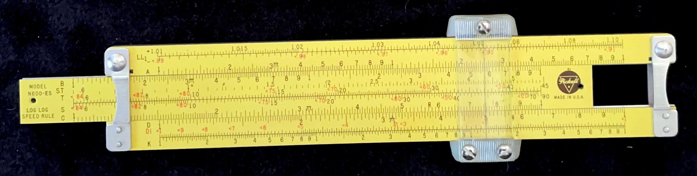
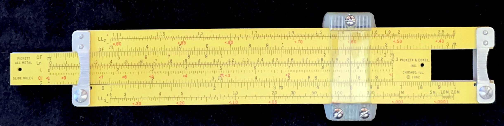

## Description

A version of this slide rule is said to have gone to the moon with Buzz Aldrin on Apollo 11. Because of this, it's known sometimes as the "Apollo Rule." This, of course, has made it very collectible, whereas it becomes hard to find a copy for less than $50...MUCH more if it comes with the original box, case, and documentation.

## Specifications

- **Sample #:** 1
- **Type:** Linear
- **Model No.:** N600-ES
- **Model Name:** Dual Base Log Log
- **Maker:** Pickett
- **# of Scales:** 22
- **Country:** USA
- **Material:** Aluminum
- **Scale Length:** 5 in.
- **Date:** 1968 to 1975
- **Condition:** C3 (like new, but with case only)

### Scales

**Front side:** LL1, LL01, A [B, ST, T, S, C] D, DI, K

**Rear side:** LL2, LL02, DF [CF, Ln, L, CI, C] D, LL3, LL03

## Assessment

This is one of the smallest rules I own. It has a durable feel, albeit the numbers can be a bit hard to read. The cursor does feature a convex lens, which magnifies the numbers at the hair-line ever so slightly.

Like most typical rules, I don't care much for the eye-saver yellow as I don't find them easy to read, especially the red fonts. Even so, it's an iconic slide rule.
