The Educational Value of Slide Rules
Every year, 160 to 180 new students enter into one of my six high school Precalculus classes.   And before I learn their names, I already know what they feel about math.   As a subject, there is nothing more polarizing.  It's the only subject taught in school where a student can be excused for carrying the label "bad at math," a label often passed down from parent to child.  And as a teacher, my first task is to overcome their preconceived attitude toward math. 

I believe that the problem stems from an educational system that reinforces the "bad at math" idea.  This is because children are ability-grouped in their formative years, classified to an ability "level," and then never given a chance later to "bridge" back up to their potential once their developmental growth supports it.   The student is left with no further opportunity because it is deemed by educators that it's no longer worth the effort.
So when a third grader struggles with multiplication tables or a sixth grader lacks algebraic reasoning, they are started on an educational path that will not allow them another opportunity when they are actually ready for it, with no chance to catch up to their peers and no positive experience to be gained.   

Because this is the situation of roughly 70% of my students when I first get them, I consider myself both a teacher AND a redeemer of math.  I've learned that I must do the latter before I can reach my own potential as the former.  So I work hard to make sure math is what it's supposed to be...confidence-building, enlightening, and enjoyable. 

Such is my job of a math apologist...to give them positive experiences in mathematics that they were never given the opportunity to have. ​  

The first of these experiences begins the moment you enter my classroom, where you will be surrounded by mathematical history.  Over 200 calculating devices, primarily slide rules, hang on my walls to elicit curiosity and questioning within my students.  The depth and breadth of what could be accomplished with these slide rules goes far beyond computational mathematics, but also into applications, history, number sense, and real-life models.  These aspects seem to have little value in today's math education, which values doing pseudo-applications (phony word problems that act like real-life math), computations and passing state-level standardized tests.   The richness of mathematics is sacrificed for the achievement of all the wrong goals, which have more to do with reading comprehension than it does real mathematics.  

So, has it always been this way?  

Over 50 years ago, the slide rule was introduced to students as early as the third grade, continuing with them throughout their scholastic years.   It was a way of life during a time when the slide rule was part and parcel to the educational process, much like the calculator is today.   However, the difference is that using a slide rule always requires certain math disciplines that a calculator does not require.  It also provides an insight into math that simple keystrokes with a calculator does not.  

What follows is not about a data-driven - or even an anecdotal - attempt to show how students are worse off by using calculators, nor is it an indictment on modern educational methods.  Rather, it is to show insight into what education with a slide rule did well and why it may be worthwhile for today's educators to consider a return to the slide rule, for at least a short while, to enhance classroom learning. ​
Introduction

There is no wikipedia-like definition of "slide rule" that doesn't use the word "obsolete" in the first sentence.  And when the first affordable pocket calculator was introduced in the 1970s, we could have measured the rate of obsolescence with a stopwatch.  A college student could have entered as a freshman with a slide rule in hand and would have graduated with the calculator that his professor required for a junior-level course.  But what was not asked, by anybody, was what would be missed from education by following the technology train?     
Technology, from the Greek root word "technes," literally means "young or child-like."   As such, anything progressive enough as a tool is "technology."  The first shovel was technology; as was the first slide rule.  And the slide rule shouldn't have been replaced anymore than the irreplaceable shovel, at least not completely.    While the assumption today is that any digital method should supersede any analog analogue, there will always be something missed in the transference.  Ask an electrical engineer to toss out his multimeter "with the needle" for the sake of the digital meter on his desktop and he will look at you as if you were crazy.  This is because he knows that the analog device will reveal something about a measurement that the digital version will not.  ​
Not to argue with the virtues of a calculator; nor am I advocating against any advancements.  But when superior technology comes along, there will still be pedagogical value to that which it replaces, especially when there is 300+ years of historical use.  As a person who is one generation removed from using a slide rule scholastically, I find learning it today to be revolutionary.  It has reminded me that something doesn't have to be practical in order to have value.  Make no mistake, a slide rule is no longer practical, and this is the reason for its obsolescence. 

But the slide rule is a tangible, visual way to see the way numbers work - and it's this aspect that warrants a reevaluation of its usefulness today.  In the least, it's akin to an abacus or counting beads in the primary years.  Or it's more like a sophisticated number line in the secondary years.  As educators, we are always looking for models that assist us with abstract principles.  While the abstractions make math challenging, it's also that aspect which makes it rewarding. 

And therein lies the polarizing nature of math.   How many students give up before the reward?  
"It's the abstractions that make math challenging, but it's also that aspect which makes it rewarding.  And therein lies the polarizing nature of math." 
What follows are TEN different ways in which math education is worse from no longer having slide rules.  These aspects are a direct reflection of the device itself; what it does and how it can help us in the classroom.  But all of these should show us how we can rethink math education today, to show how "old technology" can be used in a modern classroom; that educators might find some enlightenment about our current pedagogy. 

Sidebar: Are Calculators also Obsolete? 
An argument can be made that the replacement for the slide rule has become obsolete as well.  

The classroom set of Texas Instrument calculators (TI-84 Plus) in my classroom likely cost my school around $150 each.  Yet it's based on a technology/chip set that is more than 25 years old - and I shouldn't have to tell you how long that is in "computer years."  Low resolution, non-touch, black-and-white screens; non-intuitive, extended-menu interface for functions beyond the simple operations; and no Internet connectivity. 

Not only has this calculator's technology been usurped by phone apps and computers, but it is also the least convincing visual or pedagogical way to understand math.   

Students could now be using, for free, Desmos or Wolfram Alpha on the smartphone they already own.  Such "apps" cannot only give you solutions like the calculator, but can show you step-by-step how to do it, as well as showing you extra information and extensions to the learning.  Moreover, I can use Desmos to quickly and easily set-up a slider on a value to show visually its effect on a function.   They, and more powerful PC solutions like a programming language (e.g. Python or MatLab) and even an Excel Spreadsheet, cannot only solve problems, but they also let students create their own problems to solve.  

The idea for this is simple - if you give productive people a new tool, then they will SEEK and CREATE opportunities to use the tool. 

The only time I ever saw students use our calculators in this way was before smartphones when a few enterprising students would dive into the calculator's programmability, but anybody who has done that on a TI calculator can tell you how unintuitive and complicated that is.   Simply put, the calculators in my classroom are not a good tool by today's standards. 

So why use them?  In Texas, our standards require us to use a "graphing calculator" at the high school level.   As such, Texas students will not be reaching for a "Casio" when your state's name is on education's most popular calculator.  No matter that it was made obsolete by the first iPhone 15 years ago.  Not to bury the lead, but we'll refrain from asking "why" here.   Let us just say that a lot of money changes hands in education, with teachers not seeing much of it. 

Note: While writing this, my district has supplied me with new TI-84 Plus CE calculators, with color LCD, self-charging, and even with Python programming functionality.   It's much better than what I had, and they are appreciated, but they are still not up to the capabilities of a good, free phone app!
As a Manipulative

Look up any state standards for a math class and you will see the idea of a "math manipulative" expressed.  Defined, a math manipulative would constitute any concrete, hands-on tool for learning.   As an educator earlier in my career, this idea, often coupled with the learning "center," became thematic with good education.   The proper use of a manipulative would have students match a specific visualization or analogy to a learning goal, such as using an interactive ruler or number line to visualize the addition and subtraction of integers.  A calculator does not replace the purpose of the ruler in that case, because the virtue of the manipulative is the hands-on, visual-reinforcement of an IDEA that takes place.  ​
Dig into your state's course objectives and you'll see process standards as required for student success. In Texas, this is what the "TEKS" are for Precalculus, which includes not only the concept of the manipulative, but also "mental math, estimation, and number sense" as techniques. (Note as well "reasonableness of the solution" in P.1.B above it.) The slide rule is a perfect "manipulative" because it requires those techniques when using it. I would advocate the use of slide rules in modern education as a way to not only meet all of these requirements, but to help improve this skill deficiency in our students.
But replacing manipulatives with calculators is exactly what happened!

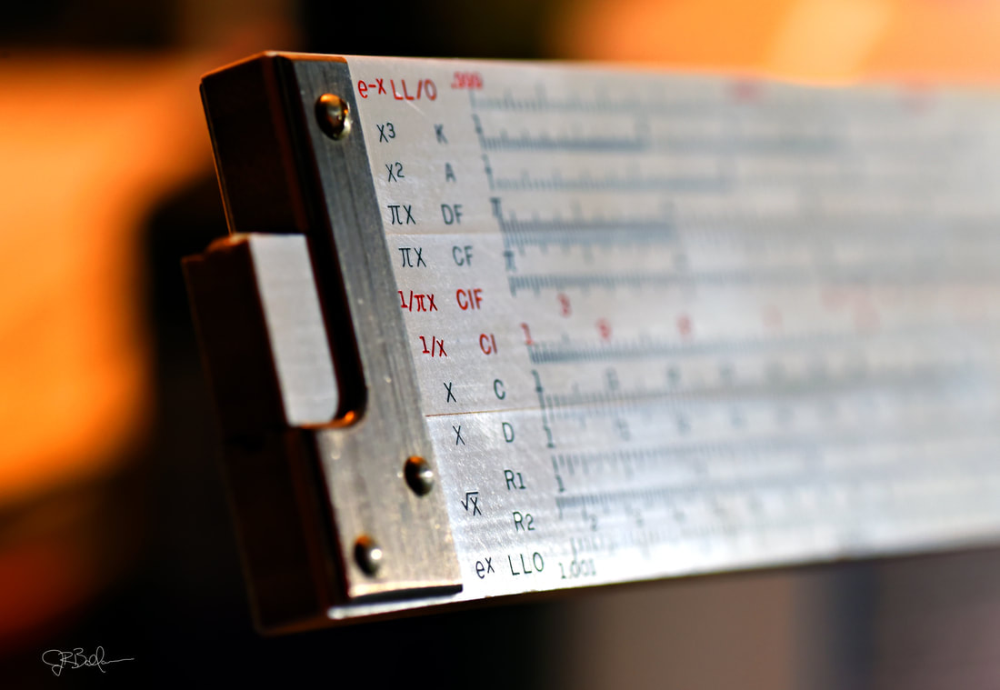
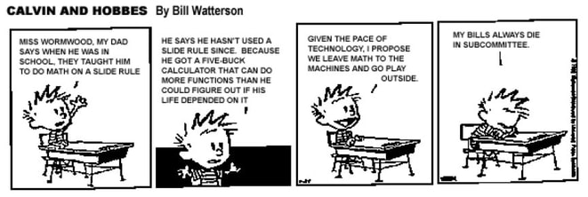
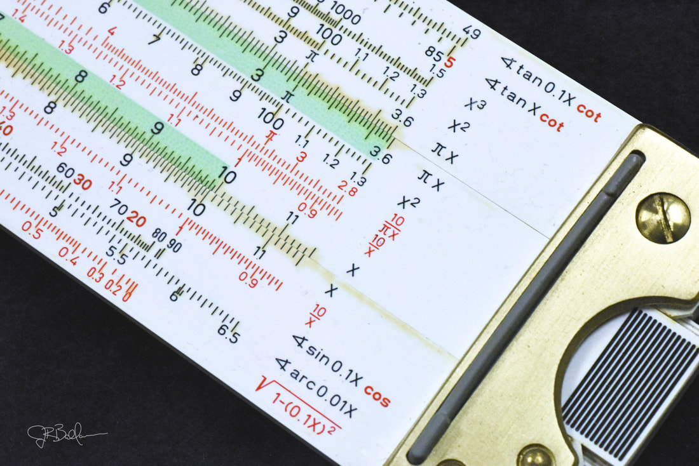
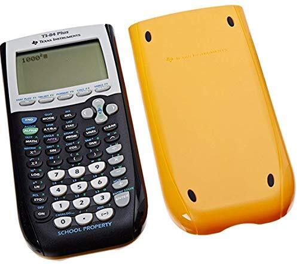
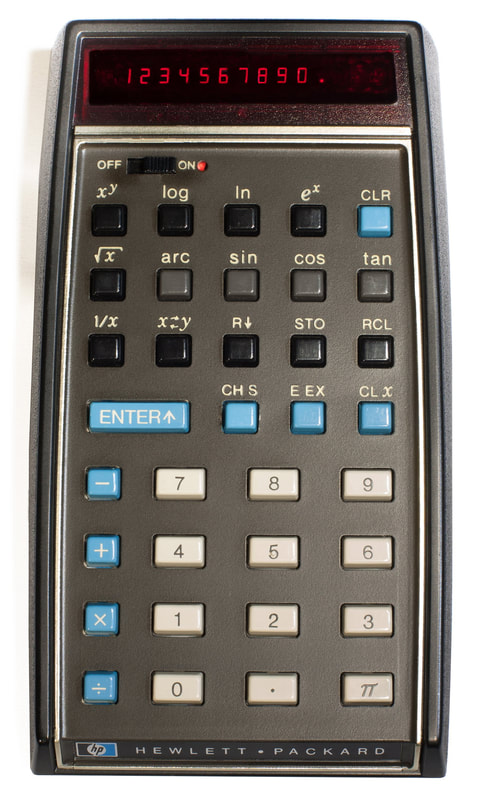
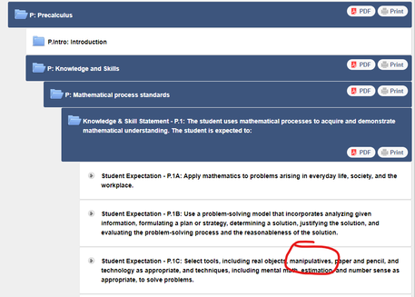

The idea of a manipulative was tossed by the wayside in favor of, first calculators, and then smart-devices.  In this new paradigm, technology BECAME the manipulative.  And it continues to this day.   In fact, when my administrators assess my teaching formally, they only care about seeing that I'm using a form of technology, and not even as a part of a specific lesson plan.   As long as I have the specific learning objective written on the board; good enough, it seems!  

Technology replacing manipulatives; it all started with good intentions.  In fact, I remember being rewarded with a trip to the elementary school library in the late 1970s where I could play a Star War's themed text-based adventure game on the school's only Apple II Computer.  To be honest, it didn't teach me to read, but it did encourage it.   But this is quickly what technology became...let's trick students into learning through educational video games!   

Aside:  I learned to read before I was 4 years old from random store signs and billboards.  While it's not something I could place in my hands, it functioned like a manipulative in that words and letters are supported with visual cues of shapes and colors.  

Certainly, one of the early uses of the smartphone in education, which spawned the BYOD (bring your own device) initiatives, was to use multimedia "apps" to help students learn in a fun way.   But because their use was seldom specific in focus, the effectiveness of these devices can be strongly debated.  Not only this, because this technology use takes place on a platform that also doubles as a student's entertainment, it also becomes a diversion FROM learning.  This is technology use at its worst. 

Currently and typically, technology is still an almost entirely passive participant in our learning; it's either a resource for research or it's used to do computations so we no longer have to.  It's a jeopardy-like game or a self-grading assignment system or a video conferencing application or an online curriculum. 

What it is NOT - if we are honest - is an active, integral role in the mastery of a learning objective.  And in the spirit of using manipulatives as a pedagogical practice, technology has failed. While it could be used to function as a manipulative toward meeting specific educational objectives, we seldom require it to do so. 

Education is far worse today because teachers are not held accountable to give students hands-on, visual modelling via manipulatives - though, judging from my state's requirements at right, it appears that it is most certainly required.*  My guess is that either we've assumed that technology is providing that or we are given the choice to neglect it.  

So perhaps it's time to bring back slide rules as a manipulative?  This is because, unlike a calculator, slide rules gives students a very specific intuition about the computations they are performing.  It is a number line, a conversion table, and a set of scales, all wrapped up into one.  If the objective is to understand fractions and proportions, then setting the C and D scales for a single fraction gives all equivalences across the scales. 

If the objective is to understand continuity, then the slide rule can be used to give a subtle feel for either the continuity or the closeness of values.  It builds intuition, especially when connected to the active feel of the slide rule.   And importantly, as we will see in examples that follow, the slide rule helps support students in the development of mental math, estimation, and number sense skills that most teachers believe to be lacking in today's students.  
​​*Note: Manipulatives are differentiated from technology (see right), as we can see by reading the 4th bullet point of the Precalculus standards.  So as indicated, manipulatives (and real objects) are intended to be used whether, or not, technology is used. 
Reasonableness of Solution

On every test I give my Precalculus students, somebody will ask if they can use a calculator.  That question, though asked by one person verbally, is actually one that half the class wants to ask.  It's almost as if the class got together to find the volunteer brave enough to ask it! 

Students today feel that if they had a calculator, then everything would be miraculously better.   

But after each test, when we go over commonly missed problems, it's almost always the calculator problems that they get wrong.    This is largely because students assume no responsibility for such problems; they believe that the calculator would do everything right for them.  When the calculator spits out the wrong answer, they have no understanding, no warning that it is incorrect.  This is because students are either not taught to provide estimations in advance of the solution or because they simply lack the ability to do so.  The prophylactic aspect or idea of a "reasonable" solution eludes them.  
On a slide rule, the C and D scales (labelled on the left of the scales), provide students the ability to do division. In this case, with the 8 on the D scale aligned with the 7 on the C scale, the result of 8 
÷7
÷
7
 can be read at the D scale beneath the "1" or "left index" of the C scale, as shown here on the hairline of the cursor. This reading of 114 (and a little more) are the significant figures for any of the computations at the left. It becomes YOUR job to supply the necessary decimal.
It's different with a slide rule.    As an example, on a calculator, you get the following outputs...

8÷700=.0114286
8
÷
700
=
.0114286

8÷70=0.114286
8
÷
70
=
0.114286

8÷7=1.14286
8
÷
7
=
1.14286

80÷7=11.4286
80
÷
7
=
11.4286

800÷7=114.286
800
÷
7
=
114.286

But when doing this computation on a slide rule, all 5 computations are performed with the identical setting of the rule (see right).    The user must know where the decimal place belongs.   

Now, in a list of pros and cons for slide rules, having to supply your own decimal is usually listed among the disadvantages, especially in a calculator society that freely yields decimal precision for each unique problem.  However, a math teacher can quickly understand the pedagogical advantages to placing your own decimal.  Quite simply, the slide rule requires students to have a sense of magnitude and scale with any problem they are trying to compute.  

It was quite commonplace for school children to estimate a problem such as "80 divided by 7"  as being "a little more" than 10, simply because if 
70÷7=10
70
÷
7
=
10
 , then 
80÷7
80
÷
7
 would equal a "little bit more."   This, of course, encourages the practice of better "numeracy" (see next topic point), but for the student it simply requires that they be constantly engaged with each step of a problem, having an idea of what they should expect.  With a calculator, it's all too commonplace for a student to input an operation of numbers incorrectly, and because he or she had no idea of the problem's magnitude, the error is not often detected before moving to the next step.  

Here's another example where using a slide rule has significant educational value.   Consider the computation 
367×12
367
×
12
.  Setting up the slide rule is pretty straight-forward.  Students of the day would align the decimals 3.67 and 1.2 using the C and D scales.  Most any slide rule would compute the three significant digits of 440.  The arithmetic would obviously place the decimal at 4.40, but that's not the correct magnitude for the answer.  So how many places should the decimal move?   

This is where students of yesteryear would have known inherently something that today's students struggle with, namely, scientific notation.  They would have mentally constructed 367 as 
3.67×
10
2
3.67
×
10
2
 and 12 as 
1.2×
10
1
1.2
×
10
1
.   As such, they would have known, when multiplying those numbers, that the product of same-base exponentials adds the powers:   
10
2
×
10
1
=
10
3
10
2
×
10
1
=
10
3
.  So the answer of 
4.40×
10
3
4.40
×
10
3
 would have told the student to drag the decimal to the right three places, yielding approximately 4400 as a result (we must apply the last zero). 

Of course this is the restriction with slide rules, since the real answer is 4404, which is out of the typical three significant digits of resolution.  But the 4400 approximation would have been considered accurate enough in that era of slide rule usage.  However, the typical student would not have let that stop them...he or she would have known the last digit had to be a 4 simply because in the original problem, when the last digits of the numbers are multiplied, it would have required the last digit to be a 4.   Thus, 4404 is the result most students would have achieved with the slide rule! 

When is the last time YOUR student used scientific notation so elegantly? 

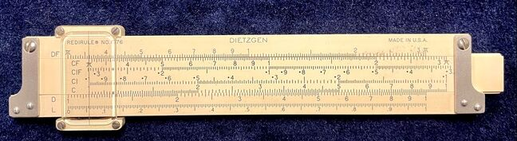
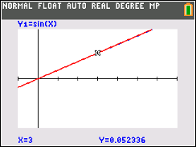
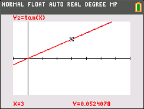
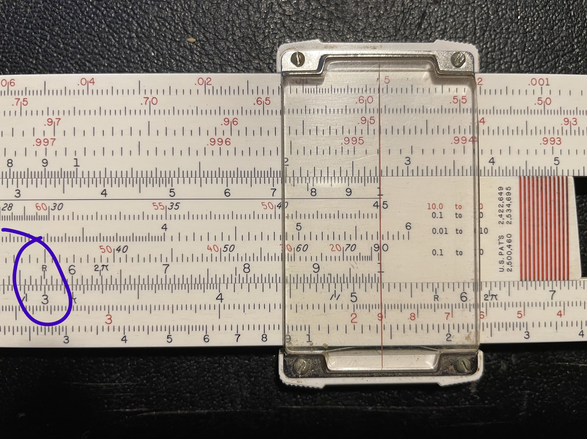
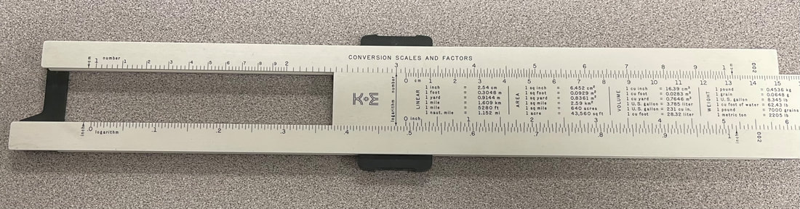

As a teacher of any level of math, it is important to have students evaluate their solutions for reasonableness.  In many cases now, as opposed to earlier in my career, this has become a missing skill for an alarming number of my students.  I wish I didn't have to keep reminding them to watch their mode in the calculator when doing trigonometry; but alas, unless they know the answer in advance, most students don't catch the mistake. So, in my world of Precalculus, having some understanding of what a reasonable solution looks like is a skill that you do not want to be without.  A slide rule serves as a lovely and fun way to give students an inherent awareness of the magnitude or size of a computation! 
Improved Numeracy

Numbers are fascinating in and of themselves.  They do not exist just to be useful or functional.  They aren't merely to give a language for math or to facilitate the solution to a problem.   They have their own delight; their own magic.  There are patterns, behaviors, and curiosities that are revealed with improved number sense.  But I believe most of today's high school math teachers would agree that our student's sense about numbers is lacking.   I believe this skill has progressively worsened on every generation since the end of the slide rule era; an inverse function of the reliance on technology to do it for us. 

To support this statement, let's do some exploration about numbers and then show ways in which only the slide rules would have provided the intuition for it. 

Let's start with these facts...
​

sin(
3
∘
)=.052
𝑠
𝑖
𝑛
(
3
∘
)
=
.052
 

tan(
3
∘
)=.052
𝑡
𝑎
𝑛
(
3
∘
)
=
.052

3
∘
≈.052radians
3
∘
≈
.052
𝑟
𝑎
𝑑
𝑖
𝑎
𝑛
𝑠

​First, despite teaching trig graphs to kids, I NEVER made the association, in 28 years of teaching, that sine and tangent curves are so nearly identical when near the origin.  Similar, yes, but not so exacting as this.  But as you can see from the figures at right, both function curves look almost identical over their first 6 degrees. 

When I first discovered this, it took me a while to forgive myself for not knowing this fact.  I eventually did, since quite simply there has never been a context to make such a comparison for me.  Why would I, when not only do we represent trig graphs in radians, but we never have a reason to show such a small domain of sine and tangent curves on the same graph?   Perhaps I could have had a teacher show it to me somewhere along the way, but that would have required them to a) know about it themselves and b) value it enough to actually mention it to me. 

But these numerical relationships are obvious to those who grew up with a slide rule.  In fact, many slide rules had an "ST" scale, the purpose of which was to compute the sine or tangent of small angles (up to ~5.7 degrees).  This works well because the output of sine and tangent for angles in this domain are equivalent within 3 significant figures of resolution in which a typical 10" slide rule is capable.   So it didn't matter if taking the sine or tangent of an angle like 5 degrees...they knew the output would be identical within a few decimal places.  

The sine graph zoomed to an x-window of 7 degrees. Compare to the tangent graph pictured below.
Comparing tangent to sine in this interval, the curves are approximate to within three significant figures.
But for today's high-schooler?   He or she can earn an entire credit in Precalculus and never realize that insight.   

But notice as well that I slipped in one other observation, that .052 is ALSO the radian measure of 3 degrees - .0529 to be precise - and while this can easily go unnoticed, the implication is that the sin and tangent of small angles are also equivalent to the radian value of that angle.   This means that to find the sine or tangent of an angle like 2 degrees, a calculator or slide rule is not required.  All one needs to do is divide by 57.2 (because there are 57.2 degrees in one radian).  ​
Here on this K&E Deci-Lon 10 slide rule, I've circled 3 on the D scale and have aligned it with the "R" gauge mark on the C scale. This gauge mark represents 57.2, which here is being divided into the 3. Note under the hairline on the cursor, 524 can be read. These significant figures require the user to know that .0524 would be the proper reading for computing the sine or tangent value of 3 degrees. Students of the slide rule era would have known that sine and tangent at these angle sizes would require this decimal placement...and they would know that at such small angle sizes, the sine and tangent functions are mostly equivalent.

Armed with this knowledge, even a 5th grader can compute the sine or tangent of an angle 6 degrees or less, with 3 digit precision, equipped only with long division!  While it's doubtful any 5th grader would need to do this, high school students back in the day most certainly did.  In some cases, if their slide rules did not have trig scales, or, more likely, the rule only had S and T scales with no provision for higher resolution for small angles, then dividing by 57.2 was indeed the method used.  In fact, on many slide rules, 57.2 was included as a gauge mark on the C or D scale, for division of such small angles.  An example of this is shown at left where we show a way of finding the sine or tangent value of 3 degrees. 

Let's look at another intuition about numbers, this time as it concerns logarithms. 
​
​Note:  For those needing a quick reminder, the log of a number is the value required to raise a base, in this case base 10, to yield the argument (the number in parentheses).  Said as an exponential, 
10
.477
=3
10
.477
=
3
 in the following example. 

How about this pattern of values? 

log(3)=0.477
𝑙
𝑜
𝑔
(
3
)
=
0.477

log(30)=1.477
𝑙
𝑜
𝑔
(
30
)
=
1.477

log(300)=2.477
𝑙
𝑜
𝑔
(
300
)
=
2.477

log(3000)=3.477
𝑙
𝑜
𝑔
(
3000
)
=
3.477
An aspect of logarithms that my students are NOT required to learn (according to our state requirements) is knowledge of the characteristic and mantissa of a log.   For any number between 1 and 10, the log of that number will be a decimal value between 0 and 1.   This result is known as the mantissa.   To find the log of numbers greater than 10, a whole number value (the characteristic) is added to the mantissa depending on the number of digits of the input.  This can be seen very easily using a tool for logarithms that my students ARE required to know, the Product Rule for Logs, as applied to the following pattern:

log(3)=0.477
𝑙
𝑜
𝑔
(
3
)
=
0.477

log(30)=log(3×10)=log3+log10=0.477(mantissa)+1(characteristic)=1.477
𝑙
𝑜
𝑔
(
30
)
=
𝑙
𝑜
𝑔
(
3
×
10
)
=
𝑙
𝑜
𝑔
3
+
𝑙
𝑜
𝑔
10
=
0.477
(
𝑚
𝑎
𝑛
𝑡
𝑖
𝑠
𝑠
𝑎
)
+
1
(
𝑐
ℎ
𝑎
𝑟
𝑎
𝑐
𝑡
𝑒
𝑟
𝑖
𝑠
𝑡
𝑖
𝑐
)
=
1.477

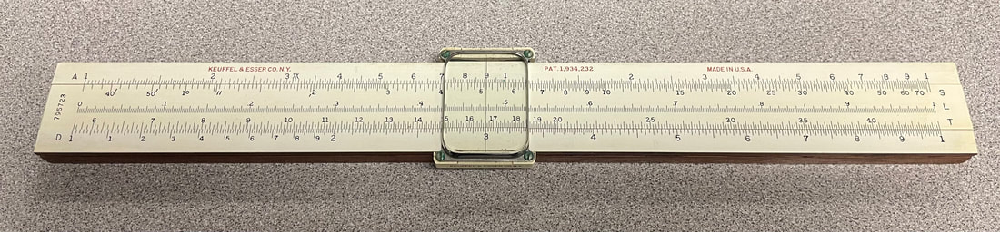
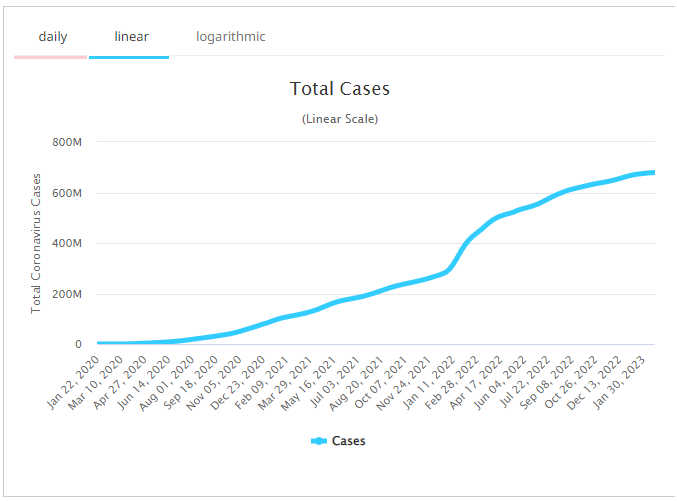
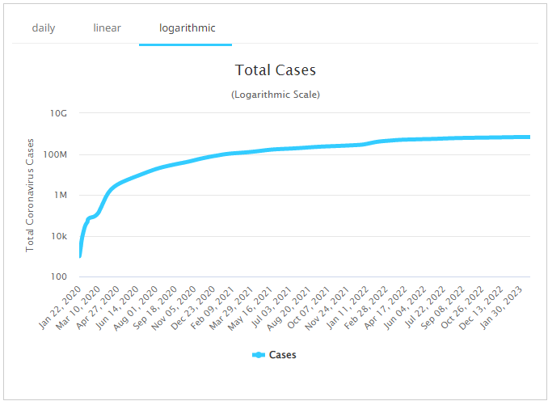
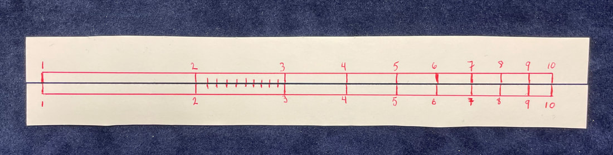
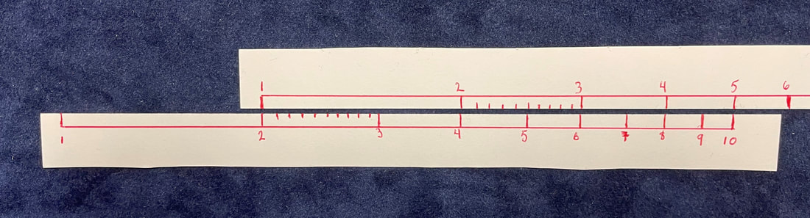
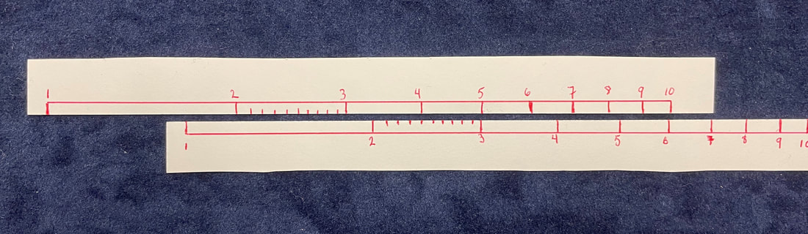

log(300)=log(3×100)=log3+log100=0.477(mantissa)+2(characteristic)=2.477
𝑙
𝑜
𝑔
(
300
)
=
𝑙
𝑜
𝑔
(
3
×
100
)
=
𝑙
𝑜
𝑔
3
+
𝑙
𝑜
𝑔
100
=
0.477
(
𝑚
𝑎
𝑛
𝑡
𝑖
𝑠
𝑠
𝑎
)
+
2
(
𝑐
ℎ
𝑎
𝑟
𝑎
𝑐
𝑡
𝑒
𝑟
𝑖
𝑠
𝑡
𝑖
𝑐
)
=
2.477

log(3000)=log(3×1000)=log3+log1000=0.477(mantissa)+3(characteristic)=3.477
𝑙
𝑜
𝑔
(
3000
)
=
𝑙
𝑜
𝑔
(
3
×
1000
)
=
𝑙
𝑜
𝑔
3
+
𝑙
𝑜
𝑔
1000
=
0.477
(
𝑚
𝑎
𝑛
𝑡
𝑖
𝑠
𝑠
𝑎
)
+
3
(
𝑐
ℎ
𝑎
𝑟
𝑎
𝑐
𝑡
𝑒
𝑟
𝑖
𝑠
𝑡
𝑖
𝑐
)
=
3.477

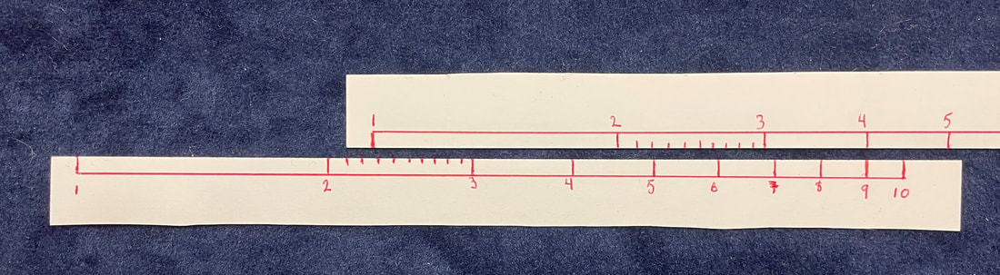
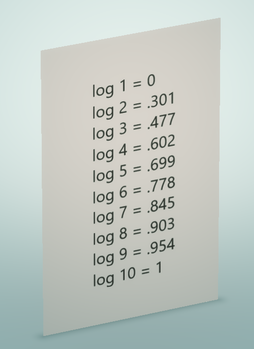
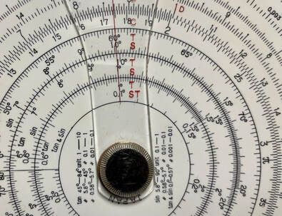

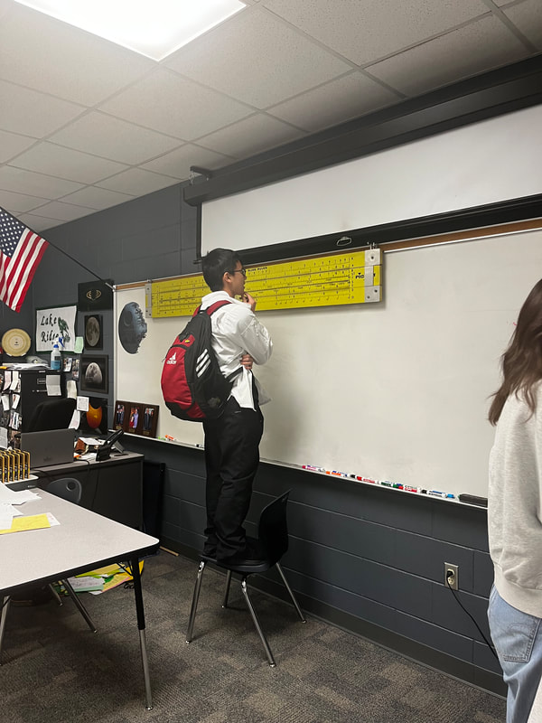

Of course, the calculator inputs this value directly, assuming we are using the correct log base on the calculator (not always a given with students).  However, the association between these values, the pattern, will not be obvious to students unless I have a reason as a teacher to show it to them.  Doing so helps the students with a perspective of the magnitude of the logs themselves, giving them expectations for which they can provide estimates and check for reasonableness of solution.   Likewise, the pattern reinforces this very important Product Rule for Logs, which my students are required to know.  This gives students a visual and practical application for this rule, and for logarithms themselves.

​With a slide rule, the understanding is seamless with usage.  For a base 10 log, most slide rules have an "L" scale.   Ironically, this scale for finding the base 10 log of a number is the only scale on a slide rule that's NOT itself logarithmic.  Instead, it is a linear scale running from 0.0 to 1.0 on most rules (often known historically as a "scale of equal measures").   See the images below for explanation...
This is a special K&E (Keuffel & Esser) GP-12 slide rule that demonstrates the use of a logarithmic scale (top) and a linear scale (bottom) to discover the mantissa of a log. This rule aligns the input 3 on the top scale, with the logarithm output on the bottom scale, reading approximately 0.477 (note the use of 0.0 to 1.0, equally spaced). To compute log (30), the same setting is used, except that the user knows to add 1 to this 0.477 value.
Almost all slide rules have a base 10 log scale, often labelled "L." Note we see it here on one of K&E's more basic slide rules. The scale runs left to right in the middle of the slide rule, with the L label on the right. The input would be set on the "D" scale in this case. Note again, reading at the hairline of the cursor, the value of ~0.477.
​This interplay between linear and logarithmic scales has further importance to graphs, and so these concepts transition well to interpreting data.  For example, exponential growth can be modeled with either linear or logarithmic axes.   Witness the following charts representing the spread of the Coronavirus since the beginning of the Covid pandemic (courtesy of www.worldometers.info)...​

When an exponential graph - representing an exponentially growing virus - is modeled using a linear y-axis (on the left), the rapid growth of the event is felt (less so in this case when the axis labels jump 200 million each tick).   But when that axis is logarithmic (on the right), in this case each tick advances 100x, we are able to see the rapid spread for the first 6 months of the pandemic until the exponential growth started to slow down.  Graphically, we see this as a "flattening of the curve," which is what world leaders hoped that their citizens would work together to accomplish.   Therefore, the logarithmic data here indicates that efforts to get the virus transmission under control were succeeding.   So the next time somebody on social media says they haven't needed Algebra 2 since high school, you can let them know that since January, 2020, it's been a daily occurrence!

With school students, displaying data in multiple representations like this tells a more complete story.  And it all starts with improving numeracy with our students.   In this case, it's about discovering what logarithmic scales are and what they can do. 
Encourages Discovery

Speaking of which, one of the aspects of slide rules that blindsided me was the thrill of discovering how slide rules work.

In fact, if you put the slide rule into the hands of somebody who's never seen one, and then asked them to figure out what all the scales do, it could be the beginning of a very satisfying journey of discovery.   
Figure 1 - Scales created from the log table.
Figure 2 - Showing the multiplication of 2 x 3 = 6. The left index of the upper scale lines up on the 2 with the result read under the 3 on the bottom scale. For that matter, it also shows all multiples of 2 (up to 5) as well. You may also notice it shows fractions/proportions equal to 1/2 across the scales, something we'll talk about in the next section.
Figure 3 - This setting of the scales shows 6 x 4 = 24. Note that the right index of the upper rule is aligned with the 6, and the answer is read under the 4 on the bottom scale. The result, 2.4, would be understood as 24. You are responsible for your own decimal! The right index is used like this if using the left decimal takes you off the scale.
Figure 4 - How about division? It's essentially the inverse of multiplication, meaning that here you align the numbers to be divided and read the answer off of the index. The scales are set to show 9 / 4 = 2.25. Here I have divided up the logs between 2 and 3 to provide more resolution for the decimal quotient.

​​We lack the time for such an investigation here, so let's give a quick primer instead.  Actually, let's BUILD a "DIY Slide Rule" from paper, starting with the table of logarithmic values at right...

With this information, you will construct two logarithmic scales (or number lines).  See Figure 1 at left.   The standard size of most slide rules are 10" (or 25 cm) scale lengths, so let's start with a sheet of paper, pencil, and ruler.   Draw a 10" line.   Mark the ends of the line with tick marks (like on a ruler) and label them 1 and 10 respectively.   These will represent the values of the log (1) and log (10) in the table. In slide rule terms, they are known as the left and right indices (indexes). 

Moving on to log (2), change the .301 decimal to a percentage (30.1%) and mark the number line with a tick mark at 30% of the distance from the left index.   That would be 3" if measuring with a ruler.   Mark this tick mark with the number 2, which represents log(2). 

Do the same with the remainder of the table, yielding a number line from 1 to 10.  Get as close as possible with your percentage approximations for more accuracy.  For example, if 
log(3)=.477
𝑙
𝑜
𝑔
(
3
)
=
.477
, then 47.7% would be a skosh shy of 4 3/4" on the ruler.   Note that the gap between 0 and 1 is far greater than the gap between 9 and 10.  This is as you should expect with a logarithmic scale.   Use the first scale to create another similar to it in Figure 1. 
Yet another discovery, this from using a circular slide rule. Here, it is set to compute sin (1 degree), with 1 placed on the arc notated with the lowest red "S". The answer, 0.00174, is read off of the arc labeled with the red "C". Again, you must supply your own decimal. But this same setting also computes sin (0.1) on the red ST scale and sin (10) on the top red S scale. Would you have known that 0.1, 1, and 10 computed for sine all have the same significant digits of 174? Yeah, me neither!
For additional precision, feel free to mark the finer gradations.  For example, adding ticks for log (1.1), while tedious, can give you better precision if the time is taken to do it accurately.  I have done such between the numbers 2 and 3 on both scales to illustrate the point.

(Historical note:  Slide rule makers used a machine to etch the tick marks.  These machines were known as "dividing engines."  With this technology, makers could produce scales representing log (1.01) with great accuracy.   Doing so, they would promote the accuracy of their rules using the term "engine-divided" when referring to logarithmically-spaced scales.)

Now, for the MAGIC!

Put the left index of one of the scales onto the 2 of the other scale, as in Figure 2. Then, measure 3 on the top rule and look at where that value falls on the bottom rule.  Observe that the result is 6.   Congratulations, you just performed the computation 
2×3=6
2
×
3
=
6
.  In addition, observe that you just performed the following computations as well:

20×3=60
20
×
3
=
60
 

2×30=60
2
×
30
=
60
 

200×3=600
200
×
3
=
600

20×300=6000
20
×
300
=
6000

2000×30=60000
2000
×
30
=
60000

The same setting of your "slide" rule gives you all such computations when, as is expected, you provide your own decimal!  

So, how does this work?   Why does this yield the product of those numbers?   Keep in mind that on your scales, 2 and 3 represent the length of log (2) on one scale and log (3) on the other.   So you are literally measuring out a distance of log (2) and adding it to the distance of log (3).   And if you recall the Product Rule of Logs discussed earlier...

log(2)+log(3)=log(2×3)=log(6)
𝑙
𝑜
𝑔
(
2
)
+
𝑙
𝑜
𝑔
(
3
)
=
𝑙
𝑜
𝑔
(
2
×
3
)
=
𝑙
𝑜
𝑔
(
6
)

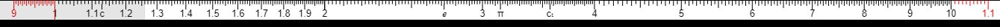
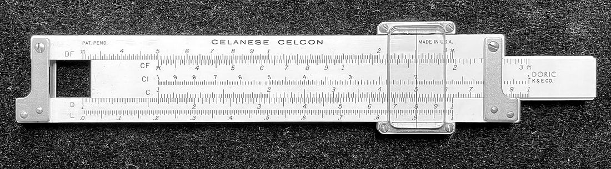
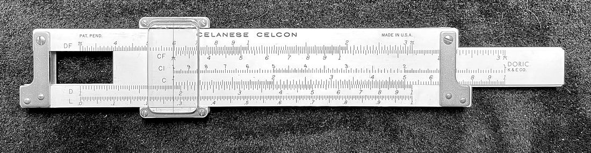
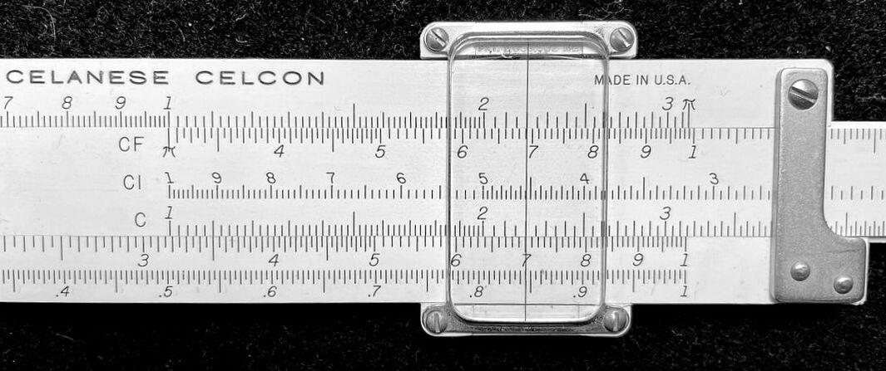
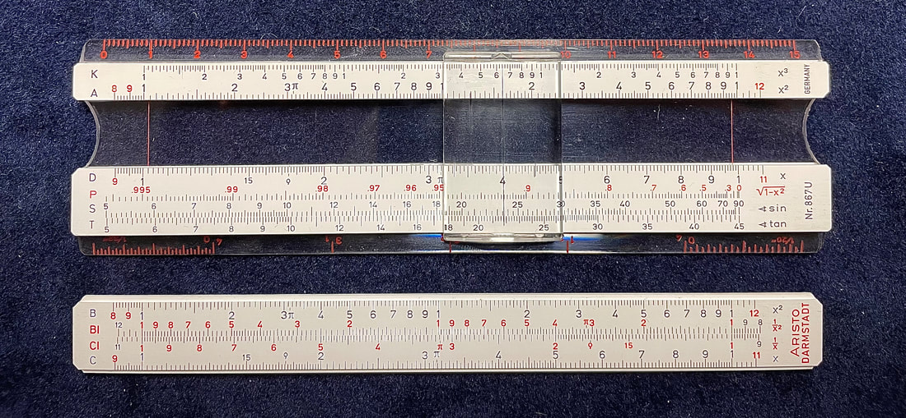
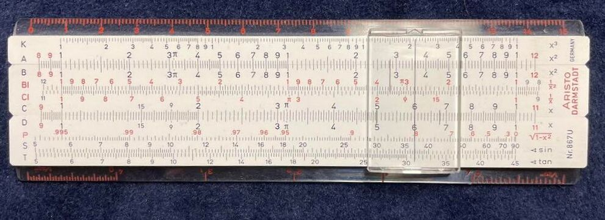

Therefore, a slide rule is the physical manifestation of the Product Rule of Logs.   

On a typical slide rule these two scales are typically labeled "C" and "D", and they are used to do both multiplication and division operations.  

This exciting discovery inevitably leads us down a much larger rabbit hole, as other scales can be created using the the C and D scales as a reference.  For example, building another scale, called the "A" scale on the slide rule, is easy to do simply by squaring the numbers on the D scale (which we can see easily on the simple K&E slide rule  shown in the previous section).  This gives a scale that can compute squares (read off of the A scale) or square roots (when read backwards off of the D scale). 

Do the same with the cubic to yield a traditional "K" scale on many slide rules.  Keying sine ("S" scale) or tangent ("T" scale) off of the D scale and you can naturally compute trig values of any angle.   ​

​Now, THIS is discovery!   

Students seldom have that opportunity, and when it does happen, it's often too late in the average student's journey.   Once they've learned how about numbers, we put a calculator in their hand and the investigation about those numbers usually ends.   And because students no longer need to use long division or multiplication on paper, they no longer remember those processes once they are needed later to factor via polynomial division, find slant asymptotes, multiply binomials, or to take the occasional integral in calculus. 

As such, math is not arithmetic.  It's not just finding the answer.  Math is the algorithm...the pattern...the process.   By putting a calculator in the hands of students, we deny them the experience of learning or practicing the algorithm that makes it possible.   And those algorithms will be used again in the future. 

Almost every mathematical understanding about numbers can be more deeply understood by using a slide rule.   It prompts the question, "How does this work?"   And in my experience, in my own classroom, students enjoy the discovery of it (see below).   

Too bad the calculator doesn't prompt the same question.  If it did, students would begin a wonderful deep-dive into the world of electronics!
Decimals, Percentages, Fractions, Ratios, and  Proportions

In terms of prerequisite skills, it's fractions, along with factoring, that continue to be a stumbling block for my Precalculus students.  Perhaps this is because we no longer value "drill and kill" methods of instruction, of learning something through sheer repetition and committing facts and procedures by rote memory.   The value of building memory skills and muscle memory is the subject of some other paper, but surely when it comes to multiplication tables, integer math, reducing fractions, and factoring, most people would understand the value of riding that bicycle for a few thousand miles after the training wheels come off?  I mean, that couldn't be a bad thing?  Right? 
All I know is that whatever the pedagogy, my students still don't know how to get common denominators when adding fractions, as much as six years after they should have "learned" it.   

Perhaps the reason they don't understand something like decimals, fractions, or percentages comes from never having internalized it, never having found meaningful application with it.  I learned fractions by making biscuits from scratch when I was 5 years old.  Yet, so many students today stare at their phone's battery icon for most of their lives and they still have trouble when we discuss percentages in class. 

They likely aren't "adult" enough to leave a 20% tip for a meal yet, but are high school students really excused from not knowing about the real-life application of percentages?  Or ratios?  How about proportions?  In many cases, if I mention these academic terms students will act like I stole their souls.   
Perhaps if they only had a nice visual representation, or a manipulative as I mentioned before?   Perhaps a fun activity to make the drilling and killing a bit more fun?  Let's try one...

The most fundamental aspect of the slide rule is the scale.  Regardless of the nature of the scale, it is essentially a line of numbers.  However, on first glance, a slide rule can seem confusing because of the resolution of the number line.  Each division of the numbers represents another placement of a decimal, divided with "tick marks" such that a number like 1.55 can be read on many scales.   This means that between the numbers 1 and 2, there must be 10 tick marks in between to be able to read the tenth's position.  And then those must be further divided with more tick marks to establish the hundredth's position.   Pictured below is such a scale (click to zoom in closer).
It takes practice to be able to read a slide rule at first, just because we are not used to seeing decimals represented in this way.  But this exercise alone, simply moving the hairline of the cursor to random numbers called out in class can give students a firm understanding of the scale and precision represented by decimal numbers out to several figures.   Similarly, you might have noticed additional marks on the scale above, including 
π≈3.14
𝜋
≈
3.14
 and 
e≈2.72
𝑒
≈
2.72
?   These can also be represented to students as a good visual of those values relative to others.  Similarly, a teacher could have students put their own custom values on the scale (often called "gauges").  For example, some square roots like 
2
–
√
,
3
–
√
,
2
,
3
,
 and 
10
−
−
√
10
 routinely come up in class whereas a decimal equivalence can be useful when memorized.   Even with a paper copy of the above scale, having students point out a variety of decimals to the hundredth's place will pay dividends.  Then having them find 1.41, 1.73, and 3.16 and labeling them with the above square roots respectively, not only will there be a better sense of the placement of these values compared to their integer arguments, but they can discover first hand how closely approximate the square root of 10 actually is to 
π
𝜋
!*

Once students can read decimals on the scales, then one of the more powerful aspects of the slide rule is that it is easy to align the rule so when one number is placed over another, the rest of the numbers across those scales will be in exact proportion to each other.   It's like a table of equivalent fractions, an adjustable one at that.   As I showed in the "DIY Slide Rule" in the previous section, when the scales are adjusted for division, the slide rule shows equivalences all across the rule.   See this here on an actual slide rule...
Notice in the above image under the hairline of the cursor (also called an indicator or runner) the numbers 5 and 8.  Those values are on the C and D scales respectively, as labelled on the left side of the rule.   The rule is setup to divide 5 into 8, and the answer would be indicated under the "1" (left index) of the C scale.  As such, reading from the D scale, you see 1.6 indicated.  While you wouldn't normally do division in the following way, 8 into 5 or (5 ÷ 8) would be represented under the "1" (right index) of the D scale, read off of the C scale here as 0.625 (you have to know where to put the decimal point). 

Thus, with one setting of the slide, you have computations for 
8÷5=1.6
8
÷
5
=
1.6
 and 
5÷8=.625
5
÷
8
=
.625
, which are also the decimal reciprocals of those values.  Important to note that those same values are the quotient for ANY two numbers opposing each other on the C and D scales.  So, 2 on the C and 3.2 on the D can be related as 
3.2÷2=1.6
3.2
÷
2
=
1.6
,  or 
2÷3.2=.625
2
÷
3.2
=
.625
.  Thus, we see a setting of the rule for ALL ratios that equate to either 1.6 or 0.625.    Again, this is for any aligned pairing of numbers, such as 2.5 and 4; 3 and 4.8; and even 40 and 64, considering that a number like "4" on a scale also represents 40 or 400 or 0.400, if you are so inclined. 

As another activity, consider if you want students to give you a variety of fractions that are the equivalent of 1.9 in decimal form.  This requires setting up the rule first, as follows...
...whereas under the cursor the "1" or "left-index" of the C scale is set over the 1.9 mark on the D scale.   From there, all aligned numbers would represent fractions equivalent to 1.9 when reading the D scale over the C scale.   Quickly here, 
2.85
1.5
2.85
1.5
 and 
3.8
2
3.8
2
, or even 
475
250
475
250
. 

In a similar way, if you wanted a ratio that's roughly equivalent to pi, then the "folded" scales of the CF and DF (the top scale) have you covered.   Shown below, we set the "1" or "index" of the top scale to pi on the CF scale.   Then, reading from the C and D scale again, we see fractional estimates for the irrational number, such as 
22
7
22
7
 as shown under the cursor line.  
Note that  
22
7
22
7
 is usually given by many teachers as a rational number approximation for pi.  We see it here clearly on the slide rule!  

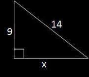
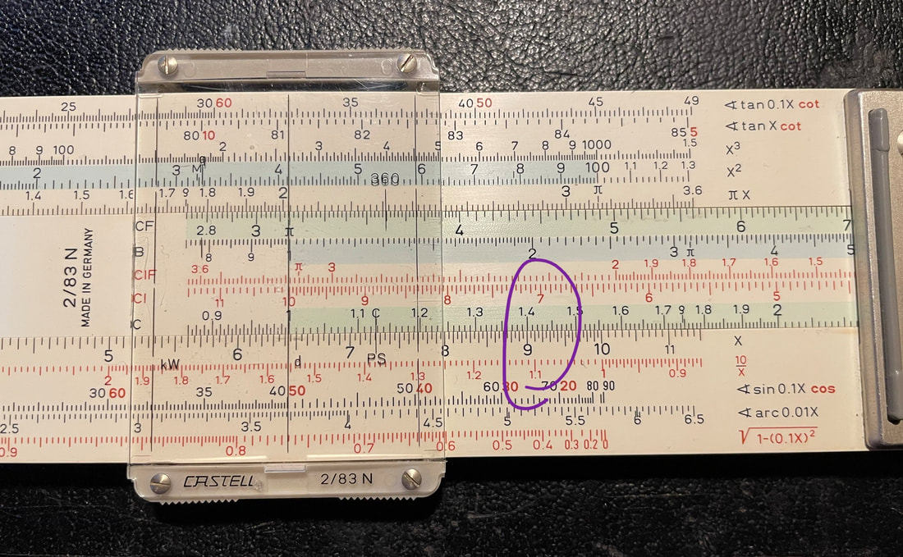
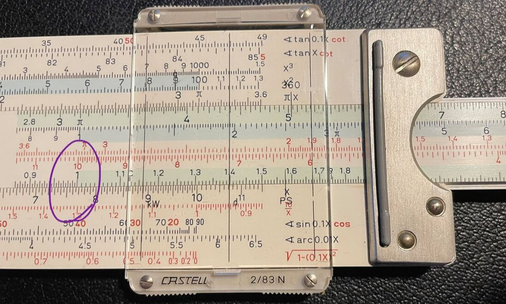
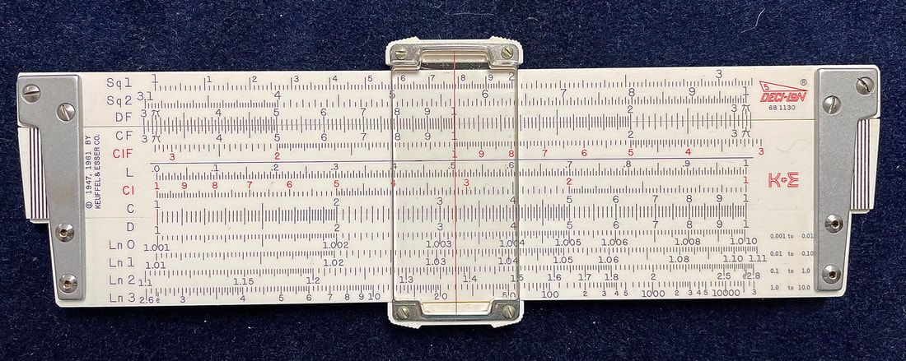
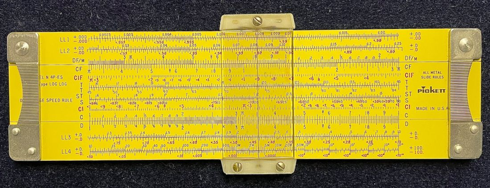
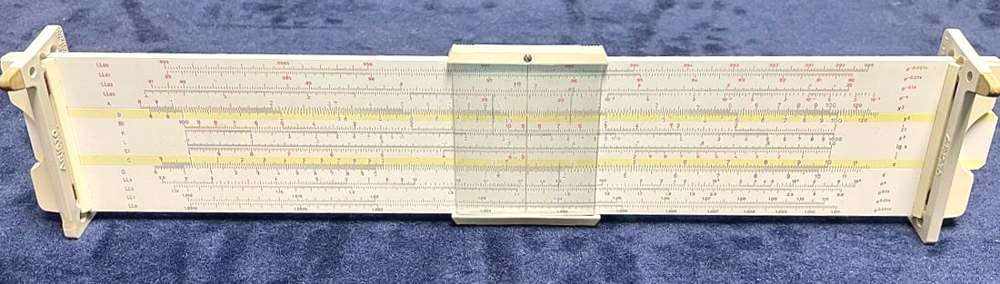

Oh, and if it is helpful, 
710
226
710
226
 approximates pi correctly up to 3.141592.  That is 8-significant figures if you aren't counting.  Give that one a try on your slide rule! 

This gives you an idea of the usefulness of the "folding scales" like CF and DF.   Having the index in the center of the rule, it assure that there are no "off-the-rule" computations when using the wrong index on the normal scales.   Similarly, because the scale is folded at pi, then you always have the product of 
n×π
𝑛
×
𝜋
, IF 
n
𝑛
 is on the D scale and the product is read off the DF scale (no movement of the slide is necessary).  As such, this makes quick work of computations involving the circumference and area of circles.

*Historical Note: Because 
10
−
−
√
10
 is so close to 
π
𝜋
, many slide rules from other makers began their folded scales at the square root of 10 instead of pi. 
Building Algebraic Understanding

In most modern education systems, on-grade-level Pre-Algebra occurs in 8th grade and Algebra I happens in 9th.  But what parents and students may not understand is that the groundwork for algebraic understanding is done much earlier, usually around the 5th grade.  This is often accomplished by using the principle of a number "holder" or "container" that can change values depending on the situation. 
For example, consider the question, "What number plus 8 equals 11?"   In such a case, students learn to write expressions for the word sentence and then plug values into the "what number" part of the expression...

_____ + 8 = 11

So in the blank (which is the "holder"), students intuit what number has to fit without really considering the algebraic "rules" for "solving" that would come later.   From there, students begin to understand that the "blank" can change if the other numbers change.   Students learn that the blank is a "variable" and that the variable can be a "blank," a "box," a "can," a "bucket" or even a letter, like "x."   

Back before hand-held calculators, it was customary for students in this age group to begin performing basic operations using a slide rule.  The idea was such that once students gained mastery of multiple-digit multiplication and long-division, then they could begin to save time by using the slide rule - for the same reason calculators are used today.  This also carried the additional virtue of preparing them for heavier slide rule usage in later grades.    This use of the slide rule for a 5th grader would have been limited to the C and D scales of the rule which, as we've seen in earlier parts of the article, are the scales that yield products and quotients, but more importantly builds understanding for multiplication, division, fractions, ratios, percentages, and proportions.   

And then, in the 6th grade, students would have learned to incorporate the A scale into their procedure.  The A scale is the square of the number on the D scale (they would have removed the slide to ignore the duplicate B and C scales).   This would allow students to build algebraic understanding in word sentences such as, "What number when squared is equal to 16?"  

Students would have written the expression: 

____ 
×
×
 ____ = 16, with the understanding that the numbers in the blanks had to be the same number (thinking of the length and width required to make a "square").  And after recalling their 3rd grade multiplication tables, would have realized that 
4×4
4
×
4
 was the multiplication that yielded a 16.  Now, note the image below: ​
This beautiful Aristo Darmstadt slide rule (which, by the way, doubled as an inch and centimeter ruler), is shown here with the slide removed.  Observe that the D scale is set to 4 while the A scale reads 16.  This is the fulfillment of the word sentence expressed above.  Students of the slide rule era would have been able to derive the answer in two ways.   

1) Set the A scale to 16 and look to the D scale for the answer. 
2) Set the D scale to any of the whole number values and look at the A scale until the answer reads 16.  

I believe it's important for teachers today to grasp the connections being made here.  If the students use the first method, it gives them introductory intuition about the nature of square roots.  If the students choose the second method, it gives them the opportunity to discover, on their own, the nature of all the squares 1 to 10, while also seeing, very visibly, that the values in between the whole numbers also have squares. 

While this activity works to introduce kids to functional relationships of squares and square roots, it's important to see that algebraic associations are built as well.  Perhaps you noticed that this slide rule is also self-documented on the right side, marked by 
x
𝑥
 on the D scale and 
x
2
𝑥
2
 on the A scale?  Just as the "blank" can change in the word statements, students could see that the 
x
𝑥
 varies as well, and could be assigned to whatever made the word statement true.   A true transition from the "holder of a value" to " 
x
𝑥
 ​ as a variable" is being made here. I would challenge a teacher to find a more intuitive and concrete way to do that for your 6th grade students!  

The "Darmstadt" arrangement of slide rule scales, which became standardized on a variety of mostly European slide rules - this Aristo rule is German -  also allows students to build intuition about other functions as well.   In the above picture, note that the K scale is marked clearly for cubes (or cubed roots).  So, 
4
3
=64
4
3
=
64
, completing a word sentence of ____ 
×
×
 ____ 
×
×
 ____ = 64, whereas "
x
𝑥
" becomes the blank.   Note as well on the slide that reciprocals 
(1/x)
(
1
/
𝑥
)
 can be discovered off of the "C-inverted" (or CI scale).   And in middle school, for those being exposed to the Inverse Square Law in 8th grade Physical Science, we have a B-inverted (or BI scale) to allow students a visible way to compute how distance affects the scatter of light. 

Perhaps my favorite, being a Precalculus teacher, is the P scale, which stands for "Pythagorean."  In Precalculus, it allows students to see all the Pythagorean relationships for unit vectors in two-dimensions.
In the image above, the slide is not necessary to see the relationship between numbers of the D and P scales.  Under the cursor, if the value on P is set for 0.8, then the D scale would read 0.6.   This reflects the association of the sides of a right triangle whose hypotenuse is 1, which happens also to be the nature of a "unit" vector.  Also significant for this setting is that such a vector's direction will be indicated directly off of the S scale (sine) just below.  So, in this example, for a unit vector with components of 
<0.8,0.6>
<
0.8
,
0.6
>
, the direction will be ~36.9 degrees. Students of yesteryear would know to find the complement of that angle for a 
<0.6,0.8>
<
0.6
,
0.8
>
 unit vector, as well doing the necessary compensation for vectors in other directional quadrants.   

The P scale will also solve any right triangle for its missing leg using a similar technique.  As example, take the triangle at right.   Then observe how this is easily solved with a different slide rule below...
Where circled, we divide the 9 by 14 (ignore the decimal in 1.4), the result being read under the left index of the C scale (see under the hairline). However, we do not need this figure (0.642). Instead, we read the bottom, red P scale for the value 0.766. By dividing with the hypotenuse (14), we now have corresponding leg values when the hypotenuse is 1.

From this situation, we can create any number of similar triangles by multiplying all the sides by any value of our choosing. Because we are finding 
x
𝑥
 when the hypotenuse is 14, then 
x
𝑥
 is solved by multiplying the 0.766 value from the P scale by 14. This is shown here, circled, with the left index of the C scale over 0.766 on the D scale, and reading the value of 
x
𝑥
 on the D scale under the 14 (1.4) on the C scale. This value for 
x=10.71
𝑥
=
10.71
 is shown under the hairline.
Solving for 
x
𝑥
 here, technically speaking, is Algebra, but here we have been showing how slide rule usage builds algebraic understanding.  And before you think that we have forgotten about that, let's look at the self-documentation for the P scale.  Easier to see on the Aristo Darmstadt rule, the 
1−
x
2
−
−
−
−
−
√
1
−
𝑥
2
 is a rewrite of the 
x
2
+
y
2
=1
𝑥
2
+
𝑦
2
=
1
 equation, allowing you to find one leg when given the other if the hypotenuse is 1.  So again, by dividing all triangle sides by the hypotenuse to begin with, then the slide rule makes quick work of solving right triangles.  

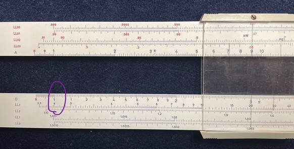
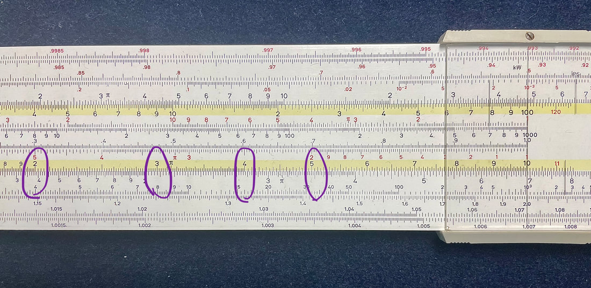
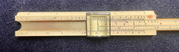
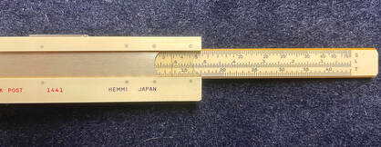
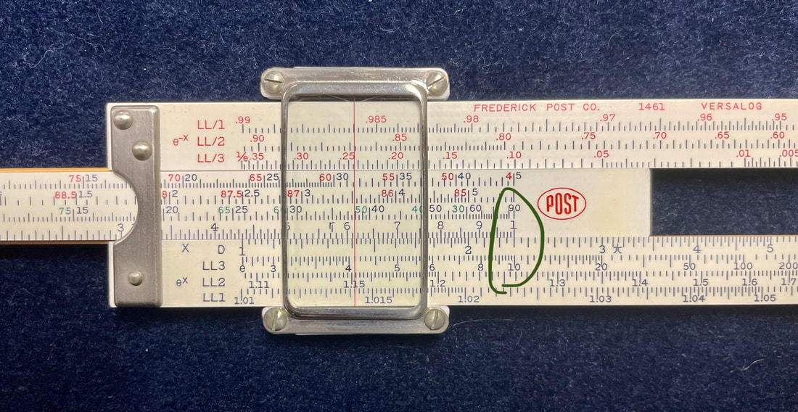
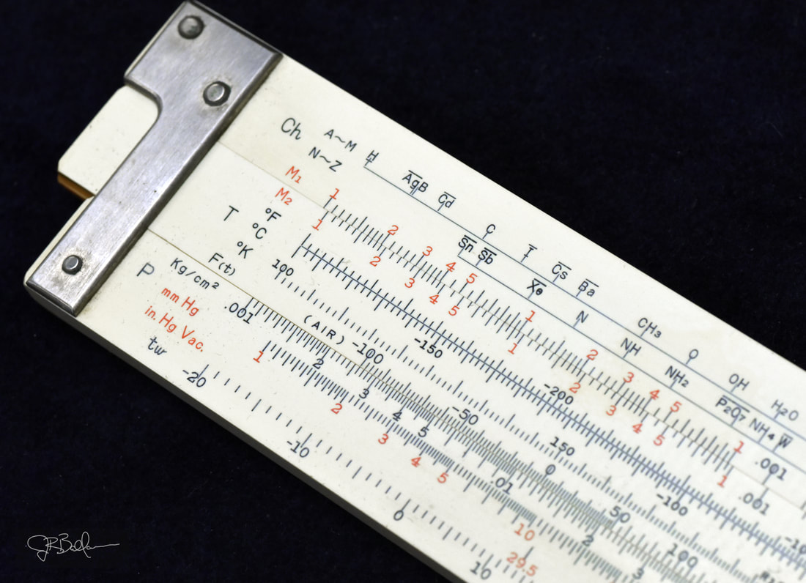

And perhaps it's not escaped your notice that if you can solve triangles in this fashion, then you can also use the P scale to compute the trig identity:

si
n
2
x+co
s
2
x=1
𝑠
𝑖
𝑛
2
𝑥
+
𝑐
𝑜
𝑠
2
𝑥
=
1
, where 
x
𝑥
 is in degrees.

Practically speaking, it permits you to see the value of cosine when the rule is set for sine and vice versa.  In the left image above, observe that the rule is set to compute 
sin(40)
𝑠
𝑖
𝑛
(
40
)
 by reading the output, 0.643, off of the D scale.   While you could get 
cos(40)
𝑐
𝑜
𝑠
(
40
)
 easily enough by moving the cursor, it's not necessary since 
cos(x)
𝑐
𝑜
𝑠
(
𝑥
)
 is a Pythagorean relationship through the above identity.  So, you could just read that output from the P-scale!   In this case 
cos(40)=0.766
𝑐
𝑜
𝑠
(
40
)
=
0.766
.   

This should be of immediate value to Trigonometry and Precalculus teachers, as it promotes the Pythagorean relationship between the two trig functions.  It also goes without too much explanation that slide rules are set-up to use the same scale for sine and cosine, with sine set to the black numbers and cosine set to the red numbers.  So in our example above, 
sin(40)
𝑠
𝑖
𝑛
(
40
)
 is also equal to  
cos(50)
𝑐
𝑜
𝑠
(
50
)
, promoting the co-function trig identities.
​
Finally, Log Log slide rules allow for students to solve for any numerical base raised to any power.   They are so named because you are literally performing the "log of a log" when using them.   Such slide rules will have scales labeled something to the effect of  LL1, LL2 and LL3 .   The numbers on the scales represent the base of the exponentials, which is a continuously running scale folded at various values to fit on the slide rule.  We see this implemented in two different ways on the slide rules below...
With the K&E Deci-Lon 5 slide rule, the bottom four scales represent one continuous scale for the base of exponentials, beginning at 1.001 on the Ln 0 scale and running to 30,000 on the Ln 3 scale. Flipping the slide rule over reveals Ln-0 to Ln-3 scales for bases between .999 to .00003.

With the Pickett NP4-ES, the scales are implemented differently, with LL1 and LL2 on the top rail and LL3 and LL4 on the bottom, with values above 1 in black numbers and values below 1 in red running "back-to-back" on the same scale.
But to show how these computations are done, let's use the massive desk model slide rule, the Aristo StudioLog 0969 pictured below.  
Slide rule makers had their own designs for how their scales were arranged.  Here, because of the massive amount of space on the rule, Aristo put all exponential scales on the same side, with red scales LL00, LL01, LL02, and LL03 on the top rail for exponential bases less than 1 and with black scales LL3, LL2, LL1, and LL0 on the bottom rail for bases greater than 1.   Looking at the right side of the LL3 scale (click the image to zoom in), the self-documentation shows as 
e
x
𝑒
𝑥
 while the C scale is labeled 
x
𝑥
.  The intuition, as taken from the other functions above, is that the number on the C scale is the power of whatever base you set.   The documentation for this uses base 
e
𝑒
 as default, which happens because the slide rule "folds" the scales specially at 
e
𝑒
, or 2.718.  We can see this even with the slide removed (Figure 1, below at left). 
Figure 1 - With the slide removed, the number e (on LL3) is the base of an exponential with 1 (on D) aligned above it, circled. The value is read off of the same LL3 scale. As such, 
e
1
=e
𝑒
1
=
𝑒
. Note that here, 
e
𝑒
 raised to any power can be computed, as under the hairline we have 
e
3
≈20
𝑒
3
≈
20
 (20.085 with calculator).
Figure 2 - Here, we have the rule set at the hairline with the right index (10) of the C scale aligned with 2.0 on the LL2 scale. From this setting, any power with base 2 can be seen on the rule, with the input on the C scale (in yellow) and the answer read off the LL3 scale. In the circled areas, from left to right, we see 2, 3, 4, and 5 on the C scale with outputs on LL2 as 4, 8, 16, and 32 respectively.

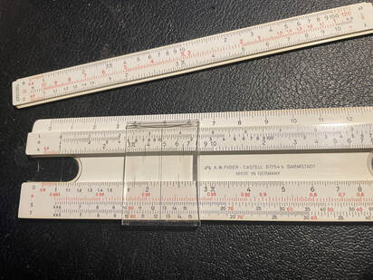
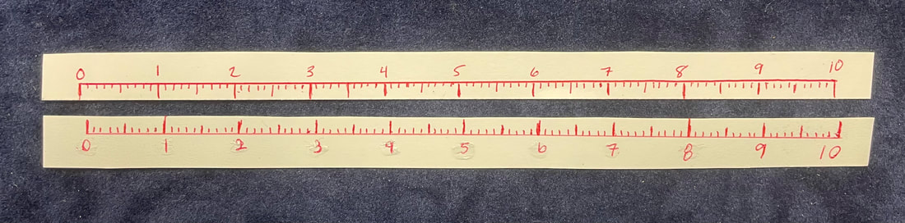
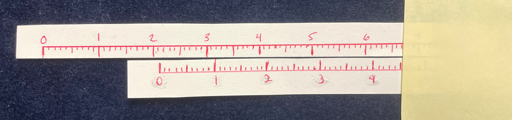
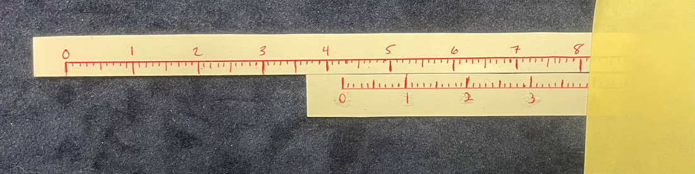
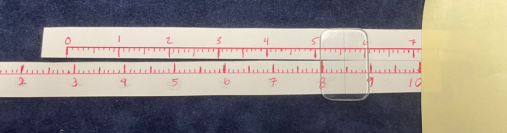

The implication of this should be obvious.  If used in a fixed position without the slide, then the position of the cursor on D (which is identical to C), shows the value of base 
e
𝑒
 raised to any power.   Once we add the slide back, we could set the index of C to any base of our choice (on any of the LL scales) and place the hairline on any exponent on that C scale.  The result will be read off the same LL scale where the base was set, unless the right index is used and you would read the output off of the scale above it for bases larger than one and below it for bases less than 1.  

For students, this changing of scale required by the slide rule reinforces the concept of the growth or decay of an exponential function based on the nature of its base.  Students gain intuition because they have to ask themselves if the value they expect should be greater or less than the base they started with when raising to positive exponents.  They can be asked to find possible outputs on neighboring scales and then select the answer that is most reasonable. 

Another virtue of using a slide rule to perform these computations is that any base raised to ALL the powers are shown with the single setting of the rule.  Figure 2 at left demonstrates how this can be done using a base of 2.  Again, this is akin to inputting the 
2
x
2
𝑥
 function in a graphing calculator and selecting the table to display a range of outputs, or all of the ordered pairs that make such a function true. 

Also, with the LL scales, reciprocals can be read directly off the rule.   The LL2 and LL02 scales, for example, are reciprocal values.  So also in Figure 2, with the slide set for 2 on the LL2 scale, the reciprocal of 2 (0.5) can be read off of the LL02 scale.   While this doesn't necessarily build algebraic understanding, it is just one of the thousands of observations about numbers that students will glean from using the device. 
And then, just as division can be performed on the rule due to being the inverse of multiplication, so can logarithms of any base.   For example, for a problem like 
x=lo
g
2
4.5
𝑥
=
𝑙
𝑜
𝑔
2
4.5
,  the student can set 2 on the LL2 scale as usual, move the hairline to 4.5 on the LL3 scale, and then read the correct answer off of the C scale (exactly the opposite of doing the exponential).  This also reinforces the definition of the log itself, meaning that each time a student solves a log equation, the student is reminded exactly what a "log" is, as the word sentence, "2 to what power is 4.5," is visibly shown on the slide rule. 

This only scratches the surface of understanding for students.  Slide rules require students to develop a need for math properties to solve certain problems.  For example, while a calculator can handle something like 
log(.041)
𝑙
𝑜
𝑔
(
.041
)
, the slide rule has difficulty with this without a little bit of rethinking.  This is because the LL1 scale (where the base 10 is) and the LL03 scale (where .041 is) cannot be used simultaneously like we did in the previous paragraph.  So students of the era knew that when taking the 
log(x)
𝑙
𝑜
𝑔
(
𝑥
)
 when 
x
𝑥
 is between 
0<x<1
0
<
𝑥
<
1
, the problem had to be rewritten.  For example, the argument of the log above, .041, could be expressed as a product of 
4.1×
10
−2
4.1
×
10
−
2
, whereas the "Product Rule of Logs" allows for 
log(4.1)+log(
10
−2
)
𝑙
𝑜
𝑔
(
4.1
)
+
𝑙
𝑜
𝑔
(
10
−
2
)
.  Because 
log(
10
−2
)=−2
𝑙
𝑜
𝑔
(
10
−
2
)
=
−
2
, which is something students of the past would have known without using the "power rule" for logs, then the result can be found by computing 
−2+log(4.1)
−
2
+
𝑙
𝑜
𝑔
(
4.1
)
.   Students could use either the L scale or the LL3 scale to compute the log portion (see Figures 3 to 5 below).  And, of course, this was also a good way to get students some practice with scientific notation!

While a calculator has no problem with the efficiency of such a problem, the value of the procedure to be followed when using the slide rule has become lost in the modern era.  The properties of logarithms, which we require our students to master, have little practicality for our students, as they can only be learned via rote memorization and drill-and-kill practice.  They are necessary, yet students will not see the "necessity," and hence they become devalued and usually "under-learned."  Yet a slide rule gives students a reason to know the rules and to internalize them affectively.  After all, Bloom's Taxonomy is more than just the cognitive domain!   So, in many ways, the question, "Why do I need to know this?" was not a question that past students ever needed to ask.   Or stated again, math is not about the computation, but rather the algorithms, methods, and techniques that lead to a computation.
Figure 3 - With the index of C set to 4.1 on the D scale, this cute Post/Hemmi 1441 slide rule is setup to compute 
log(4.1)
𝑙
𝑜
𝑔
(
4.1
)
. The solution will be found on the back of the rule in Figure 4. Of special note is the magnifying cursor, which many makers used on rules that are otherwise too small to read.
Figure 4 - Many rules like this have scales on the back of the slide. Here, the middle L scale is for base 10 logs. The result is read off of the red hairline on the small back window, 0.613 as shown here. For basic rules without Log Log scales, log problems always have to be converted to base 10 using the "change of base" rule. If the problem is already base 10, yet for arguments less than 1, then other log rules will apply, by necessity.

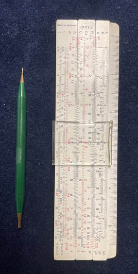
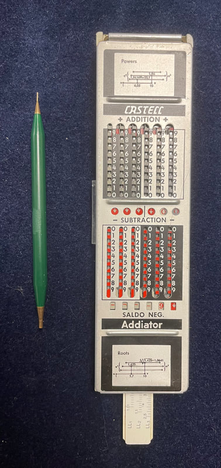
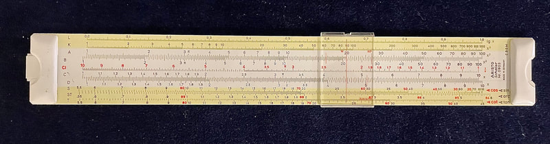
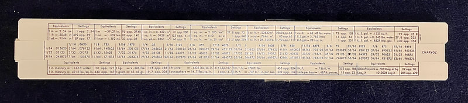
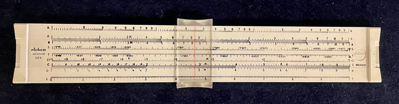
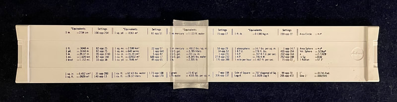

Figure 5 - Despite being a base 10 problem, the 
log(4.1)
𝑙
𝑜
𝑔
(
4.1
)
 can be found with the Log Log scales, as shown here on this Post 1461 Versalog, which is the more powerful, bigger brother to the Post 1441. We see the index of C setup on the 10 of the LL3 scale (circled). The hairline is set to 4.1, also on LL3. The resulting .613 value, read off the C scale, would add to -2 in the problem, 
log(.041)=log(
10
−2
)+log(4.1)=−2+.613≈−1.37
𝑙
𝑜
𝑔
(
.041
)
=
𝑙
𝑜
𝑔
(
10
−
2
)
+
𝑙
𝑜
𝑔
(
4.1
)
=
−
2
+
.613
≈
−
1.37
.
Cross-Curricular Application

One of the things that is not readily apparent when a student looks at the slide rules on my classroom wall is that they do more than "just" math.   Slide rules were once ubiquitous, not only for math computations, but also for applications in all of today's STEM subjects.   

I have slide rules that give the molecular weight of elements and compounds (see image below).  Others offer scales to compute inductance and capacitance of electronic circuits.  Another gives the margin as a percentage of profit on a selling price.   Several of my slide rules allow for loading capacities of military planes, and even some are custom-designed for airplane manufacturing - not to mention the E6-B flight computer still required to be used by pilots today.
Many slide rules include formulas for unit conversions in a variety of fields, which likely also includes scale markings to coincide with said formulas.  My teacher mother used a cardboard slide rule known as the EZ Grader, which computed the grade as a percentage given the total number correct against the total number of problems on an assignment.  When I was in 2nd grade, I remember using the EZ Grader to help my mother grade her 2nd grade papers.  It gave me a practical understanding of ratios and percentages before my school covered them.  Similarly today, if students computed their own grades instead of the teacher doing it for them, they'd get ratios and percentages nailed down just like I did.​
As many things are in education, emphasis on "Cross-Curricular" or "Interdisciplinary" instruction is cyclical.  In fact, it has been quite sometime since this has popped up as my school district's theme for improved instruction, which I fully expect to happen soon.  Quite simply, when subject matters are crossed, it gives additional relevance to both disciplines.  So for a subject like math, where teachers find it extremely difficult to achieve total buy-in from their students, it is helpful to encourage teachers from other areas to incorporate some math within their curriculum design. This is very easy to achieve in the sciences, as so much is already math-based.  Chemistry and Physics, in particular, can benefit with some coordination of activities built to achieve such cross-training of our students.  And there are an amazing number of slide rules that were designed to support this.

But there is a place in almost every academic discipline to utilize a slide rule within its curriculum.  Again, this is not to solve problems, but rather to show students alternative ways to think about problems.  In business, slide rules that were designed for this use are plentiful.  There were slide rules known as "profit calculators," and others for general business use.  In Art/Design, there were "proportional scales" used in the reproduction and rescaling of printed art and documents.   In the trades, there were (and still are) slide rules for hydraulics, pneumatics, and psychrometrics (HVAC). 

Hemmi 257 Chemical Engineering - This slide rule serves a special purpose, as can be seen by the nature of the scale set. Gone are the typical C/D and A/B general math scales, replaced by scales to help chemists. Today's Chemistry teachers would not know that such slide rules exist. Most other disciplines that we teach have analogous slide rules as well.
Every slide rule I have related to fields other than mathematics is an opportunity for kids within other classes.  One of my recommendations is that when you run across a slide rule like this, buy two of them, adding one to your collection and giving the other to one of your teaching partners.  In this way, it gives that teacher an opportunity for, in the least, a "show-and-tell" moment with their students, a connection that will be made back to their math classroom where they've also seen those "sliding thingies."  
Efficiency in Solving

A calculator doesn't care how you type in the numbers.  If you type it in wrong, it will happily give you the wrong answer.  Garbage in; garbage out.  But even if you choose the most inefficient order of operations, the speed at which keystrokes can be made still makes it rather efficient.   This, assuming you know what you are doing with it in the first place! 

But the slide rule is a bit more particular in this regard.  Efficiency depends on how you use it, particularly when multiple operations are required back-to-back, called "chaining" with a slide rule.  It will require you to order your computations logically, otherwise you find yourself writing down intermediate answers for the next operation.   
The classic example is doing the computation 
(3∗4∗5)
(6∗7)
(
3
∗
4
∗
5
)
(
6
∗
7
)
, simplified here to whole numbers for demonstration purposes.   There is danger when doing this computation with a calculator, as students will typically multiply the entire numerator, followed by dividing the denominator.  But as we know, if the parentheses are not honored in the denominator, then the 7 can easily end up being multiplied rather than being divided with the 6.   

​With the slide rule, if the numerator is multiplied first, followed by the denominator, then those intermediate values will need to be written down prior to finding the final quotient.  But there's a trick...students of yesteryear would have known to work the problem as 3 
÷
÷
 6 
×
×
 4 
÷
÷
 7 
×
×
 5, in that order.  This chaining of operations, which is totally permissible, allows the results of the each step to be used directly into the next operation, all without ever needing to use paper.  

Important for us, and today's students, is that you would never have reason to handle the problem that way, and so students would likely not ever know that doing so was possible, and in many instances both safe and useful.  In this case, the parentheses "serve" the problem, yet I find that students will almost always perform the parentheses quite literally.   As such, they think of the computation as 
60
42
60
42
. 

Pictured is the Faber-Castell 2/83 N Novo-Biplex, regarded as one of the most beautiful and powerful slide rules ever produced. Note here the right hand side of the scales are labeled with the functions they perform. This feature was known as "self-documenting." It was mostly a European feature. Click on the image to see a close-up.
With the slide removed because it's not needed here, this rule is set to find the outputs of 2.2. Reading closely, the square of 2.2 is on the A scale, the cube of 2.2 is on the K scale, and the log of 2.2 is on the L scale. These values can be read to three significant figures as 4.84, 10.6, and .342 respectively. Moving the hairline lets you quickly read-off these values for any number you desire.
Fact of the matter is, with fractions composed entirely of monomials, numbers (or factors) on top can be multiplied and numbers on bottom can be divided.  While this sounds insignificant, in practice it means something quite powerful to students.   I discovered this long ago when teaching transformations of trig graphs, watching students struggle when they are instructed to divide "B" values to the function's inputs.  So when they are faced with 
π
2
÷2
𝜋
2
÷
2
, they almost always fail to understand that all they need to do is place the 2 on the bottom - anything on the bottom is divided - leaving 
π
4
𝜋
4
.  Instead, I watch students reciprocate the 2 and then multiply, almost without exception.  

While this speaks equally to poor numeracy, when students only understand order of operations in terms of "PEMDAS," then they will always be trapped by that rule.  While rules are important, sometimes breaking the rules "legally" leads to more efficient math practices.  The slide rule is full of a sorts of ways to rethink math.  

Another example of when the slide rule makes you rethink math is what happens when you multiply something like 4.2 
×
×
 6.7.  It requires using the right index on the C scale to get the correct result; however, the inclination is to use the left index first, which would put the solution off the slide rule.   To fix this, you either have to remember to use the right index OR you use an inverse (CI) scale and treat the problem like it's a division problem, because multiplying two numbers is the same as dividing by its inverse, something that would have been common knowledge in the slide rule era. 

Likewise, there are also what is called "folded" scales on a slide rule, as we talked briefly about earlier in the article.   Such scales, usually labeled "CF" and "DF,"  are essentially the same as the C and D scales, yet the beginning of the scales through pi (or 
10
−
−
√
10
 depending on the manufacturer), is lifted off the scale and reapplied at the end.  This yields a single index at the center of the rule.   As such, if folded at pi, it can either be used to automatically multiply a number by pi (making circle computations knowing the radius a breeze), but also can be used instead of the C and D scales for multiplication operations to assure an index is always on the rule.   This promotes the idea that there's more than one way to do things, and some ways are more efficient than others.   This is something my students today seem to struggle with. 

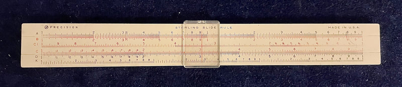
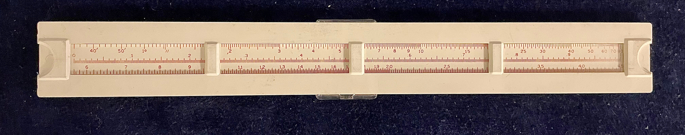
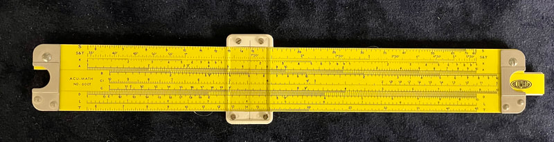
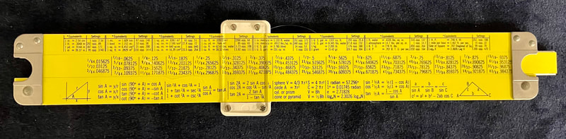
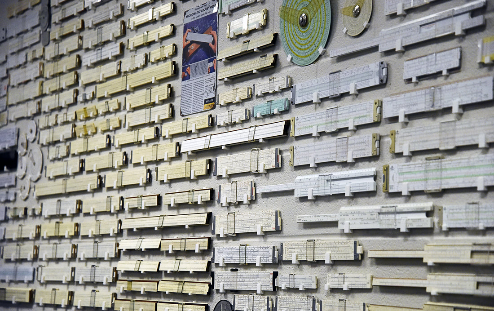

Speaking of efficiency, a slide rule can also be used as a function table to do multiple operations at once.   For example, with the slide rule at left, when the middle slide is removed inputs on the D scale can be read as outputs on the L, K, and A scales by just moving the hairline.  This slide rule, as are many of the European slide rules, are also "self-documenting," putting the functions they perform on the right side of the scale (see also above).   As such, logs, cubes, and squares can be quickly read almost simultaneously, all without really needing to decipher what the L, K, and A scales actually mean.

Now this is something a calculator can do, but it requires a little preparation...type something like the squaring function into Y1 in the graph screen.  Select the table for the graph.  And read your results for multiple inputs.  Of course this works well for integer inputs by default.  To read off decimal inputs, you would need to customize the table for tenth or hundredths, and then scroll the table up and down all day long to get where you need it.  Too bad the TI-84 doesn't have a manual cursor like a slide rule! 

Likewise, slide rules will put a premium on doing a little mental math along the way.  If efficiency is the goal, then any computation that can be done in one's head makes fewer computations required of the slide rule.   This is a practice that calculator users should do as well, as far too many students within my classes will use the calculator for even the more simple of computations (which is why their integer math is poor).  Using a slide rule, for even a week, reinforces the idea that a calculator is not needed every time a computation is required.  That said, there are mental tricks to arithmetic that slide rule era students did naturally that could also be used during today's age of the calculator.

Perhaps the most important aspect to communicate among students is that precision to a ridiculous number of decimal digits, like with a calculator, is mostly unnecessary to real-world applications.   Conversely, the inability of a slide rule to work beyond 3 or 4 significant figures is less of a problem than it was historically made out to be.   Strictly speaking, very seldom does anything built, designed, or modelled in this world require mathematical representations beyond a few significant figures.  In fact, we never actually use the calculator's ability for this, since we round or truncate almost every decimal output we get from the calculator to 2 or 3 digits anyway.  So from that point of view, the slide rule yields all the precision that is required for 99% of every application for which it's needed.   Now, this isn't an advantage of a slide rule, per say, but when my students act as if it's a disadvantage, or that giving answers to ten decimals on a calculator is an advantage, I am quick to inform them of the important point that real-life math seldom requires any precision beyond a few digits.  I remind them that most of America was built using a slide rule, from the Brooklyn Bridge to the Hoover Dam.  And that has not changed even in the calculator era.  Slide rules were an important part of efficiently building the world for more than 300 years.  That's a lot of human history. 

​And speaking of history...
Math History

As we saw earlier with the Covid graphs, Math is embedded in so much of what we do that we often take it for granted.  "Productivity" devices like our phones are made possible by the math behind them, but the user is spared the complexity.  But it's important to remember that it wasn't always this way.  At one point in history, mathematics was absolutely intertwined with everyday life.  People didn't always have computers programmed to do the math for us.  They used ledgers to compound monthly interest by hand.  They did the math to determine the thickness and amount of copper cable to electrify America.   They laid out the country with a transit, solar ephemeris, and a survey rod.   So to accomplish things, people had to think and reason solutions to life's problems.  Math wasn't just for Mathematicians.  In fact there wasn't even an occupation with the title, "Mathematician."  The people who created all the math had other vocations...philosophers, ministers, scientists, poets, merchants, foremen, and farmers. 
For them, mathematical ideas were born out of the needs of the times.  They created the math when it became necessary, necessity being the mother of invention.  Many of the individuals are remembered for centuries...

Pythagoras, Descartes, Newton, Liebniz, and Euclid.   There is a rich history of mathematics that colors the actual math that we do.   

Euler. Riemann. Gauss. Pascal.   

We teach Euclidean Geometry represented on a Cartesian coordinate plane and using the Pythagorean Theorem.  We teach Precalculus by doing binomial expansion using Pascal's Triangle, systems of equations with Gaussian Elimination, and we expose our students to Euler's number for the first time.  We study Calculus created by Newton and Liebniz while performing Reimann sums.    

All this, yet, we are not required to teach kids about these math creators, nor the situations in which they felt compelled to create it.  Our own academic language, which we use freely in class, is like a foreign language to those we teach...and for whatever reason, we do not view that as a problem. 

So instead of "discovering" math as our ancestors did, today's students learn mathematics because it is required, and this often causes resentment within students who only wonder, "When am I ever gonna use this?"  

Hopefully, as a teacher, you can answer that question for them.  But if you can't, then even a shallow dive into math history can provide enrichment for students.  We talked earlier about cross-curricular activities for our students, whereas a little work with the social studies department might lead to some projects for either class.   But in the very least, we should be supporting our academic language with vignettes of the people who gave it a name, adding color and diversity to a math curriculum that is otherwise clinical and sterile to our students.  

But if you are looking for something more hands-on, then I can think of nothing better than to show students a slide rule and how it works.   It gives a perfect illustration for how a tool was created out of a need for the math that real people needed to do.   In fact, we cross paths with guys like John Napier, William Oughtred, and Peter Mark Roget.  The first guy invented logarithms, the second guy invented the slide rule,  and the third guy wrote Roget's Thesaurus - and he created the first "log log" scale on a slide rule.   

So, if your students cannot discover math for themselves, then at least the slide rule can put them into the shoes of the people who did.  It's a perfect example as to how mathematics was birthed out of problems and questions that were, and still are, important.   What results is an appreciation of that perspective.   
Addition and Subtraction

I have saved this section for last, as no mention of addition and subtraction operations have been mentioned within this article.  This is because slide rules, being logarithmic scales, cannot be used for performing addition and subtraction.  Well, sorta. 

I mentioned earlier in the article that many of my students graduate to me without a mastery of factoring mathematical expressions.   While mastery is certainly required within the Algebra 2 prerequisite class prior to entering Precalculus, I've had many sleepless nights wondering why factoring has been forgotten by the time they get to my class?   
The concept of factoring begins early, around the 5th or 6th grade, as students first learn that numbers can be written into products.  In first use, a number can be expressed as its "prime factors."   As example, the number 20 in its prime factored form would be expressed as 
2×2×5
2
×
2
×
5
.   This idea of turning a number into a product of smaller values has important implications for reducing fractions, since if both the numerator and denominator are broken into their prime factors, then the fraction might be reducible.   That could be shown with something like 
12
20
=
2×2×3
2×2×5
=
3
5
12
20
=
2
×
2
×
3
2
×
2
×
5
=
3
5
.  All the twos would cancel each other here. 

This idea of "forming a product" is key to factoring at higher levels, such as for factoring a math expression.   So, for something like 
2
x
2
+8x
2
𝑥
2
+
8
𝑥
, a product can be formed by pulling the greatest common factor (GCF) - or any factor really - typically learned first around 7th or 8th grade.  In our example, 
2
x
2
+8x=2x(x+4)
2
𝑥
2
+
8
𝑥
=
2
𝑥
(
𝑥
+
4
)
.  Note that what is left is a product of 
2x
2
𝑥
 and 
(x+4)
(
𝑥
+
4
)
.

This takes us to an addition problem like 
422+391
422
+
391
.  As we said, addition problems cannot be performed on a slide rule with algorithmic scales.  However, I would suggest 3 ways to do it using the "spirit" of what we've discussed in this article, with the understanding that this is educational, not practical...

Method 1:  First, related to "forming a product," if the problem can be factored, then a slide rule can be used.   So, for  
422+391
422
+
391
, we can factor out 422.  To do this, 422 becomes the first part of the product when "pulled to the front."  The second part of the product divides 422 into each part of the binomial, or 
(
422
422
+
391
422
)=(1+
391
422
)
(
422
422
+
391
422
)
=
(
1
+
391
422
)
.   So factored, we have 
422+391=422(1+
391
422
)
422
+
391
=
422
(
1
+
391
422
)
.   This can be worked on a slide rule by first performing the division in the parenthesis, adding a 1 to it (which you will always do by pulling either of the numbers to the front), and then multiplying that value by the number that was pulled, 422 in this case.  A sum of 813 would make even 1st graders proud, but you didn't have the luxury of doing 3 digit vertical addition like they did.  Of course, the answer isn't always the point in mathematics, rather it's the method. 
Figure 1 - A DIY Addition Rule made with two linear scales to perform addition and subtraction. Note that each inch is divided into tenths, not the typical standard U.S. or British imperial measurement.
Figure 2 - Our slide rule here is setup to compute something easy, like 
22+45
22
+
45
. Clearly the linear distances add quite easily to yield the sum of 67 on the upper rule. Subtraction is of course the opposite, where the two numbers to be subtracted are aligned over each other and the difference taken off of the left index.
Figure 3 - Performing 
422+391
422
+
391
 from the factoring method above, our slide rule gives an approximate sum of 813, with a little imagination. A lack of precision with this hand-drawn rule not withstanding, the method remains instructive.
Figure 4 - When the sum has "carry-over" digits, spilling into a 4 digit sum, the right index can be used just as with our regular slide rule. Here, the DIY rule is setup to compute 
714+847
714
+
847
 by aligning 714 up with the right index of the bottom scale. Borrowing a glass cursor from a real slide rule, you can see the sum on the hairline of the top scale. Of course, students would need to know to add another digit to the computation when the right index is used like this.

​Method 2:  If logarithmic scales can perform multiplication and division, then what kind of scales can do addition and subtraction?  If you said linear scales, like a ruler, then you certainly know what you can do next...have students use two rulers and show them how to compare those distances to do addition and subtraction operations.   

This seems elementary, so to make it an activity befitting high-schoolers, start by asking students what is required to make sure that ANY pair of two or three digit numbers can be added?   This was easy when the sum had non-carried digits, but how does that work if they are using 12" rulers?  

So, here's what we can do...make 10" rulers instead.  As in the DIY slide rule activity earlier, making two 10" rules with decimal tenth markings is all you need.   Mine are shown in Figure 1 at left.  

Applying the newly made rulers to something easy, like 
22+45
22
+
45
, it is clear that summing the distance, like a typical slide rule, yields the correct sum of 67, as shown in Figure 2.  Here I use a yellow "post-it" note as my hairline.  

Precision can come into question with our DIY Addition Rule.  In Figure 3, we show the setup for 
422+391
422
+
391
, as we computed in the previous method.  The sum of 813 can be shown once again with my make-shift cursor. 

Finally, we answer the question you might have wondered, "How does it work for answers that go off the slide rule?"  And just like a regular slide rule, we can simply use the RIGHT index (10) to do such computations.  Working out a sum like 
714+847
714
+
847
 in Figure 4, I have aligned the right index of the bottom scale with the value of 714 on the top scale.  Using a cursor glass from a real slide rule, I set the hairline on 847 on the bottom scale, reading the sum of ~1560 from the top scale.  Here, you would have to know to read the top scale as 1560, and not 560.  4 significant figures of precision is a difficult ask for a DIY rule such as this, since the actual sum is 1561, but it's easy to be amused at what can be accomplished with couple of quickly drawn scales like this.  And for sums no larger than three digits, this method is surprisingly accurate.
Method 3: And finally, there are slide rules that can do addition.  Chiefly, any slide rule with two linear scales on it, such as two "L" scales for computing base 10 logs - strangely, it's a linear scale - can be used in a similar manner to the DIY Addition rule in the previous method.  Another rule, the K&E GP-12, shown earlier in the section on Improved Numeracy, can be used in this way.   Neither method is user friendly, since such rules will be graduated by hundredths from 0 to 1, but they can work in a pinch.  
But at right, here's a slide rule from Faber-Castell that solves the problem of addition by putting a normal slide rule on the front side AND an "Addiator" on the back.  Faber-Castell, the same company as the art supplier today - was known for including this adding machine on the back of many of their models, this particular model being their 67/54 RB Darmstadt.  This German rule, dating from 1960, is fascinating.   While using the Addiator is beyond the scope of this article, such devices, sold by many companies across the world during that era, are also ingenious devices.

I highly recommend their use in any classroom, especially as an intermediate step between learning the  pencil-and-paper multi-digit method and the basic 4-function calculator era.   The carry-over action of the device quickly demonstrates, in a mechanical way, how vertical addition actually works.  The sense of adding numbers by tossing rocks in buckets is conveyed through devices like this, without actually breaking your back with a bunch of rocks and buckets. 

Even so, if you have taught elementary math, while never having used actual rocks and buckets, then shame, shame...I refer you back to our discussion on manipulatives. 

Faber-Castell 67/54 RB Darmstadt - Showing off its slide rule side.

Faber-Castell 67/54 RB Darmstadt - Showing off its Addiator side.
Where to Start?

Acquiring slides rules and using them with two physical hands is much of the fun with this new (old) form of mathematical exploration.  But in the irony of ironies, your current PC or cellphone can put a virtual slide rule in your hand as well.   On the PC side, this webpage with a Slide Rule Simulator models many of the real-life slide rules used in the writing of this article.   For the cell phone, there are slide rule apps.  One is called Pocket Slide Rule with information in the link here.  My favorite is known as DigitalSlideRule and can be found on this link.  
​These can serve as an excellent starting point.  They also can let you experience advanced features of other slide rules without actually needing to buy them.  I highly recommend going through this article with one...and provide the links to your students.  

Another option, beyond the DIY slide rule activities in my article, are other craft-related ways to do something similar online.  There are any number of printable templates to be found online, including one of my favorite's for younger kids, the Wearable Slide Rule Bangle Bracelet found at Instructables.

But make no mistake, there is nothing like using the real thing!

Whichever way you go about it, this article has been filled with scores of examples as to how slide rules build mathematical understanding.  Perhaps you noticed the natural evolution of how this works, beginning first with the simple C and D scales for multiplication and division, and then advancing through other functions made possible by the other scales like the A, K, L, and the LL scales.  There are many others.   ​
For those contemplating learning how to use slide rules beyond our cursory exploration of them here, it is important to know that slide rules become more capable with more scales being added to the rule.  So, young children would have started using slide rules with a simple "scale set," like the Mannheim or Rietz, and then progressing to more powerful slide rules like the Darmstadt or "Log Log" scale sets when the tool was needed.   My recommendation, if determining a real slide rule for student use, are those rules known as "student" or "trainer" rules.  These are rules that I provide to my own students, as they often can be found bundled together on eBay, which saves the price on shipping.  Buying them in bulk like this averages out to around $8 to $10 per slide rule.  See the Sidebar: Suitable Slide Rules at right for specific recommendations.​
Justifying slide rule use in the modern classroom, especially finding the time to devote to it, becomes the real challenge as an educator.  It is critically important to convey to ALL invested in the education of kids that YOU realize that slide rules are NOT practical.  They are not.  This article, and your adherence to it, does not advocate for the replacement of the calculators, iPads, and cell phones in use today.   In fact, I would suggest that pushing through this article's ten sections will pay dividends with those devices as well, as undoubtedly you will evaluate how they are being used within your own curriculum.   

Moreover, slide rule technique is a reminder to educators that math is not about computations, but rather the study of algorithms, patterns, and techniques that might be capable of helping us solve problems.  This fact needs to be communicated continually to students, parents, and decision-makers within education, as most people operate under the mistaken impression that math is somehow about solutions rather than being process-oriented.   And if you, having read this, never touch a real slide rule, yet become a more effective teacher because of your understanding and advocacy of this, then I will have succeeded. 

That being said, by now you undoubtedly wonder how I use slide rules in my own high school math classroom?  Let's sort through these items in bulleted fashion...

Because I collect slide rules, my classroom is used to display my collection.  One wall is almost completely filled with around 350 of the slide rules in my collection.  These slide rules are out of their cases, hanging on custom 3D printed hangers that are hot-glued to my wall.   The slide rules range from basic to complex, less expensive to quite valuable, with a diversity in appearance that is likely more at home in a museum.   

Speaking of which, I also exhibit some desk models (on my desk), a Thatcher calculator, and two Fuller calculators on my book shelves.   At the front and back of the classroom hang giant "demonstrator" slide rules that were once made by slide rule makers to facilitate training in an education or industrial classroom setting.  

This provides a setting that sparks curiosity within students, prompting them to ask math-related questions, as well as to get students to see that they have a teacher that not only loves what he teaches, but is willing to put his own money behind it.

I provide opportunities for my own students to learn and use a slide rule as extra credit.  While you might believe they do so reluctantly, I think you might be surprised how many students just think they are "cool."  The hook is actually quite simple...I tell them I can do 
x
𝑥
 with a slide rule and that sparks a curiosity.   I provide a research project where they can earn points and I give them a slide rule for their efforts.   This academic year to date, in 2022-23, I have given away 33 slide rules.   That is 33 students who gained a deeper understanding of mathematics and an appreciation of mathematical history, while utilizing time outside of the classroom.  

Many of the slide rules intended for student use have terrific conversion tables and formulas on the slide rule itself.  While these were designed to provide a basis for computations when using a slide rule, they do not have to be.  In many cases, the tables themselves are worth their own weight in gold.  Where applicable, I often place a slide rule into a student's hand rather than a paper formula chart.   I could have very well expanded this into a whole section within the article, but ten sections was sufficient enough!

Lastly, while there is nothing required of my students involving slide rules (they are not in our state's educational standards), I often utilize the slide rule within teacher-led instruction, as demonstration of some concepts as it relates to various units of study.  For example, it's easy to demonstrate what logarithmic scales are during our unit on Exponential and Logarithmic Functions.  Or, to illustrate a table of values for quadratic and cubic functions (or their roots) by showing how they perfectly line up on the A and K scales respectively.   

And, importantly, because many of my slide rules are "specialty rules" in nature, they can be used to illustrate parallel applications, such as using a "vector" slide rule to compute reactance within electronics (within our Vectors unit) or even showing rectangular to polar conversion within our unit on Parametric and Polar Equations.  Even if the students never touch a slide rule, it shows them that what is being studied has real-life importance and application, something that did NOT stop once slide rules became extinct. 

So in short, slide rules help paint a picture of a world in which what students learn today is important to their tomorrow. ​

Sidebar: Suitable Slide Rules
Many of the best slide rules for student use today are the same as those that were marketed for student use back in the 1960s and 1970s.  These rules, while completely functional, were directed toward wide-distribution among budget-minded consumers.  For this reason, they can be found today at reasonable prices in bulk, mostly on eBay.  

Many of the slide rules pictured within the article are not such slide rules, but rather some "collectors' favorites," usually of more expensive construction, and always carrying a collector's price tag.  But even those, like the bamboo Post Versalog and mahogany K&E 4081-3 Log Log Duplex can be found for as little as $20.  So while I do not seek to have large numbers of such rules for student use, they are slide rules that I recommend for students when they inquire about purchasing their own; which are rules that have to be felt "in the hand" to be really appreciated.   You will never feel the same way about using a calculator!

Suitable slide rules found in larger numbers that my students are allowed to handle (many of which I give away), are those that often have education-friendly words written on the rule itself, often branded as a "trainer," "scholar," or "student" rule.   They will typically be plastic in construction, often single-sided rules with useful conversion formulas on the back side.  The chief makers of these rules were mostly American companies.  Two notable brands include Sterling and Acumath, neither of which made anything other than a student-type of slide rule. So any rule you find from these makers should be budget-oriented. 

Larger American makers, known for high quality slide rules, also had lines of budget rules.  These include any plastic Pickett rule, designed with a Model 1XX label (such as the Model 120, 140, and 160), and K&E with their K12-Prep rule.  The only European maker I've found with rules suitable to buy cheaply in bulk is Aristo, specifically their rules with 90X model numbers, though these will typically ship internationally from Germany.  Shipping is cheap to the States (unlike England), but you just need to be more patient with delivery.  

Many other slide rules qualify for worry-free student use, though are typically found in singles.  It makes more sense to save on shipping by buying in bulk; though it should be said that many online sellers will sell larger mixed lots of cheaper slide rules that can be more than suitable.  Likewise, estate sales can produce good finds, though rules from collectors will tend toward the nicer slide rules that may, or may not, be something you want students to handle.  

Below I show the front and back sides of many of the student rules I recommend.  Click on the images to zoom.  They can be found in the $5 range if you look hard enough.  Just be careful about shipping a single slide rule, as that will more than double the price of these slide rules.
Aristo 903 Scholar - Front
Aristo 903 Scholar - Back
Pickett 121 Microline - Front
Pickett 121 Microline - Back
Sterling Precision - Front
Sterling Precision - Back
Acumath 600T - Front
Acumath 600T - Back
Creating an environment for kids to learn math could be as simple as posters on the wall or student work on display. I prefer to surround them with a display of mathematics' past. My collection of slide rules adorns the back wall. Most collectors, in an attempt to preserve them, keep slide rules locked out of sight in their cases. I prefer to use and admire them.
Much of the article highlights aspects of slide rules that could easily be turned into activities with students.   This is not something I am always capable of doing with my own students within our curriculum due to the advanced classes that I teach and the amount of content we must pour through; however, my hope is that the article might provide impetus for teachers at other levels who could justify the DIY Slide Rule activities outlined here, or any of the other activities that actually incorporate real slide rules within the curriculum, especially as a manipulative for understanding fractions, basic math operations, and functions. ​
Conclusion

In this article, I have attempted to demonstrate the ways in which a technology from over 50 years ago can be used presently in the classroom to enhance student understanding in mathematics at almost all levels.  I have written these sections in a way to accomplish a few ​desired effects.   First, as a result of reading the article straight through, it has served also as a tutorial on the slide rule itself.  With careful reading and a little practice, you no doubt will achieve quick proficiency with a slide rule. 

Second, I have supplemented the article with a wide array of images of slide rules in my own collection in a way to highlight not only the functionality of slide rules, but also their beauty.  As a collector as well as an educator, I hope to show you that these items from math's past are wonderfully diverse in form and function, whereas a deep dive into the slide rules themselves becomes a very satisfying journey.
And lastly, I wanted to make sure you understood how accessible slide rules really are.  They are ubiquitous, especially at online auction sites.  I have purchased slide rules from antique shops and estate sales, and if you are really lucky, there might be some hiding within a box in grandma's attic. Their abundance and diversity makes them not only collectible, but also reasonably inexpensive should an educator wish to provide his or her classes with at least a few samples from which their students can explore many of the concepts highlighted in this article.   Additionally, the International Slide Rule Museum has a loan program to provide slide rules for classrooms, in the event that a teacher wants to immerse their students with a project, lab, or unit of study.   And if you do get interested in slide rules beyond what they can do to transform the math classroom, then join me at the Slide Rule Fan Club on Facebook.  ​

​
